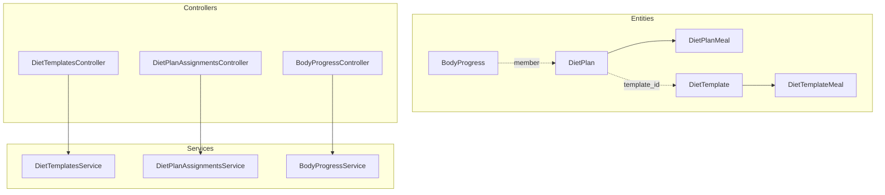
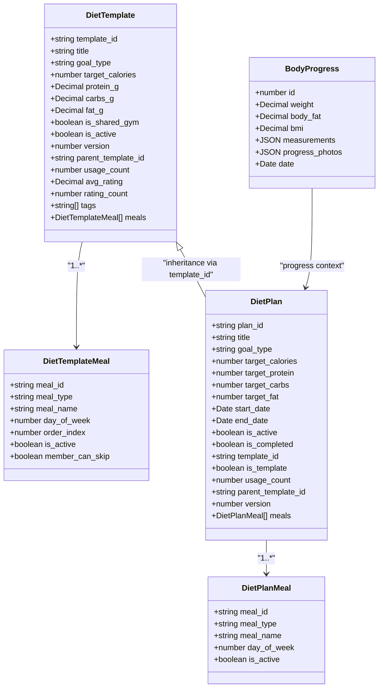
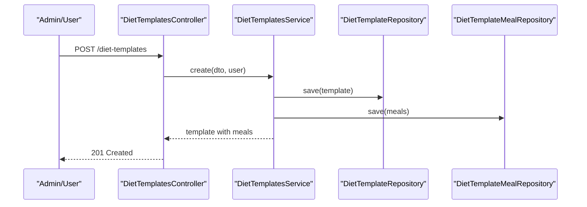
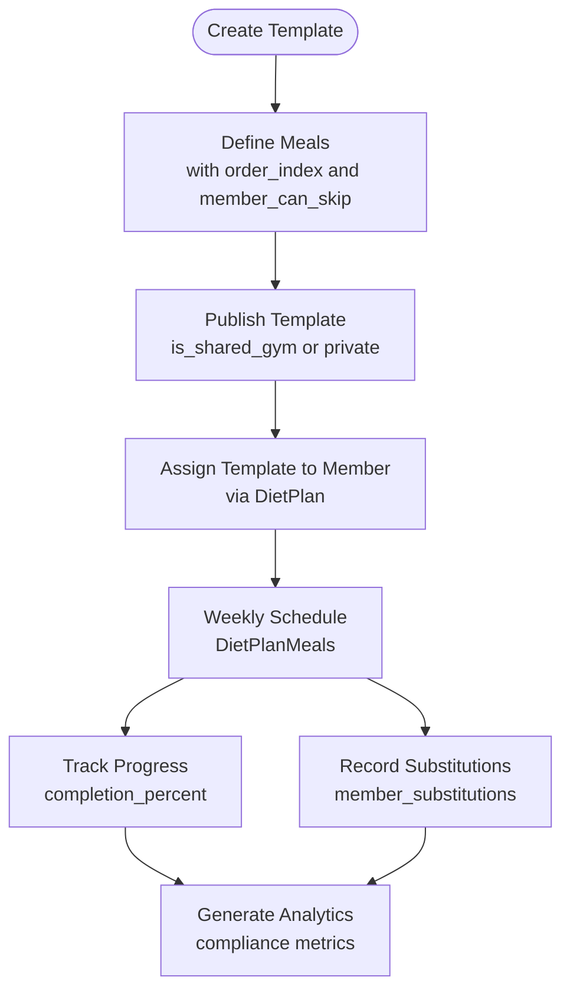
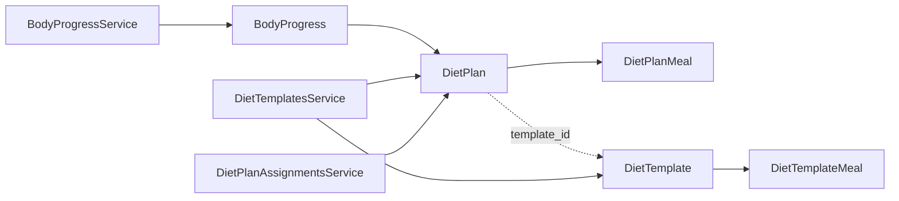

# Nutrition Program Entities

<cite>
**Referenced Files in This Document**
- [diet_plans.entity.ts](file://src/entities/diet_plans.entity.ts)
- [diet_templates.entity.ts](file://src/entities/diet_templates.entity.ts)
- [diet_plan_meals.entity.ts](file://src/entities/diet_plan_meals.entity.ts)
- [diet_template_meals.entity.ts](file://src/entities/diet_template_meals.entity.ts)
- [body_progress.entity.ts](file://src/entities/body_progress.entity.ts)
- [diet-templates.controller.ts](file://src/diet-plans/diet-templates.controller.ts)
- [diet-templates.service.ts](file://src/diet-plans/diet-templates.service.ts)
- [diet-assignments.service.ts](file://src/diet-plans/diet-assignments.service.ts)
- [body-progress.controller.ts](file://src/body-progress/body-progress.controller.ts)
- [body-progress.service.ts](file://src/body-progress/body-progress.service.ts)
- [create-diet-template.dto.ts](file://src/diet-plans/dto/create-diet-template.dto.ts)
- [diet-assignment.dto.ts](file://src/diet-plans/dto/diet-assignment.dto.ts)
</cite>

## Table of Contents
1. [Introduction](#introduction)
2. [Project Structure](#project-structure)
3. [Core Components](#core-components)
4. [Architecture Overview](#architecture-overview)
5. [Detailed Component Analysis](#detailed-component-analysis)
6. [Dependency Analysis](#dependency-analysis)
7. [Performance Considerations](#performance-considerations)
8. [Troubleshooting Guide](#troubleshooting-guide)
9. [Conclusion](#conclusion)
10. [Appendices](#appendices)

## Introduction
This document provides comprehensive data model documentation for the nutrition program entities within the gym application. It focuses on:
- DietPlans: Individual member nutrition programs with goals, targets, and daily meal assignments
- DietTemplates: Reusable meal blueprints with sharing and versioning capabilities
- DietPlanMeals: Daily meal assignments linked to specific diet plans
- DietTemplateMeals: Template-based meal definitions supporting ordering and substitutions
- BodyProgress: Nutritional and physical progress tracking for members

It explains field definitions, validation rules, business constraints, template-to-plan inheritance, meal assignment workflows, data access patterns for reporting and progress tracking, referential integrity, and practical analytics queries.

## Project Structure
The nutrition domain spans entities, services, and controllers:
- Entities define the persistent schema and relationships
- Services encapsulate business logic and access control
- Controllers expose REST endpoints with Swagger metadata

**Diagram sources**
- [diet_plans.entity.ts:15-94](file://src/entities/diet_plans.entity.ts#L15-L94)
- [diet_templates.entity.ts:14-87](file://src/entities/diet_templates.entity.ts#L14-L87)
- [diet_plan_meals.entity.ts:11-70](file://src/entities/diet_plan_meals.entity.ts#L11-L70)
- [diet_template_meals.entity.ts:11-74](file://src/entities/diet_template_meals.entity.ts#L11-L74)
- [body_progress.entity.ts:12-46](file://src/entities/body_progress.entity.ts#L12-L46)
- [diet-templates.controller.ts:38-516](file://src/diet-plans/diet-templates.controller.ts#L38-L516)
- [diet-templates.service.ts:22-358](file://src/diet-plans/diet-templates.service.ts#L22-L358)
- [diet-assignments.service.ts:19-257](file://src/diet-plans/diet-assignments.service.ts#L19-L257)
- [body-progress.controller.ts:29-815](file://src/body-progress/body-progress.controller.ts#L29-L815)
- [body-progress.service.ts:15-289](file://src/body-progress/body-progress.service.ts#L15-L289)

**Section sources**
- [diet_plans.entity.ts:15-94](file://src/entities/diet_plans.entity.ts#L15-L94)
- [diet_templates.entity.ts:14-87](file://src/entities/diet_templates.entity.ts#L14-L87)
- [diet_plan_meals.entity.ts:11-70](file://src/entities/diet_plan_meals.entity.ts#L11-L70)
- [diet_template_meals.entity.ts:11-74](file://src/entities/diet_template_meals.entity.ts#L11-L74)
- [body_progress.entity.ts:12-46](file://src/entities/body_progress.entity.ts#L12-L46)

## Core Components
This section documents each entity’s fields, constraints, and relationships.

### DietPlan
- Purpose: Stores individual member nutrition programs with goals, targets, and lifecycle
- Key fields:
  - plan_id: UUID primary key
  - member: ManyToOne to Member (onCascade: CASCADE)
  - assigned_by_trainer: ManyToOne to Trainer (nullable)
  - branch: ManyToOne to Branch (nullable)
  - title: Non-empty string
  - description: Text (nullable)
  - goal_type: Enum ['weight_loss','muscle_gain','maintenance','cutting','bulking']
  - target_calories: Integer (non-negative)
  - target_protein/carbs/fat: Integers (nullable)
  - start_date/end_date: Dates (required)
  - is_active/is_completed: Booleans
  - notes: Text (nullable)
  - template_id: UUID (nullable) for template inheritance
  - is_template: Boolean flag
  - usage_count/version: Integers for template tracking
  - parent_template_id: UUID (nullable)
  - meals: OneToMany DietPlanMeal
  - timestamps: created_at/updated_at
- Business constraints:
  - Target macros may be null for plan-level flexibility
  - Meals are cascaded on plan deletion
  - Template inheritance via template_id and is_template flags

**Section sources**
- [diet_plans.entity.ts:15-94](file://src/entities/diet_plans.entity.ts#L15-L94)

### DietTemplate
- Purpose: Reusable meal blueprints with sharing, ratings, and versioning
- Key fields:
  - template_id: UUID primary key
  - trainerId/trainer: Trainer ownership (nullable)
  - branch: Branch (nullable)
  - title: Non-empty string
  - description: Text (nullable)
  - goal_type: Enum ['weight_loss','muscle_gain','maintenance','cutting','bulking','custom']
  - target_calories: Integer (non-negative)
  - protein_g/carbs_g/fat_g: Decimal (nullable)
  - is_shared_gym: Boolean (public sharing toggle)
  - is_active: Boolean
  - version: Integer (versioning)
  - parent_template_id: UUID (nullable)
  - usage_count: Integer
  - avg_rating/rating_count: Numerics for community rating
  - notes: Text (nullable)
  - tags: JSON array (nullable)
  - meals: OneToMany DietTemplateMeal
  - timestamps: created_at/updated_at
- Business constraints:
  - Trainers can create templates; admins can create for others
  - Visibility controlled by is_shared_gym and trainer ownership
  - Version increments on copy operations

**Section sources**
- [diet_templates.entity.ts:14-87](file://src/entities/diet_templates.entity.ts#L14-L87)

### DietPlanMeal
- Purpose: Daily meal assignments within a DietPlan
- Key fields:
  - meal_id: UUID primary key
  - dietPlan: ManyToOne to DietPlan (onCascade: CASCADE)
  - meal_type: Enum ['breakfast','lunch','dinner','snack','pre_workout','post_workout']
  - meal_name: Non-empty string
  - description/ingredients/preparation: Text (nullable)
  - calories: Integer (nullable)
  - protein_g/carbs_g/fat_g: Decimals (nullable)
  - day_of_week: Integer (1–7)
  - notes: Text (nullable)
  - is_active: Boolean
  - timestamps: created_at/updated_at
- Business constraints:
  - Cascading deletion with DietPlan
  - Day-of-week scheduling supports weekly meal planning

**Section sources**
- [diet_plan_meals.entity.ts:11-70](file://src/entities/diet_plan_meals.entity.ts#L11-L70)

### DietTemplateMeal
- Purpose: Template-based meal definitions with ordering and member flexibility
- Key fields:
  - meal_id: UUID primary key
  - template: ManyToOne to DietTemplate (onCascade: CASCADE)
  - meal_type: Enum ['breakfast','lunch','dinner','snack','pre_workout','post_workout']
  - meal_name: Non-empty string
  - description/ingredients/preparation: Text (nullable)
  - calories: Integer (nullable)
  - protein_g/carbs_g/fat_g: Decimals (nullable)
  - day_of_week: Integer (1–7)
  - order_index: Integer (nullable) for ordering
  - notes: Text (nullable)
  - alternatives: Text (nullable)
  - is_active: Boolean
  - member_can_skip: Boolean (member flexibility)
  - timestamps: created_at/updated_at
- Business constraints:
  - Cascading deletion with DietTemplate
  - Optional alternatives and skip capability for personalization

**Section sources**
- [diet_template_meals.entity.ts:11-74](file://src/entities/diet_template_meals.entity.ts#L11-L74)

### BodyProgress
- Purpose: Track member nutritional and physical progress over time
- Key fields:
  - id: Auto-increment primary key
  - member: ManyToOne to Member (onDelete: CASCADE)
  - trainer: ManyToOne to Trainer (nullable)
  - weight/body_fat/bmi: Decimals (nullable)
  - measurements/progress_photos: JSON (nullable)
  - date: Date (required)
  - timestamps: created_at/updated_at
- Business constraints:
  - Access control varies by user role and member settings
  - Cascade deletion with Member ensures data hygiene

**Section sources**
- [body_progress.entity.ts:12-46](file://src/entities/body_progress.entity.ts#L12-L46)

## Architecture Overview
The system separates concerns across entities, services, and controllers:
- Controllers enforce authentication and authorization, then delegate to services
- Services implement business rules, access control, and data integrity
- Entities define schema and relationships; migrations derive from TypeORM decorators

**Diagram sources**
- [diet_templates.entity.ts:14-87](file://src/entities/diet_templates.entity.ts#L14-L87)
- [diet_template_meals.entity.ts:11-74](file://src/entities/diet_template_meals.entity.ts#L11-L74)
- [diet_plans.entity.ts:15-94](file://src/entities/diet_plans.entity.ts#L15-L94)
- [diet_plan_meals.entity.ts:11-70](file://src/entities/diet_plan_meals.entity.ts#L11-L70)
- [body_progress.entity.ts:12-46](file://src/entities/body_progress.entity.ts#L12-L46)

## Detailed Component Analysis

### Template-to-Plan Inheritance Mechanism
- Templates define reusable meal blueprints with optional macro targets
- Plans inherit from templates via template_id and is_template flags
- When a plan is marked as a template, it can be reused and versioned
- Parent-child relationships enable lineage tracking and audits

**Diagram sources**
- [diet-templates.controller.ts:45-80](file://src/diet-plans/diet-templates.controller.ts#L45-L80)
- [diet-templates.service.ts:35-67](file://src/diet-plans/diet-templates.service.ts#L35-L67)

**Section sources**
- [diet_plans.entity.ts:70-84](file://src/entities/diet_plans.entity.ts#L70-L84)
- [diet_templates.entity.ts:61-62](file://src/entities/diet_templates.entity.ts#L61-L62)

### Meal Assignment Workflows
- Templates define meals with optional ordering and skip rules
- Plans assign template meals to specific days and members
- Assignments track progress, substitutions, and chart linking

**Diagram sources**
- [diet_template_meals.entity.ts:51-67](file://src/entities/diet_template_meals.entity.ts#L51-L67)
- [diet_plan_meals.entity.ts:56-63](file://src/entities/diet_plan_meals.entity.ts#L56-L63)
- [diet-assignments.service.ts:158-201](file://src/diet-plans/diet-assignments.service.ts#L158-L201)

**Section sources**
- [diet-templates.service.ts:289-314](file://src/diet-plans/diet-templates.service.ts#L289-L314)
- [diet-assignments.service.ts:30-76](file://src/diet-plans/diet-assignments.service.ts#L30-L76)

### Validation Rules and Business Constraints
- DTO validations enforce:
  - Enum constraints for goal_type and meal_type
  - Numeric bounds (min values) for calories/macros
  - Required fields for identifiers and names
  - Date formats for start/end dates
- Service-level checks:
  - Role-based access (ADMIN/TRAINER only for template operations)
  - Ownership checks for updates/deletes
  - Existence checks for members and users
  - Pagination and filtering for listings

**Section sources**
- [create-diet-template.dto.ts:17-88](file://src/diet-plans/dto/create-diet-template.dto.ts#L17-L88)
- [diet-templates.service.ts:35-42](file://src/diet-plans/diet-templates.service.ts#L35-L42)
- [diet-assignments.service.ts:30-37](file://src/diet-plans/diet-assignments.service.ts#L30-L37)

### Data Access Patterns for Reporting and Progress Tracking
- Templates:
  - Paginated listing with filters (goal_type, max_calories)
  - Trainer-scoped visibility and sharing
- Assignments:
  - Filtering by member, status, pagination
  - Progress logging and substitutions
- BodyProgress:
  - Chronological retrieval per member
  - Role-based visibility (admin/trainer)

**Section sources**
- [diet-templates.controller.ts:82-179](file://src/diet-plans/diet-templates.controller.ts#L82-L179)
- [diet-assignments.service.ts:78-131](file://src/diet-plans/diet-assignments.service.ts#L78-L131)
- [body-progress.controller.ts:147-271](file://src/body-progress/body-progress.controller.ts#L147-L271)

## Dependency Analysis
- Entities:
  - DietPlan depends on Member, Trainer, Branch; contains OneToMany DietPlanMeal
  - DietTemplate depends on Trainer, Branch; contains OneToMany DietTemplateMeal
  - BodyProgress depends on Member and Trainer
- Services depend on repositories and enforce access control
- Controllers depend on services and DTOs

**Diagram sources**
- [diet_plans.entity.ts:15-94](file://src/entities/diet_plans.entity.ts#L15-L94)
- [diet_templates.entity.ts:14-87](file://src/entities/diet_templates.entity.ts#L14-L87)
- [diet_plan_meals.entity.ts:11-70](file://src/entities/diet_plan_meals.entity.ts#L11-L70)
- [diet_template_meals.entity.ts:11-74](file://src/entities/diet_template_meals.entity.ts#L11-L74)
- [body_progress.entity.ts:12-46](file://src/entities/body_progress.entity.ts#L12-L46)
- [diet-templates.service.ts:22-358](file://src/diet-plans/diet-templates.service.ts#L22-L358)
- [diet-assignments.service.ts:19-257](file://src/diet-plans/diet-assignments.service.ts#L19-L257)
- [body-progress.service.ts:15-289](file://src/body-progress/body-progress.service.ts#L15-L289)

**Section sources**
- [diet-templates.service.ts:22-358](file://src/diet-plans/diet-templates.service.ts#L22-L358)
- [diet-assignments.service.ts:19-257](file://src/diet-plans/diet-assignments.service.ts#L19-L257)
- [body-progress.service.ts:15-289](file://src/body-progress/body-progress.service.ts#L15-L289)

## Performance Considerations
- Prefer paginated queries for large lists (templates, assignments, progress)
- Use selective relation loading (leftJoinAndSelect) to avoid N+1 issues
- Indexes on frequently filtered fields (goal_type, trainerId, memberId, status)
- Aggregate computations (avg_rating, usage_count) should be updated atomically
- Avoid loading unnecessary nested relations when not required

## Troubleshooting Guide
Common issues and resolutions:
- Access Denied:
  - Ensure user role is ADMIN/TRAINER for template operations
  - Ownership checks apply for updates/deletes
- Not Found:
  - Verify member, user, template, and plan existence before operations
- Validation Failures:
  - Confirm enum values and numeric bounds in DTOs
  - Ensure dates are valid ISO strings
- Progress Tracking:
  - Use findByMember to retrieve chronological progress
  - Validate role permissions for viewing others’ progress

**Section sources**
- [diet-templates.service.ts:129-145](file://src/diet-plans/diet-templates.service.ts#L129-L145)
- [diet-assignments.service.ts:133-146](file://src/diet-plans/diet-assignments.service.ts#L133-L146)
- [body-progress.service.ts:111-122](file://src/body-progress/body-progress.service.ts#L111-L122)

## Conclusion
The nutrition program entities form a cohesive model for reusable templates, personalized plans, structured meal assignments, and progress tracking. Clear validation, role-based access control, and robust assignment workflows support scalable reporting and compliance tracking. The template-to-plan inheritance enables efficient reuse and versioning while maintaining data integrity.

## Appendices

### Field Definitions Reference
- DietPlan:
  - Identifiers: plan_id
  - Relationships: member, assigned_by_trainer, branch
  - Goals: goal_type, target_calories, target_protein/target_carbs/target_fat
  - Timeline: start_date, end_date
  - Status: is_active, is_completed
  - Template lineage: template_id, is_template, usage_count, parent_template_id, version
  - Content: title, description, notes, meals
- DietTemplate:
  - Identifiers: template_id
  - Ownership: trainerId/trainer, branch
  - Goals: goal_type, target_calories, protein_g, carbs_g, fat_g
  - Visibility: is_shared_gym, is_active
  - Versioning: version, parent_template_id, usage_count
  - Ratings: avg_rating, rating_count
  - Metadata: notes, tags, meals
- DietPlanMeal:
  - Identifiers: meal_id
  - Relationship: dietPlan
  - Meal info: meal_type, meal_name, description, ingredients, preparation
  - Macros: calories, protein_g, carbs_g, fat_g
  - Schedule: day_of_week, is_active
  - Notes: notes
- DietTemplateMeal:
  - Identifiers: meal_id
  - Relationship: template
  - Meal info: meal_type, meal_name, description, ingredients, preparation
  - Macros: calories, protein_g, carbs_g, fat_g
  - Schedule: day_of_week, order_index
  - Flexibility: notes, alternatives, is_active, member_can_skip
- BodyProgress:
  - Identifiers: id
  - Relationships: member, trainer
  - Metrics: weight, body_fat, bmi
  - Details: measurements, progress_photos
  - Timestamp: date

**Section sources**
- [diet_plans.entity.ts:15-94](file://src/entities/diet_plans.entity.ts#L15-L94)
- [diet_templates.entity.ts:14-87](file://src/entities/diet_templates.entity.ts#L14-L87)
- [diet_plan_meals.entity.ts:11-70](file://src/entities/diet_plan_meals.entity.ts#L11-L70)
- [diet_template_meals.entity.ts:11-74](file://src/entities/diet_template_meals.entity.ts#L11-L74)
- [body_progress.entity.ts:12-46](file://src/entities/body_progress.entity.ts#L12-L46)

### Examples of Complex Queries for Analytics and Compliance
- Template popularity:
  - Count usage_count across templates grouped by goal_type and ordered by usage
- Compliance tracking:
  - Calculate completion_percent averages per plan and per member
  - Identify members with substitutions exceeding threshold
- Macro adherence:
  - Compare target macros vs actual consumption derived from DietPlanMeals and BodyProgress trends
- Sharing impact:
  - Correlate is_shared_gym with usage_count and average rating

Note: These queries leverage the schema and relationships defined above. Implement them using the service layer with proper pagination and filtering.