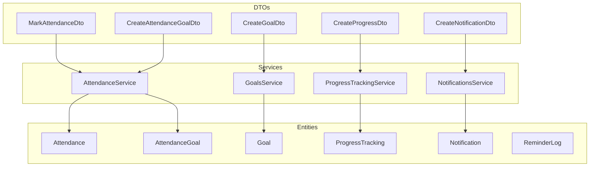
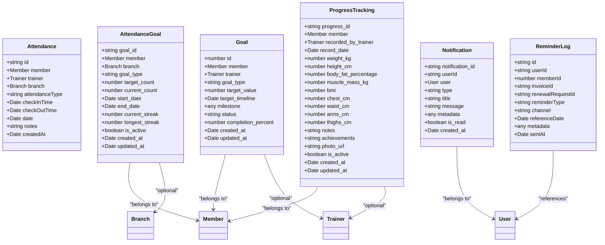
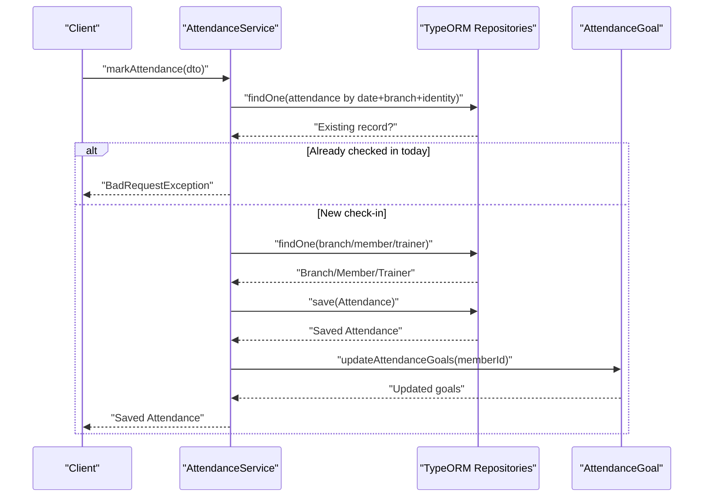
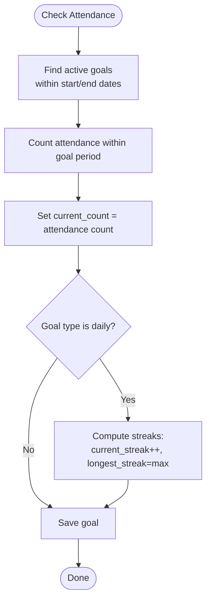
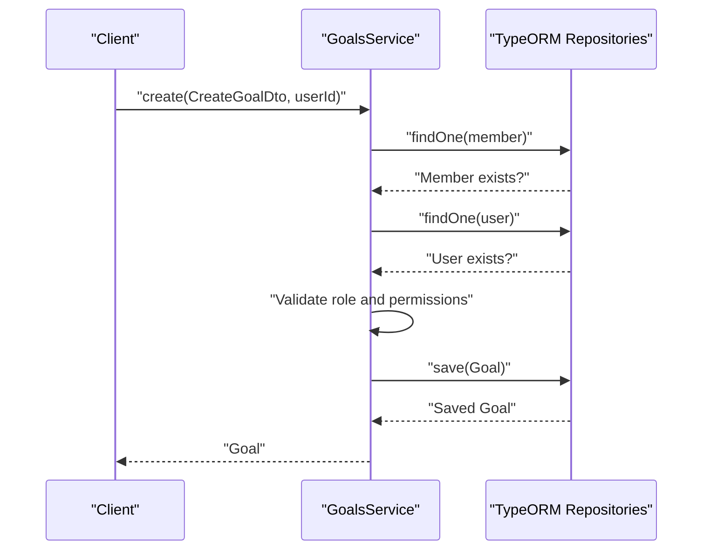
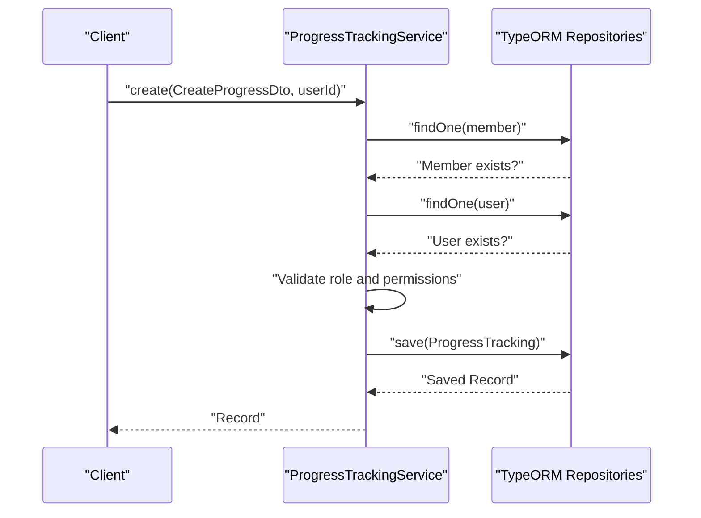
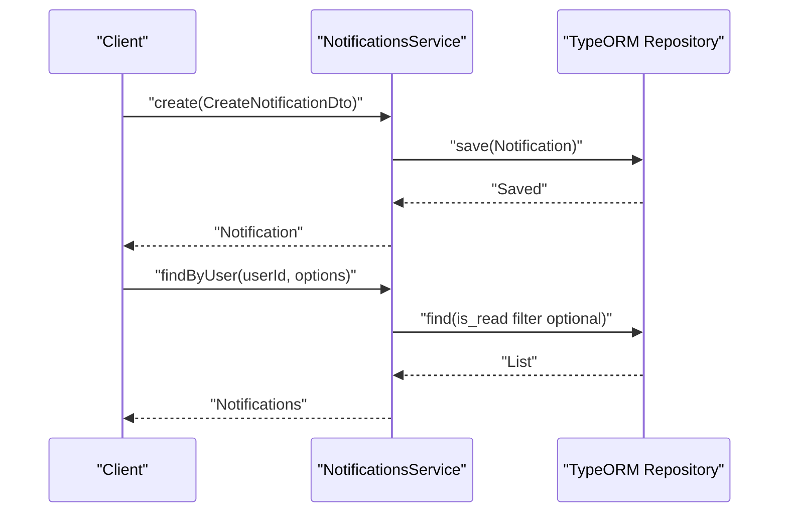
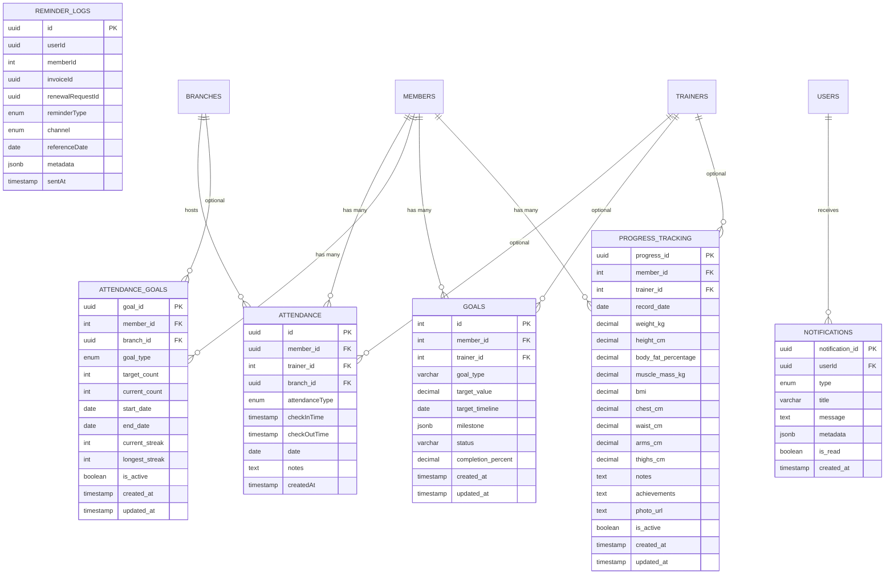

# Tracking & Monitoring Entities

<cite>
**Referenced Files in This Document**
- [attendance.entity.ts](file://src/entities/attendance.entity.ts)
- [attendance_goals.entity.ts](file://src/entities/attendance_goals.entity.ts)
- [goals.entity.ts](file://src/entities/goals.entity.ts)
- [progress_tracking.entity.ts](file://src/entities/progress_tracking.entity.ts)
- [notifications.entity.ts](file://src/entities/notifications.entity.ts)
- [reminder_logs.entity.ts](file://src/entities/reminder_logs.entity.ts)
- [mark-attendance.dto.ts](file://src/attendance/dto/mark-attendance.dto.ts)
- [create-attendance-goal.dto.ts](file://src/attendance/dto/create-attendance-goal.dto.ts)
- [create-goal.dto.ts](file://src/goals/dto/create-goal.dto.ts)
- [create-progress.dto.ts](file://src/progress-tracking/dto/create-progress.dto.ts)
- [create-notification.dto.ts](file://src/notifications/dto/create-notification.dto.ts)
- [attendance.service.ts](file://src/attendance/attendance.service.ts)
- [goals.service.ts](file://src/goals/goals.service.ts)
- [progress-tracking.service.ts](file://src/progress-tracking/progress-tracking.service.ts)
- [notifications.service.ts](file://src/notifications/notifications.service.ts)
</cite>

## Table of Contents
1. [Introduction](#introduction)
2. [Project Structure](#project-structure)
3. [Core Components](#core-components)
4. [Architecture Overview](#architecture-overview)
5. [Detailed Component Analysis](#detailed-component-analysis)
6. [Dependency Analysis](#dependency-analysis)
7. [Performance Considerations](#performance-considerations)
8. [Troubleshooting Guide](#troubleshooting-guide)
9. [Conclusion](#conclusion)
10. [Appendices](#appendices)

## Introduction
This document describes the data model and workflows for tracking and monitoring entities in the gym management system. It focuses on:
- Attendance tracking for members and trainers
- Attendance goals for setting and measuring participation targets
- General goals for health and fitness targets
- Progress tracking for physical measurements and milestones
- Notifications and reminders for communication workflows

It explains entity relationships, validation rules, business constraints, and data access patterns. It also outlines goal-setting frameworks, attendance workflows, progress measurement systems, and examples of complex queries for analytics and reporting.

## Project Structure
The tracking and monitoring domain spans several modules:
- Attendance module: attendance records, attendance goals, and monthly analytics
- Goals module: general goals for members
- Progress tracking module: body metrics and progress records
- Notifications module: in-app notifications and reminder logs
- Entities: strongly-typed persistence models with TypeORM decorators

**Diagram sources**
- [attendance.entity.ts:12-43](file://src/entities/attendance.entity.ts#L12-L43)
- [attendance_goals.entity.ts:12-54](file://src/entities/attendance_goals.entity.ts#L12-L54)
- [goals.entity.ts:12-46](file://src/entities/goals.entity.ts#L12-L46)
- [progress_tracking.entity.ts:12-72](file://src/entities/progress_tracking.entity.ts#L12-L72)
- [notifications.entity.ts:33-70](file://src/entities/notifications.entity.ts#L33-L70)
- [reminder_logs.entity.ts:20-57](file://src/entities/reminder_logs.entity.ts#L20-L57)
- [attendance.service.ts:17-30](file://src/attendance/attendance.service.ts#L17-L30)
- [goals.service.ts:15-26](file://src/goals/goals.service.ts#L15-L26)
- [progress-tracking.service.ts:15-26](file://src/progress-tracking/progress-tracking.service.ts#L15-L26)
- [notifications.service.ts:8-13](file://src/notifications/notifications.service.ts#L8-L13)

**Section sources**
- [attendance.entity.ts:12-43](file://src/entities/attendance.entity.ts#L12-L43)
- [attendance_goals.entity.ts:12-54](file://src/entities/attendance_goals.entity.ts#L12-L54)
- [goals.entity.ts:12-46](file://src/entities/goals.entity.ts#L12-L46)
- [progress_tracking.entity.ts:12-72](file://src/entities/progress_tracking.entity.ts#L12-L72)
- [notifications.entity.ts:33-70](file://src/entities/notifications.entity.ts#L33-L70)
- [reminder_logs.entity.ts:20-57](file://src/entities/reminder_logs.entity.ts#L20-L57)
- [attendance.service.ts:17-30](file://src/attendance/attendance.service.ts#L17-L30)
- [goals.service.ts:15-26](file://src/goals/goals.service.ts#L15-L26)
- [progress-tracking.service.ts:15-26](file://src/progress-tracking/progress-tracking.service.ts#L15-L26)
- [notifications.service.ts:8-13](file://src/notifications/notifications.service.ts#L8-L13)

## Core Components
This section documents the primary entities and their fields, constraints, and relationships.

### Attendance
Tracks check-in/check-out events for members and trainers at a branch on a given date.

Fields
- id: UUID, primary key
- member: ManyToOne to Member (nullable cascade on delete)
- trainer: ManyToOne to Trainer (nullable)
- branch: ManyToOne to Branch (required)
- attendanceType: Enum ['member','trainer']
- checkInTime: Timestamp (required)
- checkOutTime: Timestamp (nullable)
- date: Date (required)
- notes: Text (nullable)
- createdAt: Auto timestamp

Constraints
- A member/trainer can only check in once per date at a branch.
- Cascading deletion for member association.
- Required fields enforce presence of identity and timestamp.

Validation rules
- DTO enforces mutual exclusivity of member vs trainer identity and requires branchId.

**Section sources**
- [attendance.entity.ts:12-43](file://src/entities/attendance.entity.ts#L12-L43)
- [mark-attendance.dto.ts:10-34](file://src/attendance/dto/mark-attendance.dto.ts#L10-L34)

### AttendanceGoal
Sets and tracks attendance targets for members with daily/weekly/monthly cadence.

Fields
- goal_id: UUID, primary key
- member: ManyToOne to Member (with cascade on delete)
- branch: ManyToOne to Branch (nullable)
- goal_type: Enum ['daily','weekly','monthly']
- target_count: Integer (required)
- current_count: Integer (default 0)
- start_date: Date (required)
- end_date: Date (required)
- current_streak: Integer (default 0)
- longest_streak: Integer (default 0)
- is_active: Boolean (default true)
- created_at: Auto timestamp
- updated_at: Auto timestamp

Business constraints
- Active goals are evaluated during attendance marking.
- Daily goals increment streaks based on consecutive attendance.
- Counts are recalculated for active goals within the goal period.

**Section sources**
- [attendance_goals.entity.ts:12-54](file://src/entities/attendance_goals.entity.ts#L12-L54)
- [create-attendance-goal.dto.ts:11-55](file://src/attendance/dto/create-attendance-goal.dto.ts#L11-L55)
- [attendance.service.ts:344-393](file://src/attendance/attendance.service.ts#L344-L393)

### Goal
General-purpose goals for members (e.g., weight loss, endurance), optionally assigned to trainers.

Fields
- id: Number, primary key
- member: ManyToOne to Member (required, cascade delete)
- trainer: ManyToOne to Trainer (nullable)
- goal_type: String (length 100)
- target_value: Decimal (precision 10, scale 2, nullable)
- target_timeline: Date (nullable)
- milestone: JSONB (nullable)
- status: String (length 50, default 'active')
- completion_percent: Decimal (precision 5, scale 2, default 0)
- created_at: Auto timestamp
- updated_at: Auto timestamp

Validation rules
- DTO validates numeric ranges, optional fields, and allowed status values.

Permissions and access
- Creation/update/delete controlled by user role and member self-management flag.

**Section sources**
- [goals.entity.ts:12-46](file://src/entities/goals.entity.ts#L12-L46)
- [create-goal.dto.ts:4-80](file://src/goals/dto/create-goal.dto.ts#L4-L80)
- [goals.service.ts:28-104](file://src/goals/goals.service.ts#L28-L104)

### ProgressTracking
Records periodic physical measurements and progress notes for members.

Fields
- progress_id: UUID, primary key
- member: ManyToOne to Member (required, cascade delete)
- recorded_by_trainer: ManyToOne to Trainer (nullable)
- record_date: Date (required)
- weight_kg: Decimal (nullable)
- height_cm: Decimal (nullable)
- body_fat_percentage: Decimal (nullable)
- muscle_mass_kg: Decimal (nullable)
- bmi: Decimal (nullable)
- chest_cm: Decimal (nullable)
- waist_cm: Decimal (nullable)
- arms_cm: Decimal (nullable)
- thighs_cm: Decimal (nullable)
- notes: Text (nullable)
- achievements: Text (nullable)
- photo_url: Text (nullable)
- is_active: Boolean (default true)
- created_at: Auto timestamp
- updated_at: Auto timestamp

Validation rules
- DTO enforces numeric minima and optional fields.

Permissions and access
- Controlled by user role and member self-management flag.

**Section sources**
- [progress_tracking.entity.ts:12-72](file://src/entities/progress_tracking.entity.ts#L12-L72)
- [create-progress.dto.ts:11-94](file://src/progress-tracking/dto/create-progress.dto.ts#L11-L94)
- [progress-tracking.service.ts:28-109](file://src/progress-tracking/progress-tracking.service.ts#L28-L109)

### Notification
In-app notifications for users with categorized types and metadata.

Fields
- notification_id: UUID, primary key
- userId: UUID (foreign key to User)
- user: ManyToOne to User
- type: Enum (NotificationType)
- title: String (length 200)
- message: Text
- metadata: JSONB (nullable)
- is_read: Boolean (default false)
- created_at: Auto timestamp

Enums
- NotificationType includes goal, chart/training, diet, template, system, and reminder categories.

**Section sources**
- [notifications.entity.ts:33-70](file://src/entities/notifications.entity.ts#L33-L70)
- [create-notification.dto.ts:5-59](file://src/notifications/dto/create-notification.dto.ts#L5-L59)
- [notifications.service.ts:15-24](file://src/notifications/notifications.service.ts#L15-L24)

### ReminderLog
System reminder logs for subscription, payment, and renewal workflows.

Fields
- id: UUID, primary key
- userId: UUID
- memberId: Integer (nullable)
- invoiceId: UUID (nullable)
- renewalRequestId: UUID (nullable)
- reminderType: Enum (Subscription expiry, due payment, renewal invoice, renewal activated)
- channel: Enum (email, in_app)
- referenceDate: Date
- metadata: JSONB (nullable)
- sentAt: Auto timestamp

**Section sources**
- [reminder_logs.entity.ts:20-57](file://src/entities/reminder_logs.entity.ts#L20-L57)

## Architecture Overview
The tracking and monitoring system integrates entities, services, DTOs, and controllers to support:
- Attendance capture and goal updates
- Goal creation and lifecycle management
- Progress recording and retrieval
- Notification generation and delivery
- Reminder logging for operational workflows

**Diagram sources**
- [attendance.entity.ts:12-43](file://src/entities/attendance.entity.ts#L12-L43)
- [attendance_goals.entity.ts:12-54](file://src/entities/attendance_goals.entity.ts#L12-L54)
- [goals.entity.ts:12-46](file://src/entities/goals.entity.ts#L12-L46)
- [progress_tracking.entity.ts:12-72](file://src/entities/progress_tracking.entity.ts#L12-L72)
- [notifications.entity.ts:33-70](file://src/entities/notifications.entity.ts#L33-L70)
- [reminder_logs.entity.ts:20-57](file://src/entities/reminder_logs.entity.ts#L20-L57)

## Detailed Component Analysis

### Attendance Workflow
End-to-end flow for marking attendance, preventing duplicates, and updating attendance goals.

**Diagram sources**
- [attendance.service.ts:32-98](file://src/attendance/attendance.service.ts#L32-L98)
- [attendance.service.ts:344-393](file://src/attendance/attendance.service.ts#L344-L393)

Key behaviors
- Duplicate prevention per day per identity at a branch.
- Automatic goal updates when a member checks in.
- Validation via DTO ensures either member or trainer is present.

**Section sources**
- [attendance.service.ts:32-98](file://src/attendance/attendance.service.ts#L32-L98)
- [mark-attendance.dto.ts:10-34](file://src/attendance/dto/mark-attendance.dto.ts#L10-L34)

### Attendance Goals Framework
Daily/weekly/monthly goals with streak tracking and target enforcement.

**Diagram sources**
- [attendance.service.ts:344-393](file://src/attendance/attendance.service.ts#L344-L393)
- [attendance_goals.entity.ts:12-54](file://src/entities/attendance_goals.entity.ts#L12-L54)

Validation and constraints
- Target count must be positive.
- Goal period must be valid (start ≤ end).
- Streaks are maintained per daily goals.

**Section sources**
- [create-attendance-goal.dto.ts:11-55](file://src/attendance/dto/create-attendance-goal.dto.ts#L11-L55)
- [attendance_goals.entity.ts:12-54](file://src/entities/attendance_goals.entity.ts#L12-L54)

### Goals Lifecycle
Creation, permission checks, and CRUD operations for general goals.

**Diagram sources**
- [goals.service.ts:28-104](file://src/goals/goals.service.ts#L28-L104)
- [create-goal.dto.ts:4-80](file://src/goals/dto/create-goal.dto.ts#L4-L80)

Access control
- ADMIN, TRAINER, or MEMBER (if allowed) can create goals.
- Members can only manage goals if permitted by the member profile.
- Updates/deletes require ownership or assignment.

**Section sources**
- [goals.service.ts:28-104](file://src/goals/goals.service.ts#L28-L104)
- [create-goal.dto.ts:4-80](file://src/goals/dto/create-goal.dto.ts#L4-L80)

### Progress Tracking
Recording and retrieving progress with permission gating.

**Diagram sources**
- [progress-tracking.service.ts:28-109](file://src/progress-tracking/progress-tracking.service.ts#L28-L109)
- [create-progress.dto.ts:11-94](file://src/progress-tracking/dto/create-progress.dto.ts#L11-L94)

Validation and constraints
- All numeric measurements must be non-negative.
- Optional trainer can be assigned by ADMIN.

**Section sources**
- [progress-tracking.service.ts:28-109](file://src/progress-tracking/progress-tracking.service.ts#L28-L109)
- [create-progress.dto.ts:11-94](file://src/progress-tracking/dto/create-progress.dto.ts#L11-L94)

### Notifications and Reminders
Notification creation and filtering; reminder logs for system workflows.

**Diagram sources**
- [notifications.service.ts:15-39](file://src/notifications/notifications.service.ts#L15-L39)
- [create-notification.dto.ts:5-59](file://src/notifications/dto/create-notification.dto.ts#L5-L59)

Notification types
- Goal progress/completion/missed and milestone events
- Chart/training assignment/shared
- Diet plan assignment
- Template feedback requests
- System and reminder notifications

Reminder logs
- Track sent reminders with channels and metadata for subscription, payment, and renewal workflows.

**Section sources**
- [notifications.entity.ts:33-70](file://src/entities/notifications.entity.ts#L33-L70)
- [reminder_logs.entity.ts:20-57](file://src/entities/reminder_logs.entity.ts#L20-L57)
- [notifications.service.ts:96-190](file://src/notifications/notifications.service.ts#L96-L190)

## Dependency Analysis
Relationships and referential integrity:
- Attendance belongs to Member/Trainer/Branch; cascading deletes for member.
- AttendanceGoal belongs to Member/Branch; cascading deletes for member.
- Goal belongs to Member/Trainer; cascading deletes for member.
- ProgressTracking belongs to Member/Trainer; cascading deletes for member.
- Notification belongs to User; metadata stores contextual references.
- ReminderLog references User and optional related entities.

**Diagram sources**
- [attendance.entity.ts:12-43](file://src/entities/attendance.entity.ts#L12-L43)
- [attendance_goals.entity.ts:12-54](file://src/entities/attendance_goals.entity.ts#L12-L54)
- [goals.entity.ts:12-46](file://src/entities/goals.entity.ts#L12-L46)
- [progress_tracking.entity.ts:12-72](file://src/entities/progress_tracking.entity.ts#L12-L72)
- [notifications.entity.ts:33-70](file://src/entities/notifications.entity.ts#L33-L70)
- [reminder_logs.entity.ts:20-57](file://src/entities/reminder_logs.entity.ts#L20-L57)

**Section sources**
- [attendance.entity.ts:12-43](file://src/entities/attendance.entity.ts#L12-L43)
- [attendance_goals.entity.ts:12-54](file://src/entities/attendance_goals.entity.ts#L12-L54)
- [goals.entity.ts:12-46](file://src/entities/goals.entity.ts#L12-L46)
- [progress_tracking.entity.ts:12-72](file://src/entities/progress_tracking.entity.ts#L12-L72)
- [notifications.entity.ts:33-70](file://src/entities/notifications.entity.ts#L33-L70)
- [reminder_logs.entity.ts:20-57](file://src/entities/reminder_logs.entity.ts#L20-L57)

## Performance Considerations
- Indexing recommendations
  - Attendance: composite index on (date, branchId, memberId/trainerId) to optimize daily check-in uniqueness and queries.
  - AttendanceGoal: indexes on (member_id, is_active, start_date, end_date) for goal evaluation.
  - Goal: indexes on (member_id, status, trainer_id) for filtering.
  - ProgressTracking: index on (member_id, record_date) for chronological retrieval.
  - Notification: index on (userId, is_read, created_at) for unread counts and paginated lists.
- Aggregation queries
  - Use database-level aggregation for monthly attendance calendars and streak computations to avoid client-side loops.
- Caching
  - Frequently accessed dashboards (e.g., recent progress, unread notifications) can benefit from short-lived caches keyed by user/member.

## Troubleshooting Guide
Common issues and resolutions:
- Duplicate check-in on the same day
  - Symptom: Bad request when attempting to check in again on the same date.
  - Resolution: Ensure checkout occurs or wait until the next day; verify branch and identity pairing.
- Member not found during attendance
  - Symptom: Not found error when checking in.
  - Resolution: Confirm member ID and branch ID are valid and match the intended identity.
- Goal creation permission denied
  - Symptom: Forbidden error when creating goals.
  - Resolution: Verify user role and member self-management flag; ensure trainer assignment when applicable.
- Progress record permission denied
  - Symptom: Forbidden error when creating/updating progress records.
  - Resolution: Confirm user role and member self-management flag; ensure trainer assignment if editing by ADMIN.
- Notification ownership errors
  - Symptom: Not found when marking as read or deleting.
  - Resolution: Ensure the notification belongs to the requesting user.

**Section sources**
- [attendance.service.ts:32-98](file://src/attendance/attendance.service.ts#L32-L98)
- [goals.service.ts:124-180](file://src/goals/goals.service.ts#L124-L180)
- [progress-tracking.service.ts:131-196](file://src/progress-tracking/progress-tracking.service.ts#L131-L196)
- [notifications.service.ts:45-86](file://src/notifications/notifications.service.ts#L45-L86)

## Conclusion
The tracking and monitoring system provides robust models for attendance, goal setting, progress measurement, and communication. Entities are designed with clear referential integrity and validation rules enforced at both the DTO and service layers. Workflows integrate seamlessly to support real-time updates (e.g., goal streaks on check-in) and scalable analytics (e.g., monthly calendars, unread counts).

## Appendices

### Data Access Patterns and Examples
Below are example queries for analytics and reporting. Replace placeholders with actual IDs and dates.

- Attendance analytics
  - Monthly attendance calendar for a member
    - Query: Select distinct dates and check-in times for a member within a month; compute attended days and totals.
    - Reference: [attendance.service.ts:214-273](file://src/attendance/attendance.service.ts#L214-L273)
  - Current and longest streaks for a member
    - Query: Iterate last 90 days and compute current streak; track longest streak across sequences.
    - Reference: [attendance.service.ts:275-342](file://src/attendance/attendance.service.ts#L275-L342)

- Goal achievement tracking
  - Active goals for a member within a period
    - Query: Filter goals by member, active flag, and date range; compute completion percent and streaks.
    - Reference: [attendance.service.ts:344-393](file://src/attendance/attendance.service.ts#L344-L393)
  - Unread notifications by user
    - Query: Count and list unread notifications for a user ordered by creation time.
    - Reference: [notifications.service.ts:26-39](file://src/notifications/notifications.service.ts#L26-L39), [notifications.service.ts:88-92](file://src/notifications/notifications.service.ts#L88-L92)

- Engagement tracking
  - Recent progress records for a member
    - Query: Retrieve progress records ordered by record date descending.
    - Reference: [progress-tracking.service.ts:246-260](file://src/progress-tracking/progress-tracking.service.ts#L246-L260)

- Notification delivery
  - Goal progress/completion/missed notifications
    - Methods: sendGoalProgressNotification, sendGoalCompletedNotification, sendGoalMissedNotification
    - Reference: [notifications.service.ts:96-124](file://src/notifications/notifications.service.ts#L96-L124)
  - Milestone notifications
    - Methods: sendMilestoneCompleteNotification, sendMilestoneMissedNotification
    - Reference: [notifications.service.ts:126-144](file://src/notifications/notifications.service.ts#L126-L144)