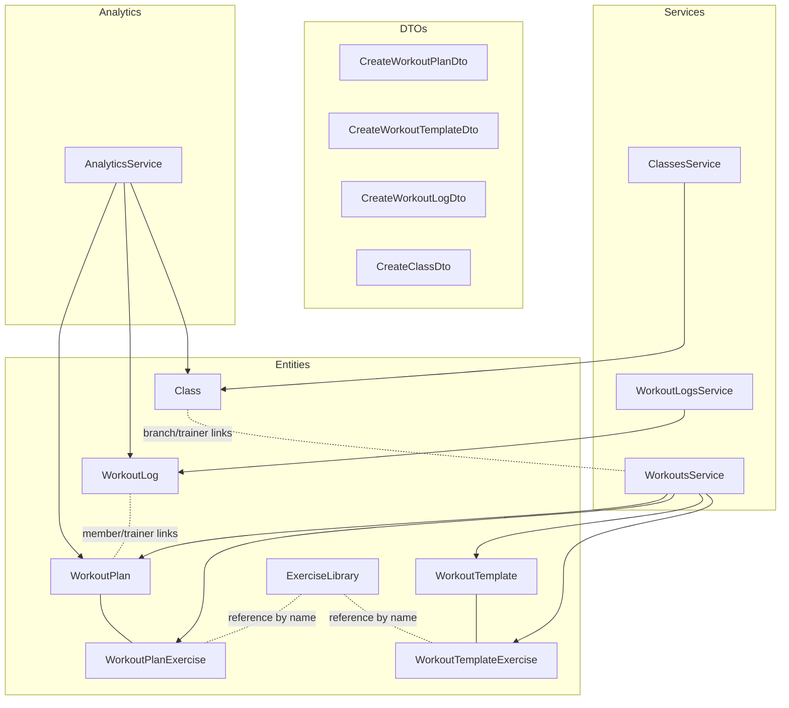
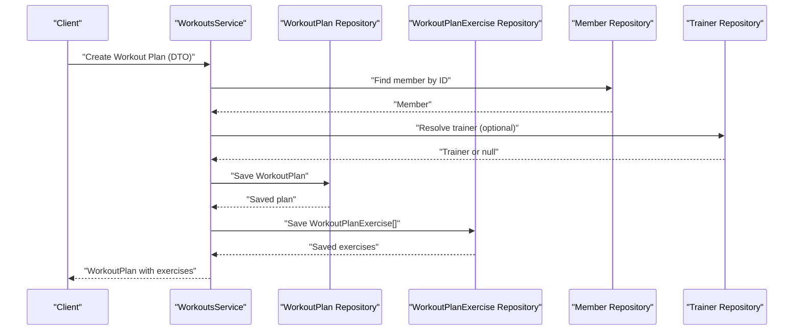
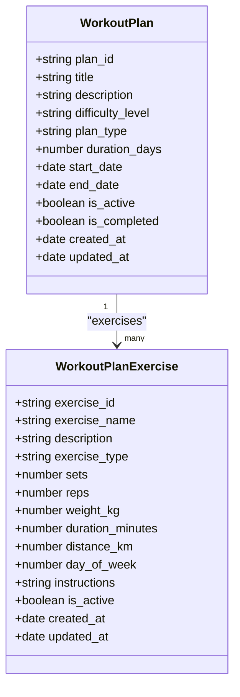
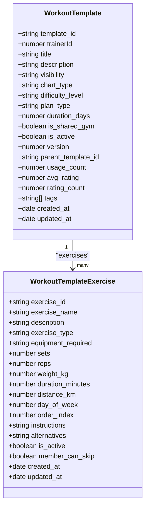
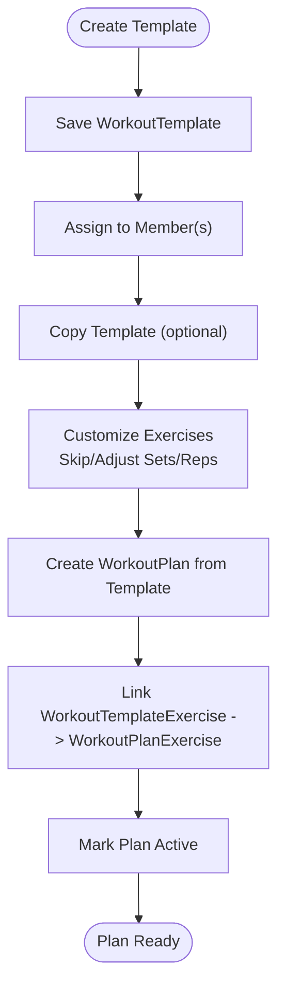
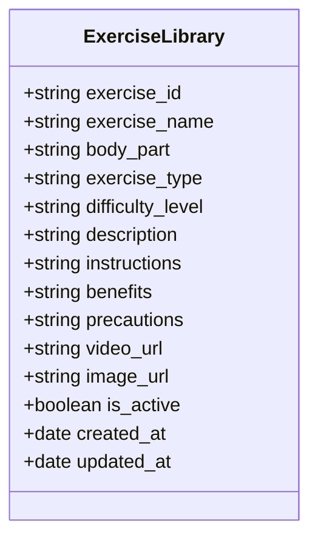
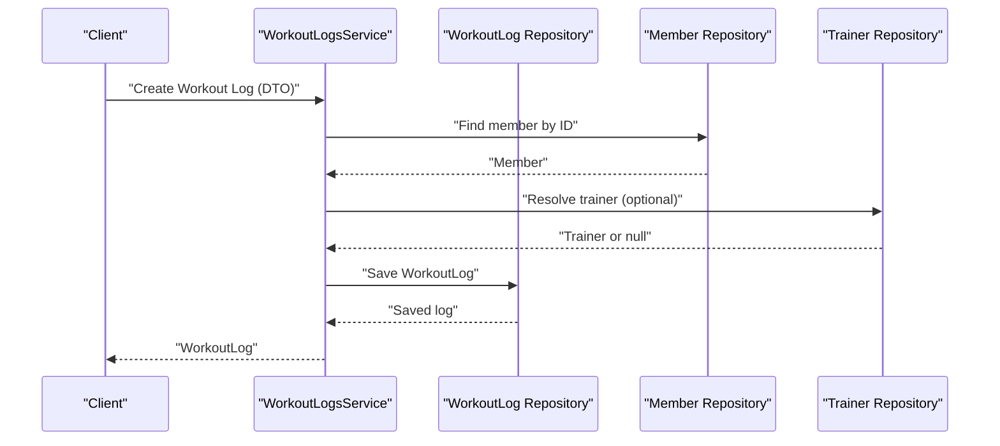
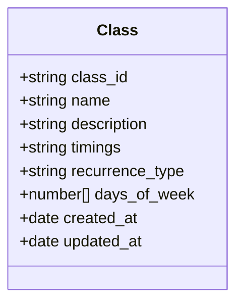
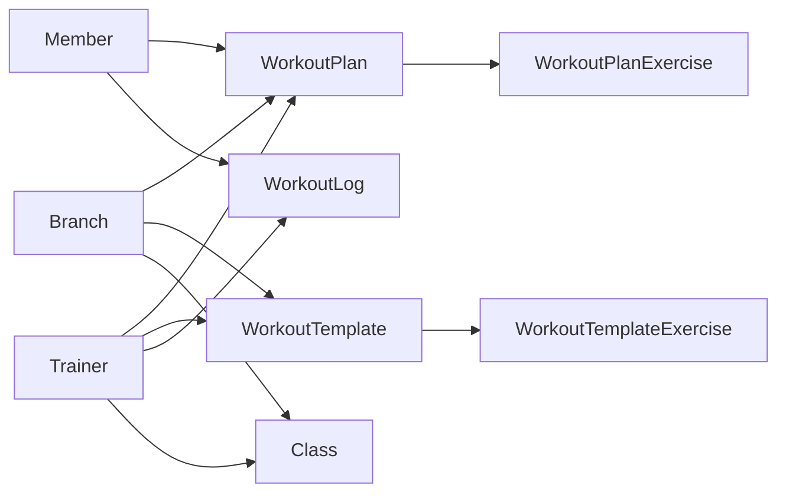
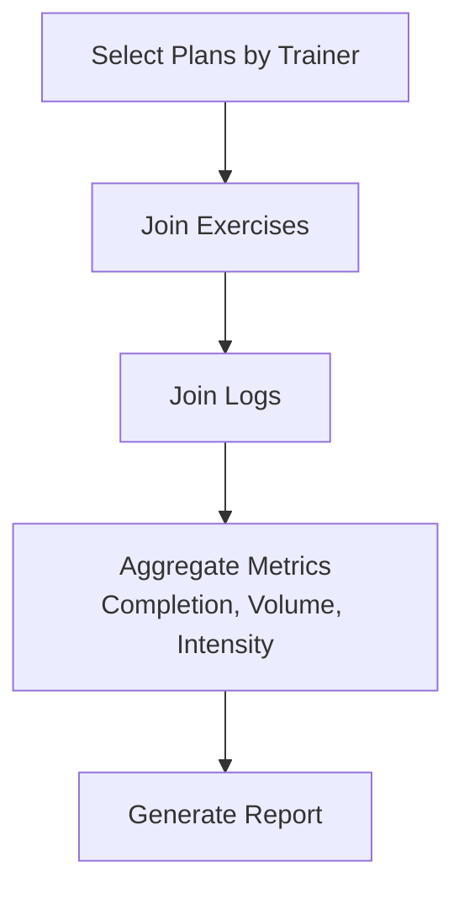

# Training Program Entities

<cite>
**Referenced Files in This Document**
- [workout_plans.entity.ts](file://src/entities/workout_plans.entity.ts)
- [workout_templates.entity.ts](file://src/entities/workout_templates.entity.ts)
- [workout_plan_exercises.entity.ts](file://src/entities/workout_plan_exercises.entity.ts)
- [workout_template_exercises.entity.ts](file://src/entities/workout_template_exercises.entity.ts)
- [exercise_library.entity.ts](file://src/entities/exercise_library.entity.ts)
- [workout_logs.entity.ts](file://src/entities/workout_logs.entity.ts)
- [classes.entity.ts](file://src/entities/classes.entity.ts)
- [create-workout-plan.dto.ts](file://src/workouts/dto/create-workout-plan.dto.ts)
- [create-workout-template.dto.ts](file://src/workouts/dto/create-workout-template.dto.ts)
- [create-workout-log.dto.ts](file://src/workout-logs/dto/create-workout-log.dto.ts)
- [create-class.dto.ts](file://src/classes/dto/create-class.dto.ts)
- [workouts.service.ts](file://src/workouts/workouts.service.ts)
- [workout-logs.service.ts](file://src/workout-logs/workout-logs.service.ts)
- [classes.service.ts](file://src/classes/classes.service.ts)
- [analytics.service.ts](file://src/analytics/analytics.service.ts)
</cite>

## Table of Contents
1. [Introduction](#introduction)
2. [Project Structure](#project-structure)
3. [Core Components](#core-components)
4. [Architecture Overview](#architecture-overview)
5. [Detailed Component Analysis](#detailed-component-analysis)
6. [Dependency Analysis](#dependency-analysis)
7. [Performance Considerations](#performance-considerations)
8. [Troubleshooting Guide](#troubleshooting-guide)
9. [Conclusion](#conclusion)
10. [Appendices](#appendices)

## Introduction
This document provides comprehensive data model documentation for training program entities. It covers:
- Individual member training programs (WorkoutPlans)
- Reusable training blueprints (WorkoutTemplates)
- Exercise assignments within plans (WorkoutPlanExercises)
- Standardized exercise library (ExerciseLibrary)
- Exercise completion and performance tracking (WorkoutLogs)
- Group training sessions (Classes)

It explains field definitions, validation rules, business constraints, relationships, and data access patterns. It also outlines template-to-plan inheritance mechanisms, exercise assignment workflows, and analytics queries for reports and trainer workload analysis.

## Project Structure
The training program domain spans entities, DTOs, services, and analytics. Entities define the schema; DTOs enforce validation; services encapsulate business logic; analytics aggregates data across entities.

**Diagram sources**
- [workout_plans.entity.ts:15-72](file://src/entities/workout_plans.entity.ts#L15-L72)
- [workout_plan_exercises.entity.ts:11-59](file://src/entities/workout_plan_exercises.entity.ts#L11-L59)
- [workout_templates.entity.ts:41-125](file://src/entities/workout_templates.entity.ts#L41-L125)
- [workout_template_exercises.entity.ts:23-90](file://src/entities/workout_template_exercises.entity.ts#L23-L90)
- [exercise_library.entity.ts:9-58](file://src/entities/exercise_library.entity.ts#L9-L58)
- [workout_logs.entity.ts:12-49](file://src/entities/workout_logs.entity.ts#L12-L49)
- [classes.entity.ts:5-39](file://src/entities/classes.entity.ts#L5-L39)
- [create-workout-plan.dto.ts:77-144](file://src/workouts/dto/create-workout-plan.dto.ts#L77-L144)
- [create-workout-template.dto.ts:99-151](file://src/workouts/dto/create-workout-template.dto.ts#L99-L151)
- [create-workout-log.dto.ts:10-79](file://src/workout-logs/dto/create-workout-log.dto.ts#L10-L79)
- [create-class.dto.ts:14-73](file://src/classes/dto/create-class.dto.ts#L14-L73)
- [workouts.service.ts:17-280](file://src/workouts/workouts.service.ts#L17-L280)
- [workout-logs.service.ts:15-282](file://src/workout-logs/workout-logs.service.ts#L15-L282)
- [classes.service.ts:11-211](file://src/classes/classes.service.ts#L11-L211)
- [analytics.service.ts:21-647](file://src/analytics/analytics.service.ts#L21-L647)

**Section sources**
- [workout_plans.entity.ts:15-72](file://src/entities/workout_plans.entity.ts#L15-L72)
- [workout_templates.entity.ts:41-125](file://src/entities/workout_templates.entity.ts#L41-L125)
- [workout_plan_exercises.entity.ts:11-59](file://src/entities/workout_plan_exercises.entity.ts#L11-L59)
- [workout_template_exercises.entity.ts:23-90](file://src/entities/workout_template_exercises.entity.ts#L23-L90)
- [exercise_library.entity.ts:9-58](file://src/entities/exercise_library.entity.ts#L9-L58)
- [workout_logs.entity.ts:12-49](file://src/entities/workout_logs.entity.ts#L12-L49)
- [classes.entity.ts:5-39](file://src/entities/classes.entity.ts#L5-L39)
- [create-workout-plan.dto.ts:77-144](file://src/workouts/dto/create-workout-plan.dto.ts#L77-L144)
- [create-workout-template.dto.ts:99-151](file://src/workouts/dto/create-workout-template.dto.ts#L99-L151)
- [create-workout-log.dto.ts:10-79](file://src/workout-logs/dto/create-workout-log.dto.ts#L10-L79)
- [create-class.dto.ts:14-73](file://src/classes/dto/create-class.dto.ts#L14-L73)
- [workouts.service.ts:17-280](file://src/workouts/workouts.service.ts#L17-L280)
- [workout-logs.service.ts:15-282](file://src/workout-logs/workout-logs.service.ts#L15-L282)
- [classes.service.ts:11-211](file://src/classes/classes.service.ts#L11-L211)
- [analytics.service.ts:21-647](file://src/analytics/analytics.service.ts#L21-L647)

## Core Components
This section defines each entity, its fields, constraints, and relationships.

- WorkoutPlan
  - Purpose: Stores individual member training programs.
  - Key fields: plan_id (UUID), member (ManyToOne), assigned_by_trainer (ManyToOne), branch (ManyToOne), title, description, difficulty_level, plan_type, duration_days, start_date, end_date, is_active, is_completed, notes, created_at, updated_at.
  - Constraints: Cascading delete via member relationship; enums for difficulty_level and plan_type; date range enforced by start_date and end_date; is_active and is_completed booleans.
  - Relationships: OneToMany with WorkoutPlanExercise; ManyToOne with Member, Trainer, Branch.

- WorkoutPlanExercise
  - Purpose: Stores exercise assignments within a WorkoutPlan.
  - Key fields: exercise_id (UUID), workoutPlan (ManyToOne), exercise_name, description, exercise_type (enum: sets_reps/time/distance), sets, reps, weight_kg, duration_minutes, distance_km, day_of_week, instructions, is_active, created_at, updated_at.
  - Constraints: Numeric fields validated with minimums; day_of_week defaults to 1; is_active default true.
  - Relationships: ManyToOne with WorkoutPlan.

- WorkoutTemplate
  - Purpose: Stores reusable training blueprints.
  - Key fields: template_id (UUID), trainerId, trainer (ManyToOne), branch (ManyToOne), title, description, visibility (enum: PRIVATE/GYM_PUBLIC), chart_type (enum), difficulty_level (enum), plan_type (enum), duration_days, is_shared_gym, is_active, version, parent_template_id (UUID), usage_count, avg_rating, rating_count, notes, tags (JSON array), created_at, updated_at.
  - Constraints: Defaults for visibility, plan_type, version, usage_count, rating_count; optional parent_template_id enables template inheritance.
  - Relationships: OneToMany with WorkoutTemplateExercise; ManyToOne with Trainer, Branch.

- WorkoutTemplateExercise
  - Purpose: Stores exercise entries within a WorkoutTemplate.
  - Key fields: exercise_id (UUID), template (ManyToOne), exercise_name, description, exercise_type (enum), equipment_required (enum), sets, reps, weight_kg, duration_minutes, distance_km, day_of_week, order_index, instructions, alternatives, is_active, member_can_skip, created_at, updated_at.
  - Constraints: Numeric validations; equipment_required enum; order_index optional; member_can_skip default false.
  - Relationships: ManyToOne with WorkoutTemplate.

- ExerciseLibrary
  - Purpose: Centralized repository of standardized exercises with metadata.
  - Key fields: exercise_id (UUID), exercise_name, body_part (enum), exercise_type (enum), difficulty_level (enum), description, instructions, benefits, precautions, video_url, image_url, is_active, created_at, updated_at.
  - Constraints: is_active default true; enums for categorization.
  - Relationships: None.

- WorkoutLog
  - Purpose: Tracks exercise completion and performance for individuals.
  - Key fields: id (autoincrement), member (ManyToOne), trainer (ManyToOne), exercise_name, sets, reps, weight, duration, notes, date, created_at, updated_at.
  - Constraints: Numeric validations; date required; member/trainer relationships with cascade delete for member.
  - Relationships: ManyToOne with Member, Trainer.

- Class
  - Purpose: Defines group training sessions.
  - Key fields: class_id (UUID), branch (ManyToOne), trainer (ManyToOne), name, description, timings (enum), recurrence_type (enum), days_of_week (array), created_at, updated_at.
  - Constraints: Optional trainer; recurrence fields support daily/weekly/monthly schedules with days_of_week arrays.
  - Relationships: ManyToOne with Branch, Trainer.

**Section sources**
- [workout_plans.entity.ts:15-72](file://src/entities/workout_plans.entity.ts#L15-L72)
- [workout_plan_exercises.entity.ts:11-59](file://src/entities/workout_plan_exercises.entity.ts#L11-L59)
- [workout_templates.entity.ts:41-125](file://src/entities/workout_templates.entity.ts#L41-L125)
- [workout_template_exercises.entity.ts:23-90](file://src/entities/workout_template_exercises.entity.ts#L23-L90)
- [exercise_library.entity.ts:9-58](file://src/entities/exercise_library.entity.ts#L9-L58)
- [workout_logs.entity.ts:12-49](file://src/entities/workout_logs.entity.ts#L12-L49)
- [classes.entity.ts:5-39](file://src/entities/classes.entity.ts#L5-L39)

## Architecture Overview
The training program architecture centers around four core workflows:
- Template creation and sharing
- Plan generation from templates
- Exercise assignment and tracking
- Group session scheduling

**Diagram sources**
- [workouts.service.ts:31-125](file://src/workouts/workouts.service.ts#L31-L125)
- [workout_plans.entity.ts:15-72](file://src/entities/workout_plans.entity.ts#L15-L72)
- [workout_plan_exercises.entity.ts:11-59](file://src/entities/workout_plan_exercises.entity.ts#L11-L59)
- [create-workout-plan.dto.ts:77-144](file://src/workouts/dto/create-workout-plan.dto.ts#L77-L144)

**Section sources**
- [workouts.service.ts:31-125](file://src/workouts/workouts.service.ts#L31-L125)
- [create-workout-plan.dto.ts:77-144](file://src/workouts/dto/create-workout-plan.dto.ts#L77-L144)

## Detailed Component Analysis

### WorkoutPlan and WorkoutPlanExercise
- Data model
  - WorkoutPlan holds plan metadata and lifecycle flags; cascades deletes with member.
  - WorkoutPlanExercise embeds exercise details and scheduling info; linked to a plan.
- Validation rules
  - DTO enforces non-empty strings, enums, numeric ranges, and date constraints.
- Business constraints
  - Plans are owned by members; optional trainer assignment; active/completed flags; duration bounds via start/end dates.
- Access patterns
  - Services support CRUD, filtering by member/user, and relation loading.

**Diagram sources**
- [workout_plans.entity.ts:15-72](file://src/entities/workout_plans.entity.ts#L15-L72)
- [workout_plan_exercises.entity.ts:11-59](file://src/entities/workout_plan_exercises.entity.ts#L11-L59)

**Section sources**
- [workout_plans.entity.ts:15-72](file://src/entities/workout_plans.entity.ts#L15-L72)
- [workout_plan_exercises.entity.ts:11-59](file://src/entities/workout_plan_exercises.entity.ts#L11-L59)
- [create-workout-plan.dto.ts:77-144](file://src/workouts/dto/create-workout-plan.dto.ts#L77-L144)
- [workouts.service.ts:127-142](file://src/workouts/workouts.service.ts#L127-L142)

### WorkoutTemplate and WorkoutTemplateExercise
- Data model
  - WorkoutTemplate stores blueprint metadata, visibility, ratings, and optional parent_template_id for inheritance.
  - WorkoutTemplateExercise captures exercise specs and scheduling within templates.
- Validation rules
  - DTOs enforce enums, numeric minima, optional fields, and nested arrays.
- Business constraints
  - Visibility supports PRIVATE vs GYM_PUBLIC; optional equipment requirement; order_index for sequencing; member_can_skip flag.
- Access patterns
  - Services handle creation, updates, copying, rating, and filtering templates.

**Diagram sources**
- [workout_templates.entity.ts:41-125](file://src/entities/workout_templates.entity.ts#L41-L125)
- [workout_template_exercises.entity.ts:23-90](file://src/entities/workout_template_exercises.entity.ts#L23-L90)

**Section sources**
- [workout_templates.entity.ts:41-125](file://src/entities/workout_templates.entity.ts#L41-L125)
- [workout_template_exercises.entity.ts:23-90](file://src/entities/workout_template_exercises.entity.ts#L23-L90)
- [create-workout-template.dto.ts:99-151](file://src/workouts/dto/create-workout-template.dto.ts#L99-L151)
- [workouts.service.ts:17-280](file://src/workouts/workouts.service.ts#L17-L280)

### Template-to-Plan Inheritance Mechanism
- Parent-child relationship
  - WorkoutTemplate supports parent_template_id enabling inheritance; version increments and usage_count track reuse.
- Assignment workflow
  - Templates can be copied and customized for members; assignment DTOs allow overriding dates and skipping exercises.
- Practical implications
  - Shared templates (is_shared_gym) propagate across branches; private templates remain trainer-scoped.

**Diagram sources**
- [workout_templates.entity.ts:41-125](file://src/entities/workout_templates.entity.ts#L41-L125)
- [workout_template_exercises.entity.ts:23-90](file://src/entities/workout_template_exercises.entity.ts#L23-L90)
- [workout_plans.entity.ts:15-72](file://src/entities/workout_plans.entity.ts#L15-L72)
- [workout_plan_exercises.entity.ts:11-59](file://src/entities/workout_plan_exercises.entity.ts#L11-L59)
- [create-workout-template.dto.ts:247-271](file://src/workouts/dto/create-workout-template.dto.ts#L247-L271)

**Section sources**
- [workout_templates.entity.ts:41-125](file://src/entities/workout_templates.entity.ts#L41-L125)
- [create-workout-template.dto.ts:247-271](file://src/workouts/dto/create-workout-template.dto.ts#L247-L271)
- [workouts.service.ts:17-280](file://src/workouts/workouts.service.ts#L17-L280)

### Exercise Library
- Data model
  - ExerciseLibrary centralizes standardized exercises with metadata for body parts, types, difficulty, and media assets.
- Usage
  - Exercise names in plans/templates serve as references; services can validate against library entries.

**Diagram sources**
- [exercise_library.entity.ts:9-58](file://src/entities/exercise_library.entity.ts#L9-L58)

**Section sources**
- [exercise_library.entity.ts:9-58](file://src/entities/exercise_library.entity.ts#L9-L58)

### WorkoutLogs
- Data model
  - WorkoutLog records exercise performance with optional trainer attribution and member linkage.
- Validation rules
  - DTO enforces numeric minima and date formatting.
- Access patterns
  - Services support CRUD, filtering by member/user, and trainer-scoped views.

**Diagram sources**
- [workout-logs.service.ts:28-104](file://src/workout-logs/workout-logs.service.ts#L28-L104)
- [workout_logs.entity.ts:12-49](file://src/entities/workout_logs.entity.ts#L12-L49)
- [create-workout-log.dto.ts:10-79](file://src/workout-logs/dto/create-workout-log.dto.ts#L10-L79)

**Section sources**
- [workout-logs.service.ts:28-104](file://src/workout-logs/workout-logs.service.ts#L28-L104)
- [create-workout-log.dto.ts:10-79](file://src/workout-logs/dto/create-workout-log.dto.ts#L10-L79)

### Classes
- Data model
  - Class defines group sessions with branch/trainer linkage, timing preferences, and recurrence rules.
- Validation rules
  - DTO enforces enums, arrays, and optional fields.
- Access patterns
  - Services support CRUD, filtering by branch/timing/day, and trainer association.

**Diagram sources**
- [classes.entity.ts:5-39](file://src/entities/classes.entity.ts#L5-L39)

**Section sources**
- [classes.entity.ts:5-39](file://src/entities/classes.entity.ts#L5-L39)
- [create-class.dto.ts:14-73](file://src/classes/dto/create-class.dto.ts#L14-L73)
- [classes.service.ts:24-65](file://src/classes/classes.service.ts#L24-L65)

## Dependency Analysis
- Internal dependencies
  - WorkoutPlan depends on Member, Trainer, Branch; OneToMany with WorkoutPlanExercise.
  - WorkoutTemplate depends on Trainer, Branch; OneToMany with WorkoutTemplateExercise.
  - WorkoutPlanExercise and WorkoutTemplateExercise depend on their respective parent entities.
  - WorkoutLog depends on Member, Trainer.
  - Class depends on Branch, Trainer.
- External dependencies
  - Services use repositories for persistence and enforce role-based access controls.

**Diagram sources**
- [workout_plans.entity.ts:15-72](file://src/entities/workout_plans.entity.ts#L15-L72)
- [workout_plan_exercises.entity.ts:11-59](file://src/entities/workout_plan_exercises.entity.ts#L11-L59)
- [workout_templates.entity.ts:41-125](file://src/entities/workout_templates.entity.ts#L41-L125)
- [workout_template_exercises.entity.ts:23-90](file://src/entities/workout_template_exercises.entity.ts#L23-L90)
- [workout_logs.entity.ts:12-49](file://src/entities/workout_logs.entity.ts#L12-L49)
- [classes.entity.ts:5-39](file://src/entities/classes.entity.ts#L5-L39)

**Section sources**
- [workout_plans.entity.ts:15-72](file://src/entities/workout_plans.entity.ts#L15-L72)
- [workout_templates.entity.ts:41-125](file://src/entities/workout_templates.entity.ts#L41-L125)
- [workout_logs.entity.ts:12-49](file://src/entities/workout_logs.entity.ts#L12-L49)
- [classes.entity.ts:5-39](file://src/entities/classes.entity.ts#L5-L39)

## Performance Considerations
- Indexing recommendations
  - Add indexes on member_id, trainer_id, branch_id, plan_id, template_id, exercise_name, date for frequent joins and filters.
- Query optimization
  - Use select-only projections for listing endpoints; load relations conditionally.
  - Prefer batch inserts for exercise assignments during plan creation.
- Pagination
  - Apply pagination in template and log listings to avoid large result sets.

## Troubleshooting Guide
- Common errors and resolutions
  - Not Found: Member/Trainer/Class/Plan/Log missing by ID triggers NotFoundException; ensure foreign keys exist.
  - Forbidden: Role checks restrict access; ADMIN can manage all; TRAINER can manage assigned items; MEMBER can manage self if permitted.
  - Validation failures: DTOs enforce enums, numeric minima, and required fields; adjust inputs accordingly.
- Audit and diagnostics
  - Services log user actions and role checks; verify user role and trainer/member associations.

**Section sources**
- [workouts.service.ts:32-56](file://src/workouts/workouts.service.ts#L32-L56)
- [workout-logs.service.ts:28-68](file://src/workout-logs/workout-logs.service.ts#L28-L68)
- [classes.service.ts:24-32](file://src/classes/classes.service.ts#L24-L32)

## Conclusion
The training program entities form a cohesive domain supporting individualized and shared workout experiences. WorkoutTemplates enable scalable blueprint reuse, while WorkoutPlans capture personalized execution. ExerciseLibrary ensures consistent exercise metadata, and WorkoutLogs track performance. Classes coordinate group sessions. Services enforce business rules and access control, while analytics aggregates insights across the system.

## Appendices

### Field Definitions and Validation Rules
- WorkoutPlan
  - Fields: plan_id, member_id, trainer_id, branch_id, title, description, difficulty_level, plan_type, duration_days, start_date, end_date, is_active, is_completed, notes, created_at, updated_at.
  - Enums: difficulty_level, plan_type.
  - Constraints: Dates; numeric validations; cascade delete on member.
- WorkoutPlanExercise
  - Fields: exercise_id, plan_id, exercise_name, description, exercise_type, sets, reps, weight_kg, duration_minutes, distance_km, day_of_week, instructions, is_active, created_at, updated_at.
  - Enums: exercise_type.
  - Constraints: Numeric minima; day_of_week default 1; is_active default true.
- WorkoutTemplate
  - Fields: template_id, trainerId, trainer_id, branch_id, title, description, visibility, chart_type, difficulty_level, plan_type, duration_days, is_shared_gym, is_active, version, parent_template_id, usage_count, avg_rating, rating_count, notes, tags, created_at, updated_at.
  - Enums: visibility, chart_type, difficulty_level, plan_type.
  - Constraints: Defaults; optional parent_template_id; JSON tags.
- WorkoutTemplateExercise
  - Fields: exercise_id, template_id, exercise_name, description, exercise_type, equipment_required, sets, reps, weight_kg, duration_minutes, distance_km, day_of_week, order_index, instructions, alternatives, is_active, member_can_skip, created_at, updated_at.
  - Enums: exercise_type, equipment_required.
  - Constraints: Numeric minima; order_index optional; member_can_skip default false.
- ExerciseLibrary
  - Fields: exercise_id, exercise_name, body_part, exercise_type, difficulty_level, description, instructions, benefits, precautions, video_url, image_url, is_active, created_at, updated_at.
  - Enums: body_part, exercise_type, difficulty_level.
  - Constraints: is_active default true.
- WorkoutLog
  - Fields: id, member_id, trainer_id, exercise_name, sets, reps, weight, duration, notes, date, created_at, updated_at.
  - Constraints: Numeric minima; date required; cascade delete on member.
- Class
  - Fields: class_id, branch_id, trainer_id, name, description, timings, recurrence_type, days_of_week, created_at, updated_at.
  - Enums: timings, recurrence_type.
  - Constraints: Optional trainer; days_of_week array.

**Section sources**
- [workout_plans.entity.ts:15-72](file://src/entities/workout_plans.entity.ts#L15-L72)
- [workout_plan_exercises.entity.ts:11-59](file://src/entities/workout_plan_exercises.entity.ts#L11-L59)
- [workout_templates.entity.ts:41-125](file://src/entities/workout_templates.entity.ts#L41-L125)
- [workout_template_exercises.entity.ts:23-90](file://src/entities/workout_template_exercises.entity.ts#L23-L90)
- [exercise_library.entity.ts:9-58](file://src/entities/exercise_library.entity.ts#L9-L58)
- [workout_logs.entity.ts:12-49](file://src/entities/workout_logs.entity.ts#L12-L49)
- [classes.entity.ts:5-39](file://src/entities/classes.entity.ts#L5-L39)

### Data Integrity and Referential Relationships
- Foreign keys
  - WorkoutPlan.member_id → Member.id
  - WorkoutPlan.assigned_by_trainer_id → Trainer.id
  - WorkoutPlan.branch_id → Branch.branch_id
  - WorkoutPlanExercise.plan_id → WorkoutPlan.plan_id
  - WorkoutTemplate.trainer_id → Trainer.id
  - WorkoutTemplate.branch_id → Branch.branch_id
  - WorkoutTemplateExercise.template_id → WorkoutTemplate.template_id
  - WorkoutLog.member_id → Member.id
  - WorkoutLog.trainer_id → Trainer.id
  - Class.branch_id → Branch.branch_id
  - Class.trainer_id → Trainer.id
- Cascade behavior
  - Member cascade delete affects WorkoutPlan and WorkoutLog.
  - Template/Plan cascade delete on exercises.

**Section sources**
- [workout_plans.entity.ts:15-72](file://src/entities/workout_plans.entity.ts#L15-L72)
- [workout_plan_exercises.entity.ts:11-59](file://src/entities/workout_plan_exercises.entity.ts#L11-L59)
- [workout_templates.entity.ts:41-125](file://src/entities/workout_templates.entity.ts#L41-L125)
- [workout_template_exercises.entity.ts:23-90](file://src/entities/workout_template_exercises.entity.ts#L23-L90)
- [workout_logs.entity.ts:12-49](file://src/entities/workout_logs.entity.ts#L12-L49)
- [classes.entity.ts:5-39](file://src/entities/classes.entity.ts#L5-L39)

### Data Access Patterns and Reports
- Training report generation
  - Aggregate plan completions and exercise adherence by member and trainer.
  - Join WorkoutPlan with WorkoutPlanExercise and WorkoutLog to compute metrics.
- Progress tracking
  - Use WorkoutLog entries grouped by exercise_name and date to monitor improvements.
- Trainer workload analysis
  - Count assigned plans per trainer and average plan duration.
- Analytics service usage
  - Utilize AnalyticsService for high-level dashboards and drill-downs across entities.

**Diagram sources**
- [workouts.service.ts:261-278](file://src/workouts/workouts.service.ts#L261-L278)
- [workout-logs.service.ts:246-281](file://src/workout-logs/workout-logs.service.ts#L246-L281)
- [analytics.service.ts:101-647](file://src/analytics/analytics.service.ts#L101-L647)

**Section sources**
- [workouts.service.ts:261-278](file://src/workouts/workouts.service.ts#L261-L278)
- [workout-logs.service.ts:246-281](file://src/workout-logs/workout-logs.service.ts#L246-L281)
- [analytics.service.ts:101-647](file://src/analytics/analytics.service.ts#L101-L647)

### Example Queries for Analytics and Trainer Workload
- Member workout volume (sets/reps/weight) by date range
  - Join WorkoutLog with Member; filter by date range; sum sets, reps, weight.
- Trainer workload (plans assigned)
  - Join WorkoutPlan with Trainer; group by trainer; count plans and average duration.
- Template popularity (usage_count)
  - Query WorkoutTemplate by usage_count descending; optionally filter by visibility and branch.
- Group class attendance trends
  - Join Class with Attendance; group by class and date; compute attendance rates.

[No sources needed since this section provides conceptual examples]