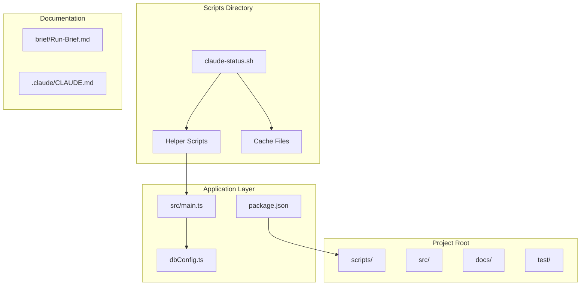
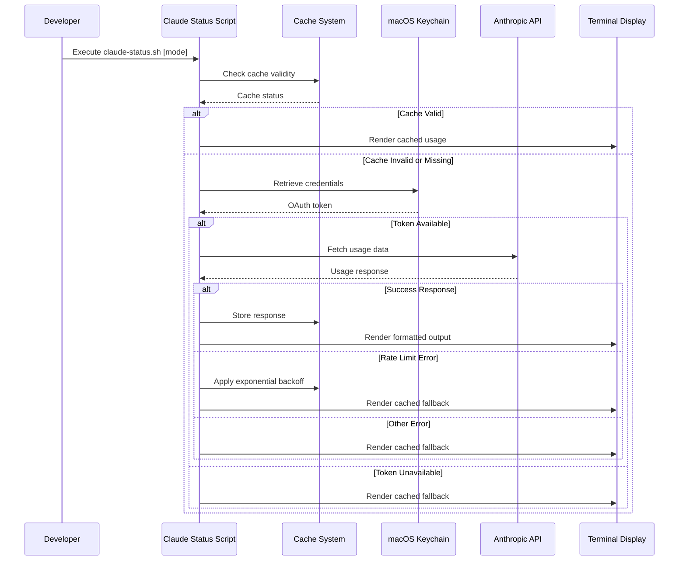
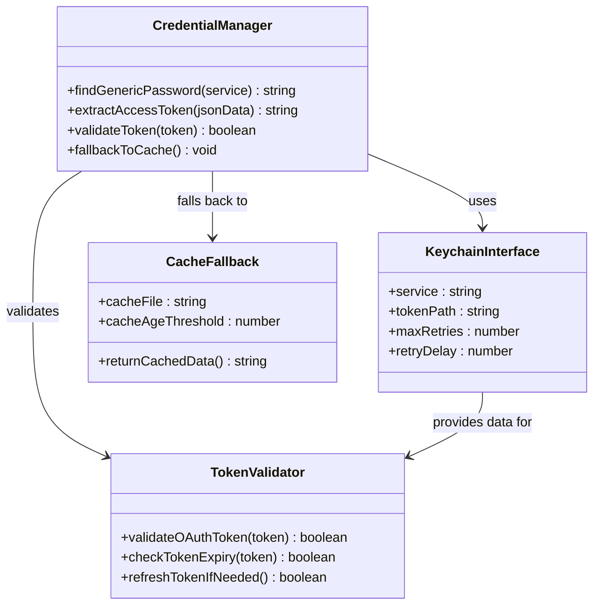
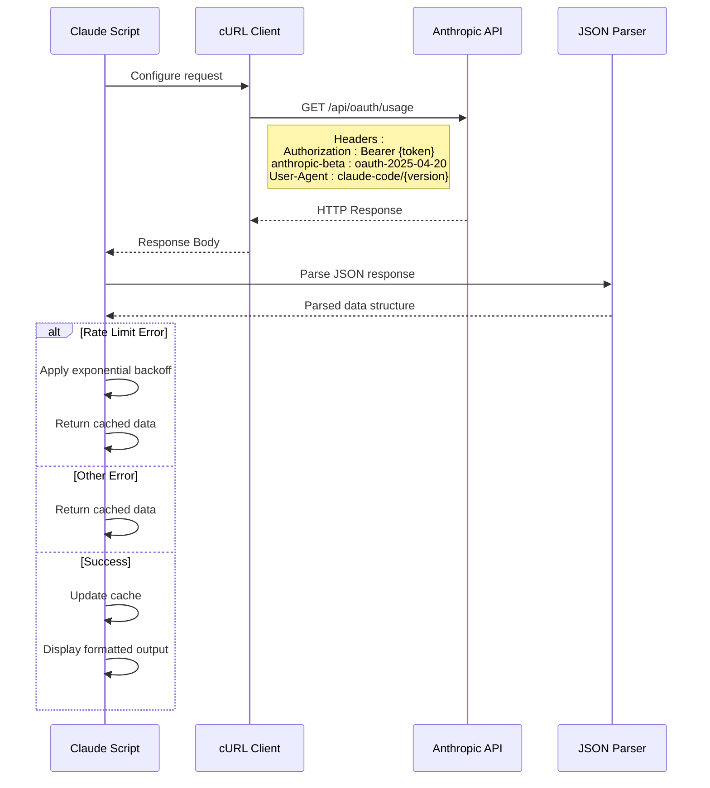
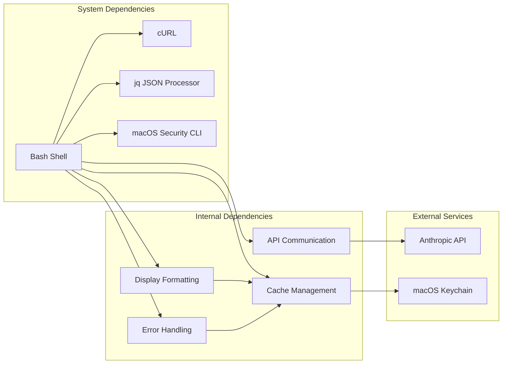
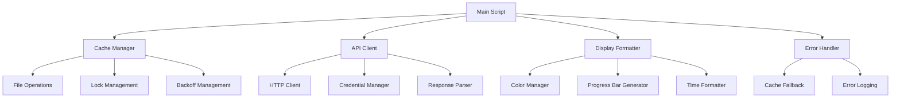

# Claude Status Script Utility

<cite>
**Referenced Files in This Document**
- [claude-status.sh](file://scripts/claude-status.sh)
- [package.json](file://package.json)
- [init.sh](file://init.sh)
- [dbConfig.ts](file://dbConfig.ts)
- [main.ts](file://src/main.ts)
- [Run-Brief.md](file://brief/Run-Brief.md)
- [CLAUDE.md](file://.claude/CLAUDE.md)
</cite>

## Table of Contents
1. [Introduction](#introduction)
2. [Project Structure](#project-structure)
3. [Core Components](#core-components)
4. [Architecture Overview](#architecture-overview)
5. [Detailed Component Analysis](#detailed-component-analysis)
6. [Dependency Analysis](#dependency-analysis)
7. [Performance Considerations](#performance-considerations)
8. [Troubleshooting Guide](#troubleshooting-guide)
9. [Conclusion](#conclusion)

## Introduction

The Claude Status Script Utility is a sophisticated shell script designed to monitor and display Anthropic Claude AI API usage limits for developers working with Claude Code. This utility provides real-time visibility into Claude's rate limiting system, displaying both 5-hour and 7-day usage percentages with visual progress bars and automatic cache management.

The script serves as a critical development tool for Claude Code users, offering immediate feedback on API quota consumption and helping prevent rate limit errors that could disrupt development workflows. It integrates seamlessly with macOS Keychain for secure credential storage and implements intelligent caching mechanisms to minimize API calls while maintaining accurate usage information.

## Project Structure

The Claude Status Script Utility is part of a larger NestJS Gym Management System, specifically located within the scripts directory. The project follows a modular architecture with clear separation of concerns between development utilities and the main application code.

**Diagram sources**
- [claude-status.sh](file://scripts/claude-status.sh)
- [main.ts](file://src/main.ts)
- [dbConfig.ts](file://dbConfig.ts)
- [package.json](file://package.json)

**Section sources**
- [claude-status.sh](file://scripts/claude-status.sh)
- [package.json](file://package.json)

## Core Components

The Claude Status Script Utility consists of several interconnected components that work together to provide comprehensive API usage monitoring:

### Primary Components

**1. Cache Management System**
- Centralized cache directory at `$HOME/.cache`
- API response caching with configurable TTL (120 seconds)
- Lock file mechanism preventing concurrent API requests
- Backoff file for exponential rate limit handling

**2. Credential Management**
- macOS Keychain integration for secure token storage
- Automatic credential retrieval using `security` command
- Fallback mechanisms when credentials are unavailable

**3. API Communication Layer**
- Anthropic API endpoint integration
- OAuth 2025-04-20 beta header support
- User-agent version detection for Claude Code
- Robust error handling and retry logic

**4. Display Formatting Engine**
- Tokyo Night Storm color palette for tmux compatibility
- Dynamic progress bar visualization
- Intelligent time formatting (minutes, hours, days)
- Percentage-based color coding (red/yellow/green)

**Section sources**
- [claude-status.sh](file://scripts/claude-status.sh)

## Architecture Overview

The Claude Status Script Utility implements a layered architecture that balances functionality with simplicity, providing robust API monitoring capabilities through well-defined component interactions.

**Diagram sources**
- [claude-status.sh](file://scripts/claude-status.sh)

### Component Interactions

The script orchestrates a sophisticated flow of operations involving multiple subsystems:

1. **Initialization Phase**: Script validates cache directory existence and sets up color formatting
2. **Cache Validation**: Checks for existing cache files and their freshness
3. **Credential Retrieval**: Securely fetches OAuth tokens from macOS Keychain
4. **API Communication**: Executes HTTP requests with proper headers and timeouts
5. **Response Processing**: Parses JSON responses and handles various error conditions
6. **Output Generation**: Formats data into human-readable progress bars and statistics

**Section sources**
- [claude-status.sh](file://scripts/claude-status.sh)

## Detailed Component Analysis

### Cache Management System

The cache management system implements a multi-layered approach to optimize API usage while ensuring data accuracy:

**Diagram sources**
- [claude-status.sh](file://scripts/claude-status.sh)

### Credential Management Architecture

The credential management system leverages macOS Keychain for secure token storage and retrieval:

**Diagram sources**
- [claude-status.sh](file://scripts/claude-status.sh)

### API Communication Protocol

The API communication layer implements a robust protocol for interacting with Anthropic's OAuth usage endpoint:

**Diagram sources**
- [claude-status.sh](file://scripts/claude-status.sh)

**Section sources**
- [claude-status.sh](file://scripts/claude-status.sh)

### Display Formatting System

The display formatting system provides intuitive visual representation of API usage data:

| Component | Function | Implementation Details |
|-----------|----------|----------------------|
| **Color Palette** | Visual hierarchy indication | Tokyo Night Storm theme with red/yellow/green for usage levels |
| **Progress Bars** | Percentage visualization | 10-character wide bars with filled/empty segments |
| **Time Formatting** | Reset time display | Dynamic formatting for minutes, hours, and days |
| **Percentage Display** | Usage percentage | Integer conversion with color-coded indicators |

**Section sources**
- [claude-status.sh](file://scripts/claude-status.sh)

## Dependency Analysis

The Claude Status Script Utility maintains minimal external dependencies while leveraging system-level tools for optimal performance and reliability.

**Diagram sources**
- [claude-status.sh](file://scripts/claude-status.sh)

### External Dependencies

The script relies on several system-level tools that must be available for proper operation:

**Essential Dependencies:**
- **bash**: Version 4.0 or higher for modern array and string features
- **curl**: For HTTP communication with timeout support
- **jq**: For JSON parsing and manipulation
- **security**: macOS Keychain command-line interface

**Optional Dependencies:**
- **claude**: Claude Code CLI for version detection
- **tmux**: For colored output formatting

**Section sources**
- [claude-status.sh](file://scripts/claude-status.sh)

### Internal Component Dependencies

The script's internal components demonstrate clear separation of concerns with minimal coupling:

**Diagram sources**
- [claude-status.sh](file://scripts/claude-status.sh)

**Section sources**
- [claude-status.sh](file://scripts/claude-status.sh)

## Performance Considerations

The Claude Status Script Utility is designed with performance optimization as a primary concern, implementing several strategies to minimize resource usage while maintaining responsiveness.

### Cache Optimization Strategies

**Cache TTL Management**: The script implements a 120-second cache window that balances freshness with efficiency. This prevents excessive API calls while ensuring usage data remains reasonably current for development purposes.

**Concurrent Request Prevention**: A lock file mechanism ensures only one API request occurs simultaneously, preventing race conditions and reducing the likelihood of rate limit errors during automated usage checks.

**Intelligent Fallback Logic**: When credentials are unavailable or API calls fail, the script gracefully falls back to cached data, maintaining usability even under network or authentication issues.

### Memory and Resource Usage

**Minimal Memory Footprint**: The script uses efficient string operations and avoids loading large datasets into memory. All data processing occurs through streaming JSON parsing with `jq`.

**Optimized File Operations**: Cache files are small JSON structures (typically under 1KB), minimizing disk I/O overhead and storage requirements.

**Efficient Color Processing**: Color formatting uses simple string concatenation rather than complex terminal libraries, reducing startup time and system resource usage.

### Network Efficiency

**Connection Reuse**: While the script makes individual HTTP requests, the underlying cURL implementation supports connection reuse for subsequent calls within the same script execution.

**Timeout Management**: Requests include appropriate timeout values (5 seconds) to prevent hanging operations and free up system resources quickly on network failures.

## Troubleshooting Guide

This section provides comprehensive troubleshooting guidance for common issues encountered when using the Claude Status Script Utility.

### Common Issues and Solutions

**Issue: Script fails to execute**
- **Cause**: Missing execute permissions
- **Solution**: `chmod +x scripts/claude-status.sh`
- **Prevention**: Ensure script is executable before first use

**Issue: "command not found: security"**
- **Cause**: macOS Keychain command not available
- **Solution**: Verify macOS version supports `security` command
- **Alternative**: Manually set environment variables for credentials

**Issue: Empty or outdated cache display**
- **Cause**: Cache file corruption or expiration
- **Solution**: Remove cache file: `rm ~/.cache/claude-api-response.json`
- **Alternative**: Use `./scripts/claude-status.sh age` to check cache age

**Issue: Rate limit errors during API calls**
- **Cause**: Excessive API usage or temporary service issues
- **Solution**: Wait for exponential backoff period or remove backoff file
- **Detection**: Script automatically applies 120-second base backoff (doubles on subsequent errors)

**Issue: Incorrect color output in terminal**
- **Cause**: Terminal not supporting tmux color format
- **Solution**: Use standard terminal colors or modify color variables
- **Alternative**: Run script in tmux for proper color support

### Debugging Techniques

**Enable Debug Mode**: Add `set -x` at script start to trace all executed commands
**Check Cache Age**: Use `./scripts/claude-status.sh age` to verify cache freshness
**Manual API Testing**: Test API endpoint directly with curl for authentication verification
**Log Analysis**: Monitor cache directory changes to track script activity

**Section sources**
- [claude-status.sh](file://scripts/claude-status.sh)

## Conclusion

The Claude Status Script Utility represents a sophisticated yet accessible solution for monitoring Anthropic Claude AI API usage. Its thoughtful architecture balances functionality with simplicity, providing developers with reliable real-time usage information while minimizing system impact.

The script's strength lies in its comprehensive approach to cache management, secure credential handling, and robust error recovery mechanisms. By leveraging system-level tools and implementing intelligent fallback strategies, it maintains usability even under challenging network conditions or authentication failures.

For the broader NestJS Gym Management System, this utility exemplifies best practices in development tooling: minimal dependencies, clear separation of concerns, and user-focused design. The script serves as both a functional tool and a reference implementation for similar monitoring utilities that may be needed in production environments.

Future enhancements could include support for additional Claude API endpoints, expanded terminal compatibility, and integration with other credential management systems. However, the current implementation provides a solid foundation for Claude Code development workflow optimization.