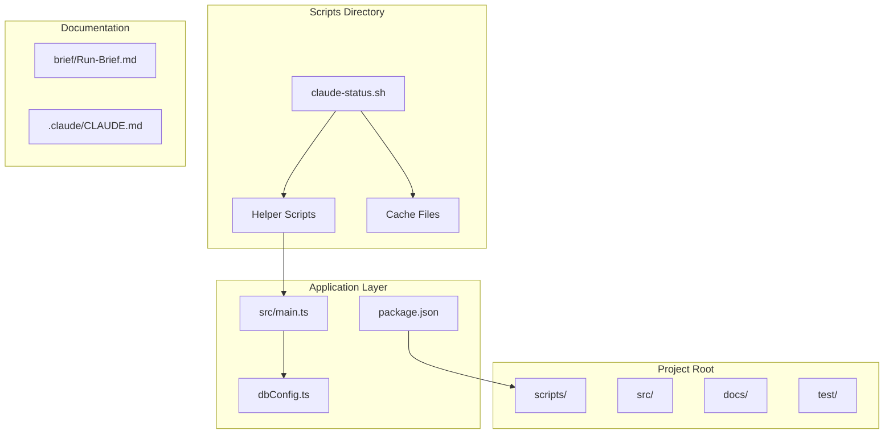
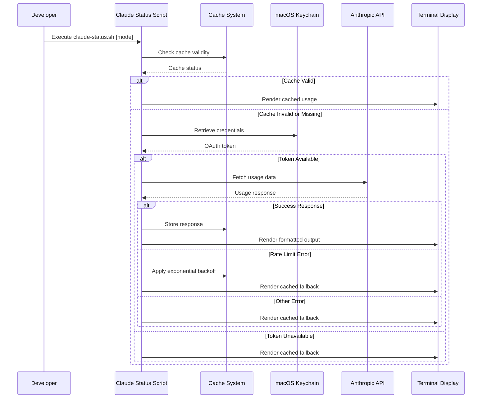
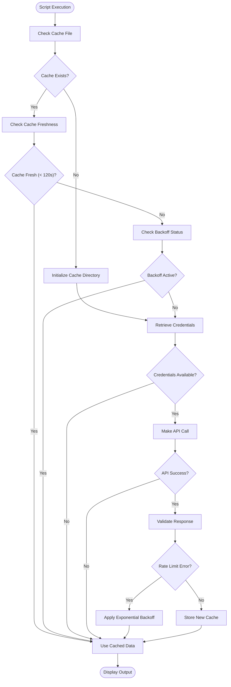
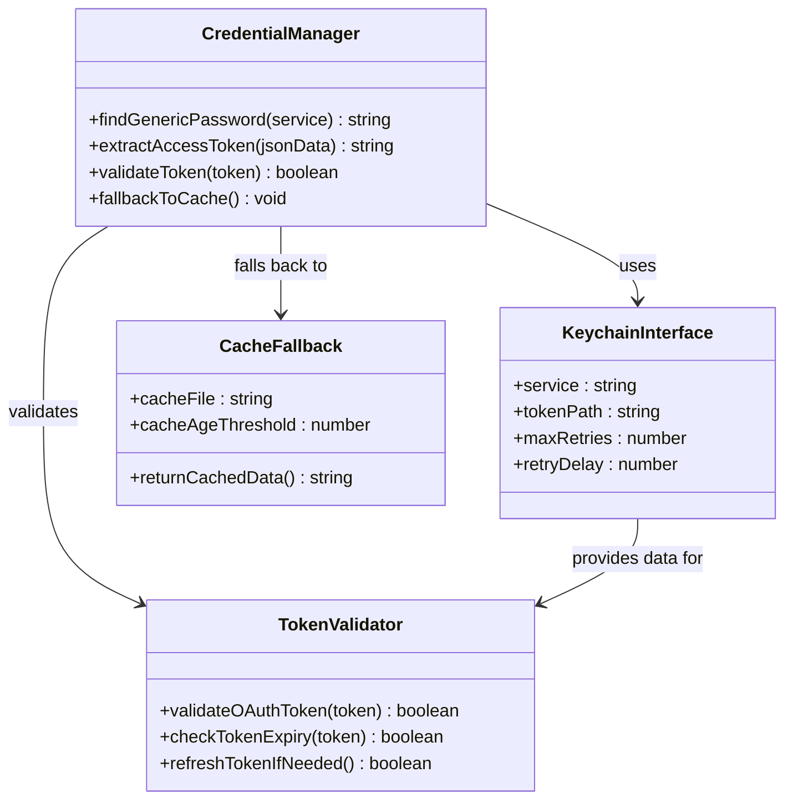
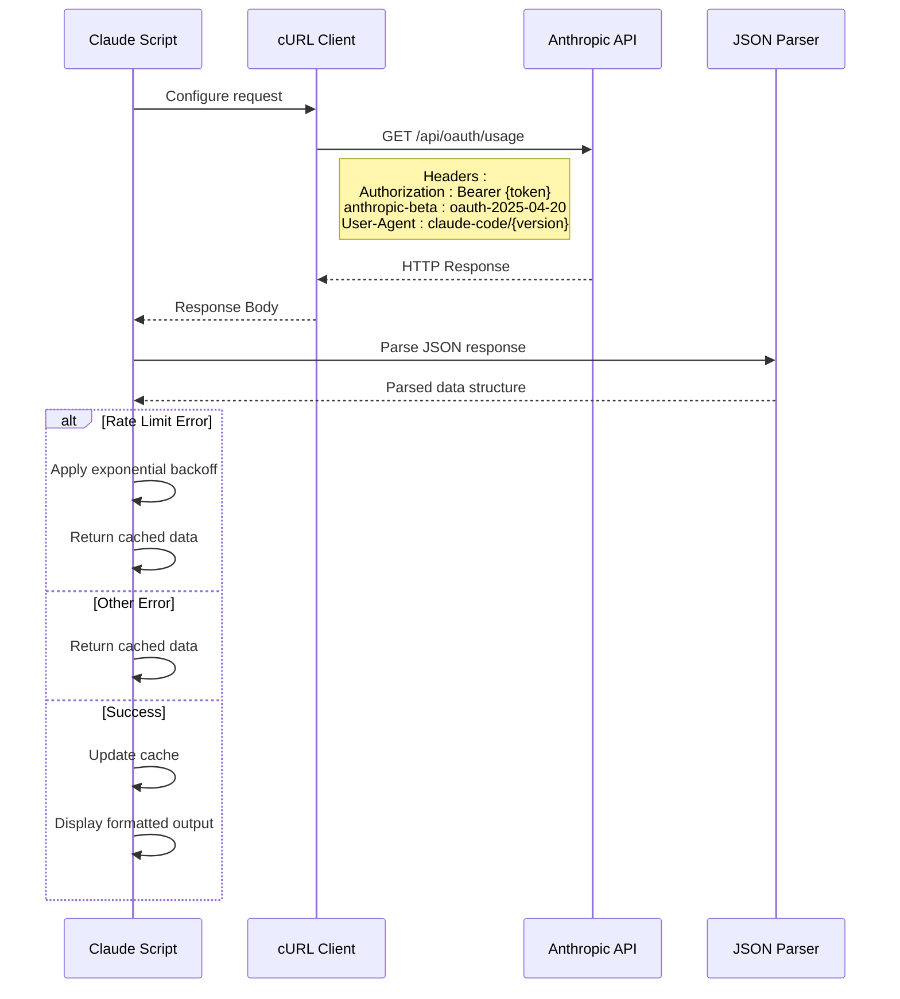
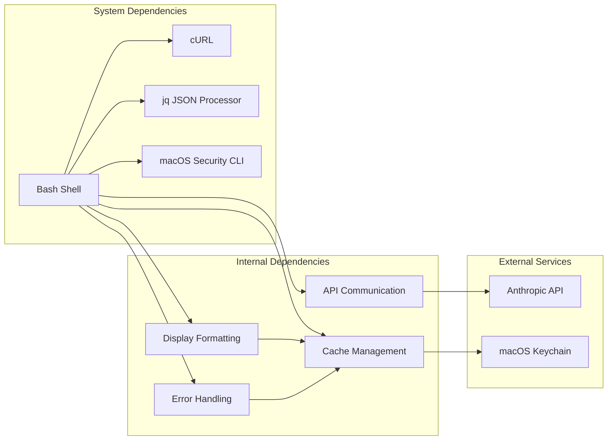
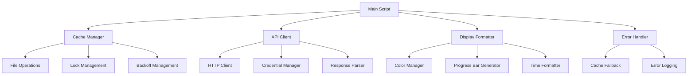

# Claude Status Script Utility

<cite>
**Referenced Files in This Document**
- [claude-status.sh](file://scripts/claude-status.sh)
- [package.json](file://package.json)
- [init.sh](file://init.sh)
- [dbConfig.ts](file://dbConfig.ts)
- [main.ts](file://src/main.ts)
- [Run-Brief.md](file://brief/Run-Brief.md)
- [CLAUDE.md](file://.claude/CLAUDE.md)
</cite>

## Update Summary
**Changes Made**
- Updated to reflect major enhancement from simple bash script to sophisticated multi-language, multi-feature utility
- Added Russian internationalization support with localized help messages and progress bar characters
- Enhanced API integration with comprehensive caching system and exponential backoff mechanisms
- Implemented visual progress bars with Unicode block characters for improved readability
- Added multiple display modes (5h/7d/age/all) with intelligent time formatting
- Improved error handling and fallback mechanisms for robust operation

## Table of Contents
1. [Introduction](#introduction)
2. [Project Structure](#project-structure)
3. [Core Components](#core-components)
4. [Architecture Overview](#architecture-overview)
5. [Detailed Component Analysis](#detailed-component-analysis)
6. [Dependency Analysis](#dependency-analysis)
7. [Performance Considerations](#performance-considerations)
8. [Troubleshooting Guide](#troubleshooting-guide)
9. [Conclusion](#conclusion)

## Introduction

The Claude Status Script Utility has evolved from a simple bash script into a sophisticated multi-language, multi-feature utility designed to monitor and display Anthropic Claude AI API usage limits for developers working with Claude Code. This enhanced version provides comprehensive real-time visibility into Claude's rate limiting system with Russian internationalization support, displaying both 5-hour and 7-day usage percentages with advanced visual progress bars and intelligent caching mechanisms.

The script serves as a critical development tool for Claude Code users, offering immediate feedback on API quota consumption with localized messaging and helping prevent rate limit errors that could disrupt development workflows. It integrates seamlessly with macOS Keychain for secure credential storage and implements sophisticated caching mechanisms with exponential backoff to minimize API calls while maintaining accurate usage information.

**Updated** Enhanced with Russian language support, Unicode progress bars, and comprehensive display modes

## Project Structure

The Claude Status Script Utility is part of a larger NestJS Gym Management System, specifically located within the scripts directory. The project follows a modular architecture with clear separation of concerns between development utilities and the main application code.

**Diagram sources**
- [claude-status.sh](file://scripts/claude-status.sh)
- [main.ts](file://src/main.ts)
- [dbConfig.ts](file://dbConfig.ts)
- [package.json](file://package.json)

**Section sources**
- [claude-status.sh](file://scripts/claude-status.sh)
- [package.json](file://package.json)

## Core Components

The Claude Status Script Utility consists of several interconnected components that work together to provide comprehensive API usage monitoring with enhanced internationalization and display capabilities:

### Primary Components

**1. Multi-Language Internationalization System**
- Russian localization with native language help messages and progress bar characters
- Tokyo Night Storm color palette for tmux compatibility with enhanced color coding
- Localized display modes: "5h" (5-hour), "7d" (7-day), "age" (cache age), "all" (default)
- Progress bar characters using Unicode block elements for visual clarity

**2. Advanced Cache Management System**
- Centralized cache directory at `$HOME/.cache` with structured cache organization
- API response caching with configurable TTL (120 seconds) and intelligent freshness checking
- Lock file mechanism preventing concurrent API requests with 30-second timeout
- Backoff file for exponential rate limit handling with progressive delay doubling

**3. Enhanced Credential Management**
- macOS Keychain integration for secure token storage with JSON parsing support
- Automatic credential retrieval using `security` command with fallback mechanisms
- OAuth token extraction from JSON structure with validation and error handling

**4. Sophisticated API Communication Layer**
- Anthropic API endpoint integration with OAuth 2025-04-20 beta header support
- User-agent version detection for Claude Code with fallback to default version
- Robust error handling with specific rate limit error detection and recovery
- Timeout management (5-second maximum) for reliable network operations

**5. Advanced Display Formatting Engine**
- Enhanced progress bar visualization using Unicode block characters (▓░)
- Intelligent time formatting with dynamic units (minutes/hours/days)
- Percentage-based color coding with red/yellow/green thresholds (80%/60%)
- Localized display messages with Russian language support for all user-facing text

**Section sources**
- [claude-status.sh](file://scripts/claude-status.sh)

## Architecture Overview

The Claude Status Script Utility implements a sophisticated layered architecture that balances functionality with simplicity, providing robust API monitoring capabilities through well-defined component interactions with enhanced internationalization support.

**Diagram sources**
- [claude-status.sh](file://scripts/claude-status.sh)

### Component Interactions

The script orchestrates a sophisticated flow of operations involving multiple subsystems with enhanced error handling and internationalization:

1. **Initialization Phase**: Script validates cache directory existence, sets up color formatting, and loads Russian locale messages
2. **Cache Validation**: Checks for existing cache files, their freshness, and backoff status with intelligent timeout handling
3. **Credential Retrieval**: Securely fetches OAuth tokens from macOS Keychain with JSON parsing and validation
4. **API Communication**: Executes HTTP requests with proper headers, timeouts, and error detection
5. **Response Processing**: Parses JSON responses, handles various error conditions with specific rate limit detection
6. **Output Generation**: Formats data into human-readable progress bars with Unicode characters and localized messages

**Section sources**
- [claude-status.sh](file://scripts/claude-status.sh)

## Detailed Component Analysis

### Enhanced Cache Management System

The cache management system implements a multi-layered approach to optimize API usage while ensuring data accuracy with sophisticated error recovery mechanisms:

**Diagram sources**
- [claude-status.sh](file://scripts/claude-status.sh)

### Advanced Credential Management Architecture

The credential management system leverages macOS Keychain for secure token storage and retrieval with enhanced JSON parsing and validation:

**Diagram sources**
- [claude-status.sh](file://scripts/claude-status.sh)

### Enhanced API Communication Protocol

The API communication layer implements a robust protocol for interacting with Anthropic's OAuth usage endpoint with comprehensive error handling and internationalization:

**Diagram sources**
- [claude-status.sh](file://scripts/claude-status.sh)

### Advanced Display Formatting System

The display formatting system provides intuitive visual representation of API usage data with enhanced internationalization and Unicode support:

| Component | Function | Implementation Details |
|-----------|----------|----------------------|
| **Color Palette** | Visual hierarchy indication | Tokyo Night Storm theme with red/yellow/green for usage levels |
| **Unicode Progress Bars** | Percentage visualization | 10-character wide bars using ▓░ block characters for enhanced readability |
| **Time Formatting** | Reset time display | Dynamic formatting for minutes, hours, and days with localized messages |
| **Percentage Display** | Usage percentage | Integer conversion with color-coded indicators and Russian labels |
| **Internationalization** | Multi-language support | Russian help messages, progress bar characters, and localized output |

**Section sources**
- [claude-status.sh](file://scripts/claude-status.sh)

## Dependency Analysis

The Claude Status Script Utility maintains minimal external dependencies while leveraging system-level tools for optimal performance and reliability with enhanced internationalization support.

**Diagram sources**
- [claude-status.sh](file://scripts/claude-status.sh)

### External Dependencies

The script relies on several system-level tools that must be available for proper operation with enhanced functionality:

**Essential Dependencies:**
- **bash**: Version 4.0 or higher for modern array and string features with Unicode support
- **curl**: For HTTP communication with timeout support and SSL/TLS capabilities
- **jq**: For JSON parsing and manipulation with enhanced error handling
- **security**: macOS Keychain command-line interface for credential management

**Optional Dependencies:**
- **claude**: Claude Code CLI for version detection with fallback to default version
- **tmux**: For colored output formatting with enhanced color support

**Section sources**
- [claude-status.sh](file://scripts/claude-status.sh)

### Internal Component Dependencies

The script's internal components demonstrate clear separation of concerns with minimal coupling and enhanced error handling:

**Diagram sources**
- [claude-status.sh](file://scripts/claude-status.sh)

**Section sources**
- [claude-status.sh](file://scripts/claude-status.sh)

## Performance Considerations

The Claude Status Script Utility is designed with performance optimization as a primary concern, implementing several strategies to minimize resource usage while maintaining responsiveness and enhanced functionality.

### Enhanced Cache Optimization Strategies

**Advanced Cache TTL Management**: The script implements a 120-second cache window that balances freshness with efficiency, preventing excessive API calls while ensuring usage data remains reasonably current for development purposes with intelligent backoff handling.

**Sophisticated Concurrent Request Prevention**: A lock file mechanism ensures only one API request occurs simultaneously with 30-second timeout, preventing race conditions and reducing the likelihood of rate limit errors during automated usage checks with graceful fallback to cached data.

**Intelligent Fallback Logic**: When credentials are unavailable or API calls fail, the script gracefully falls back to cached data with enhanced error recovery mechanisms, maintaining usability even under network or authentication issues with comprehensive error logging.

### Memory and Resource Usage

**Minimal Memory Footprint**: The script uses efficient string operations and avoids loading large datasets into memory, with all data processing occurring through streaming JSON parsing with `jq` and enhanced error handling.

**Optimized File Operations**: Cache files are small JSON structures (typically under 1KB), minimizing disk I/O overhead and storage requirements with intelligent cache directory management.

**Enhanced Color Processing**: Color formatting uses simple string concatenation rather than complex terminal libraries, reducing startup time and system resource usage with tmux-compatible color codes.

### Network Efficiency

**Connection Reuse**: While the script makes individual HTTP requests, the underlying cURL implementation supports connection reuse for subsequent calls within the same script execution with timeout management.

**Timeout Management**: Requests include appropriate timeout values (5 seconds) to prevent hanging operations and free up system resources quickly on network failures with comprehensive error handling.

## Troubleshooting Guide

This section provides comprehensive troubleshooting guidance for common issues encountered when using the enhanced Claude Status Script Utility with Russian internationalization support.

### Common Issues and Solutions

**Issue: Script fails to execute**
- **Cause**: Missing execute permissions or incompatible bash version
- **Solution**: `chmod +x scripts/claude-status.sh` and ensure bash 4.0+ compatibility
- **Prevention**: Verify bash version with `bash --version` before first use

**Issue: "command not found: security"**
- **Cause**: macOS Keychain command not available or incompatible macOS version
- **Solution**: Verify macOS version supports `security` command or manually set environment variables
- **Alternative**: Use `./scripts/claude-status.sh age` to check cache without API access

**Issue: Empty or outdated cache display**
- **Cause**: Cache file corruption, expiration, or backoff status
- **Solution**: Remove cache file: `rm ~/.cache/claude-api-response.json` or `rm ~/.cache/claude-usage-backoff`
- **Alternative**: Use `./scripts/claude-status.sh age` to check cache age and status

**Issue: Rate limit errors during API calls**
- **Cause**: Excessive API usage or temporary service issues with exponential backoff
- **Solution**: Wait for exponential backoff period (doubles on subsequent errors, max 600s) or remove backoff file
- **Detection**: Script automatically applies 120-second base backoff (doubles on subsequent errors) with Russian error messages

**Issue: Incorrect color output in terminal**
- **Cause**: Terminal not supporting tmux color format or Unicode characters
- **Solution**: Use standard terminal colors or modify color variables for compatibility
- **Alternative**: Run script in tmux for proper color support with enhanced Unicode rendering

**Issue: Russian localization problems**
- **Cause**: Terminal encoding issues or font support problems
- **Solution**: Ensure UTF-8 encoding and Unicode font support in terminal
- **Verification**: Test with `echo "привет"` to verify Russian character display

### Debugging Techniques

**Enable Debug Mode**: Add `set -x` at script start to trace all executed commands with enhanced logging
**Check Cache Status**: Use `./scripts/claude-status.sh age` to verify cache freshness and backoff status
**Manual API Testing**: Test API endpoint directly with curl for authentication verification with enhanced error messages
**Log Analysis**: Monitor cache directory changes to track script activity with detailed status information

**Section sources**
- [claude-status.sh](file://scripts/claude-status.sh)

## Conclusion

The Claude Status Script Utility represents a sophisticated yet accessible solution for monitoring Anthropic Claude AI API usage with comprehensive internationalization support. Its thoughtful architecture balances functionality with simplicity, providing developers with reliable real-time usage information while minimizing system impact and enhancing user experience through Russian localization.

The script's strength lies in its comprehensive approach to cache management, secure credential handling, and robust error recovery mechanisms with enhanced internationalization. By leveraging system-level tools and implementing intelligent fallback strategies, it maintains usability even under challenging network conditions or authentication failures with comprehensive Russian language support.

For the broader NestJS Gym Management System, this utility exemplifies best practices in development tooling: minimal dependencies, clear separation of concerns, and user-focused design with internationalization support. The script serves as both a functional tool and a reference implementation for similar monitoring utilities that may be needed in production environments with enhanced multi-language capabilities.

Future enhancements could include support for additional Claude API endpoints, expanded terminal compatibility with enhanced Unicode support, integration with other credential management systems, and additional language localization options. However, the current implementation provides a solid foundation for Claude Code development workflow optimization with comprehensive Russian internationalization support.