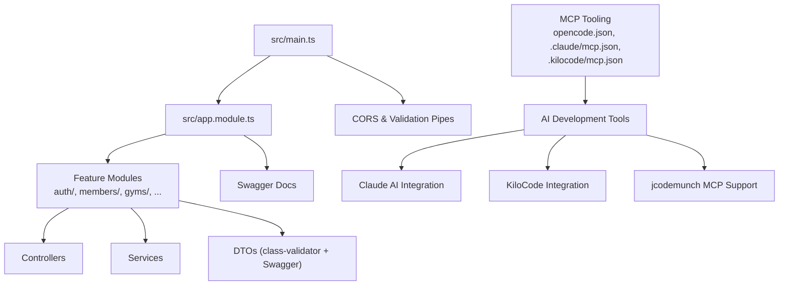
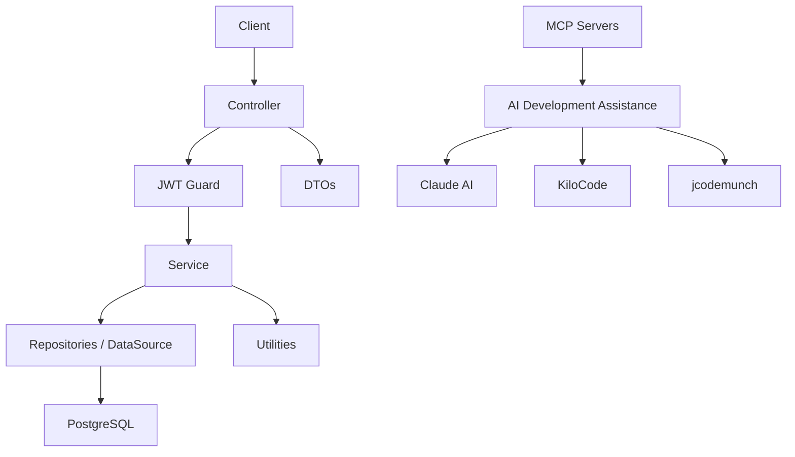
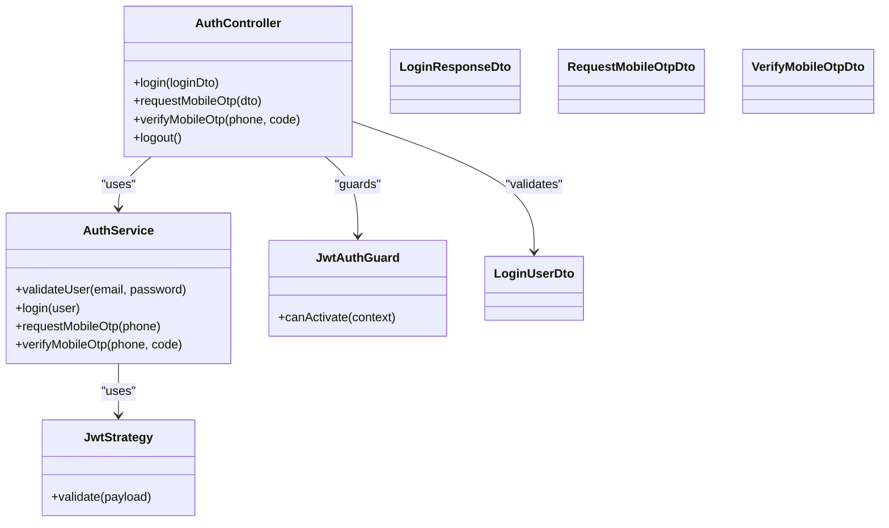
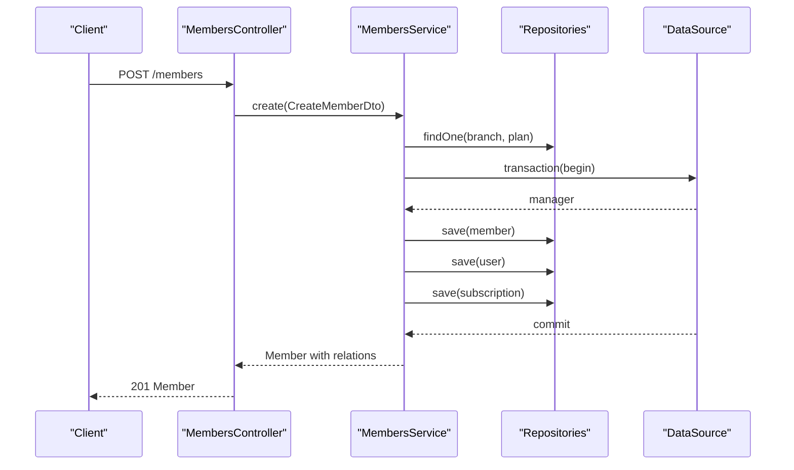
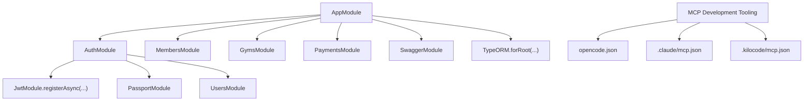
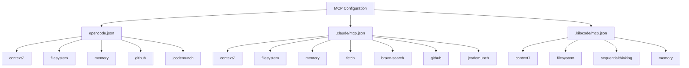

# Development Guidelines

<cite>
**Referenced Files in This Document**
- [package.json](file://package.json)
- [nest-cli.json](file://nest-cli.json)
- [tsconfig.json](file://tsconfig.json)
- [eslint.config.mjs](file://eslint.config.mjs)
- [src/main.ts](file://src/main.ts)
- [src/app.module.ts](file://src/app.module.ts)
- [src/auth/auth.module.ts](file://src/auth/auth.module.ts)
- [src/auth/auth.controller.ts](file://src/auth/auth.controller.ts)
- [src/auth/dto/login-user.dto.ts](file://src/auth/dto/login-user.dto.ts)
- [src/auth/guards/jwt-auth.guard.ts](file://src/auth/guards/jwt-auth.guard.ts)
- [src/auth/decorators/current-user.decorator.ts](file://src/auth/decorators/current-user.decorator.ts)
- [src/common/enums/role.enum.ts](file://src/common/enums/role.enum.ts)
- [src/members/members.module.ts](file://src/members/members.module.ts)
- [src/members/members.service.ts](file://src/members/members.service.ts)
- [src/members/members.controller.ts](file://src/members/members.controller.ts)
- [src/members/dto/create-member.dto.ts](file://src/members/dto/create-member.dto.ts)
- [src/test-db.ts](file://src/test-db.ts)
- [test/jest-e2e.json](file://test/jest-e2e.json)
- [opencode.json](file://opencode.json)
- [claude/mcp.json](file://.claude/mcp.json)
- [.kilocode/mcp.json](file://.kilocode/mcp.json)
- [scripts/claude-status.sh](file://scripts/claude-status.sh)
- [.claude/claude-octopus.local.md](file://.claude/claude-octopus.local.md)
- [.kilo/package.json](file://.kilo/package.json)
</cite>

## Update Summary
**Changes Made**
- Added new section on Model Context Protocol (MCP) development tooling integration
- Updated development workflow to include Claude AI and KiloCode MCP server configurations
- Enhanced debugging and profiling section with Claude usage monitoring
- Added documentation for jcodemunch MCP support and opencode.json configuration
- Updated troubleshooting guide with MCP server management

## Table of Contents
1. [Introduction](#introduction)
2. [Project Structure](#project-structure)
3. [Core Components](#core-components)
4. [Architecture Overview](#architecture-overview)
5. [Detailed Component Analysis](#detailed-component-analysis)
6. [Dependency Analysis](#dependency-analysis)
7. [Performance Considerations](#performance-considerations)
8. [Testing Strategy](#testing-strategy)
9. [Development Workflow](#development-workflow)
10. [Model Context Protocol (MCP) Development Tooling](#model-context-protocol-mcp-development-tooling)
11. [Adding Features and Modifications](#adding-features-and-modifications)
12. [Debugging and Profiling](#debugging-and-profiling)
13. [Common Pitfalls and Best Practices](#common-pitfalls-and-best-practices)
14. [Contribution Guidelines](#contribution-guidelines)
15. [Troubleshooting Guide](#troubleshooting-guide)
16. [Conclusion](#conclusion)

## Introduction
This document provides comprehensive development guidelines for contributing to the Gym Management System backend built with NestJS. It covers code standards, architectural principles, module structure, DTO patterns, service/controller design, testing strategy, development workflow, debugging, performance optimization, and contribution practices. The goal is to ensure consistent, maintainable, and scalable contributions across the team.

**Updated** Added comprehensive coverage of Model Context Protocol (MCP) development tooling integration for enhanced AI-assisted development workflows.

## Project Structure
The project follows a feature-based NestJS module structure with clear separation of concerns:
- Feature modules encapsulate domain logic (e.g., auth, members, gyms, payments).
- Each feature module includes a controller, service, module, and DTOs.
- Shared utilities and enums reside under common.
- Entities define the database schema.
- Swagger/OpenAPI documentation is auto-generated via NestJS Swagger plugin.
- **New** MCP development tooling configurations for AI-assisted development.

**Diagram sources**
- [src/main.ts:1-70](file://src/main.ts#L1-L70)
- [src/app.module.ts:1-138](file://src/app.module.ts#L1-L138)
- [opencode.json:1-42](file://opencode.json#L1-L42)
- [.claude/mcp.json:1-70](file://.claude/mcp.json#L1-L70)
- [.kilocode/mcp.json:1-72](file://.kilocode/mcp.json#L1-L72)

**Section sources**
- [src/app.module.ts:1-138](file://src/app.module.ts#L1-L138)
- [nest-cli.json:1-10](file://nest-cli.json#L1-L10)
- [opencode.json:1-42](file://opencode.json#L1-L42)
- [.claude/mcp.json:1-70](file://.claude/mcp.json#L1-L70)
- [.kilocode/mcp.json:1-72](file://.kilocode/mcp.json#L1-L72)

## Core Components
Key architectural building blocks:
- Application bootstrap initializes CORS, global validation pipe, and Swagger documentation.
- AppModule aggregates all feature modules and shared entities.
- Auth module demonstrates JWT authentication, guards, strategies, and DTOs.
- Members module showcases complex service logic with transactions, relations, and DTOs.
- **New** MCP development tooling provides AI-assisted development capabilities.

**Section sources**
- [src/main.ts:1-70](file://src/main.ts#L1-L70)
- [src/app.module.ts:1-138](file://src/app.module.ts#L1-L138)
- [src/auth/auth.module.ts:1-25](file://src/auth/auth.module.ts#L1-L25)
- [src/members/members.module.ts:1-37](file://src/members/members.module.ts#L1-L37)

## Architecture Overview
The system uses a layered architecture:
- Controllers handle HTTP requests and responses, decorated with Swagger metadata.
- Services encapsulate business logic and orchestrate repositories/external integrations.
- Modules declare dependencies, providers, controllers, and exported services.
- DTOs validate and document request/response payloads.
- Guards enforce authorization policies.
- Decorators inject contextual data (e.g., current user).
- **New** MCP servers provide AI-powered development assistance.

**Diagram sources**
- [src/auth/auth.controller.ts:1-155](file://src/auth/auth.controller.ts#L1-L155)
- [src/auth/guards/jwt-auth.guard.ts:1-6](file://src/auth/guards/jwt-auth.guard.ts#L1-L6)
- [src/members/members.service.ts:1-561](file://src/members/members.service.ts#L1-L561)
- [.claude/mcp.json:1-70](file://.claude/mcp.json#L1-L70)

## Detailed Component Analysis

### Authentication Module
The auth module demonstrates:
- JWT configuration via async provider and strategy.
- Guards extending Passport's AuthGuard.
- DTOs with class-validator and Swagger metadata.
- Controller endpoints for login, OTP request/verify, and logout.

**Diagram sources**
- [src/auth/auth.controller.ts:1-155](file://src/auth/auth.controller.ts#L1-L155)
- [src/auth/auth.module.ts:1-25](file://src/auth/auth.module.ts#L1-L25)
- [src/auth/guards/jwt-auth.guard.ts:1-6](file://src/auth/guards/jwt-auth.guard.ts#L1-L6)
- [src/auth/dto/login-user.dto.ts:1-18](file://src/auth/dto/login-user.dto.ts#L1-L18)

**Section sources**
- [src/auth/auth.module.ts:1-25](file://src/auth/auth.module.ts#L1-L25)
- [src/auth/auth.controller.ts:1-155](file://src/auth/auth.controller.ts#L1-L155)
- [src/auth/dto/login-user.dto.ts:1-18](file://src/auth/dto/login-user.dto.ts#L1-L18)
- [src/auth/guards/jwt-auth.guard.ts:1-6](file://src/auth/guards/jwt-auth.guard.ts#L1-L6)
- [src/auth/decorators/current-user.decorator.ts:1-10](file://src/auth/decorators/current-user.decorator.ts#L1-L10)
- [src/common/enums/role.enum.ts:1-7](file://src/common/enums/role.enum.ts#L1-L7)

### Members Module
The members module illustrates:
- Complex service logic with transactions, relation loading, and DTO transformations.
- Multiple controller endpoints for CRUD, admin updates, and dashboards.
- DTOs for create, update, and branch-specific responses.

**Diagram sources**
- [src/members/members.controller.ts:1-728](file://src/members/members.controller.ts#L1-L728)
- [src/members/members.service.ts:1-561](file://src/members/members.service.ts#L1-L561)
- [src/members/dto/create-member.dto.ts:1-216](file://src/members/dto/create-member.dto.ts#L1-L216)

**Section sources**
- [src/members/members.module.ts:1-37](file://src/members/members.module.ts#L1-L37)
- [src/members/members.service.ts:1-561](file://src/members/members.service.ts#L1-L561)
- [src/members/members.controller.ts:1-728](file://src/members/members.controller.ts#L1-L728)
- [src/members/dto/create-member.dto.ts:1-216](file://src/members/dto/create-member.dto.ts#L1-L216)

### DTO Implementation Patterns
- Use class-validator decorators for runtime validation.
- Annotate DTOs with Swagger ApiProperty and ApiPropertyOptional for documentation.
- Keep DTOs focused on transport/validation; avoid business logic.
- Align DTO field names with entity fields and constraints.

Examples to reference:
- [src/auth/dto/login-user.dto.ts:1-18](file://src/auth/dto/login-user.dto.ts#L1-L18)
- [src/members/dto/create-member.dto.ts:1-216](file://src/members/dto/create-member.dto.ts#L1-L216)

**Section sources**
- [src/auth/dto/login-user.dto.ts:1-18](file://src/auth/dto/login-user.dto.ts#L1-L18)
- [src/members/dto/create-member.dto.ts:1-216](file://src/members/dto/create-member.dto.ts#L1-L216)

### Service Layer Patterns
- Inject repositories and DataSource for complex operations.
- Use transactions for atomicity across related entities.
- Load relations with leftJoinAndSelect for efficient queries.
- Normalize external data (e.g., phone numbers) before persistence.
- Return transformed DTOs or view models from services to controllers.

Example to reference:
- [src/members/members.service.ts:1-561](file://src/members/members.service.ts#L1-L561)

**Section sources**
- [src/members/members.service.ts:1-561](file://src/members/members.service.ts#L1-L561)

### Controller Design
- Use ApiTags, ApiOperation, ApiResponse, ApiBody, ApiParam, ApiQuery for rich documentation.
- Apply guards (e.g., JwtAuthGuard) to secure endpoints.
- Leverage DTOs for request validation and response typing.
- Return appropriate HTTP status codes and structured error responses.

Example to reference:
- [src/auth/auth.controller.ts:1-155](file://src/auth/auth.controller.ts#L1-L155)
- [src/members/members.controller.ts:1-728](file://src/members/members.controller.ts#L1-L728)

**Section sources**
- [src/auth/auth.controller.ts:1-155](file://src/auth/auth.controller.ts#L1-L155)
- [src/members/members.controller.ts:1-728](file://src/members/members.controller.ts#L1-L728)

## Dependency Analysis
The application uses NestJS modules to compose functionality. AppModule imports feature modules and shared entities, while individual modules import TypeORM repositories and other NestJS modules.

**Diagram sources**
- [src/app.module.ts:1-138](file://src/app.module.ts#L1-L138)
- [src/auth/auth.module.ts:1-25](file://src/auth/auth.module.ts#L1-L25)
- [opencode.json:1-42](file://opencode.json#L1-L42)
- [.claude/mcp.json:1-70](file://.claude/mcp.json#L1-L70)
- [.kilocode/mcp.json:1-72](file://.kilocode/mcp.json#L1-L72)

**Section sources**
- [src/app.module.ts:1-138](file://src/app.module.ts#L1-L138)
- [src/auth/auth.module.ts:1-25](file://src/auth/auth.module.ts#L1-L25)

## Performance Considerations
- Prefer batch operations and transactions to reduce round trips.
- Use relation joins (leftJoinAndSelect) judiciously; avoid N+1 queries.
- Apply pagination and filters for large datasets.
- Cache frequently accessed configuration (e.g., JWT) using NestJS ConfigModule.
- Monitor database queries and optimize with indexes where appropriate.
- Keep DTOs lean; avoid serializing unnecessary relations.
- **New** Monitor MCP server performance and resource usage for AI-assisted development.

## Testing Strategy
The project uses Jest for unit and integration tests, with a dedicated e2e configuration.

- Unit and Integration Tests
  - Located under src/**/*.spec.ts.
  - Jest configuration includes ts-jest transformer and coverage collection.
  - Use NestJS Testing utilities to mock providers and repositories.

- End-to-End Tests
  - E2E tests are configured under test/jest-e2e.json with regex matching .e2e-spec.ts.
  - Use supertest for HTTP assertions and a test database setup.

- Test Scripts
  - npm/yarn test, test:watch, test:cov, test:debug, test:e2e are defined in package.json.

- Database Connectivity Test
  - A small script validates database connectivity using TypeORM DataSource.

**Section sources**
- [package.json:1-95](file://package.json#L1-L95)
- [test/jest-e2e.json:1-10](file://test/jest-e2e.json#L1-L10)
- [src/test-db.ts:1-19](file://src/test-db.ts#L1-L19)

## Development Workflow
- Branching Model
  - Use feature/, fix/, chore/, docs/ prefixes for all branches.
  - Rebase feature branches onto develop before opening PRs.

- Pull Requests
  - Target develop for merging features.
  - Include a clear description, linked issues, and acceptance criteria.
  - Ensure tests pass and code is linted/formatted.

- Code Review
  - Require at least one reviewer.
  - Focus on correctness, readability, maintainability, and adherence to guidelines.

- Continuous Integration
  - CI should run linting, unit tests, coverage checks, and e2e tests.
  - Enforce branch protection rules (status checks, required reviews).

**Updated** Enhanced workflow now includes MCP development tooling integration:
- Configure MCP servers in opencode.json for opencode.ai integration
- Set up Claude AI MCP servers in .claude/mcp.json for AI-assisted development
- Configure KiloCode MCP servers in .kilocode/mcp.json for advanced development assistance
- Use jcodemunch MCP for enhanced code analysis and development support

## Model Context Protocol (MCP) Development Tooling

### MCP Server Configuration Overview
The project now includes comprehensive MCP development tooling for AI-assisted development:

#### opencode.json Configuration
- **Purpose**: Primary MCP configuration for opencode.ai integration
- **Servers**: context7, filesystem, memory, github, jcodemunch
- **Environment Variables**: DEFAULT_MINIMUM_TOKENS, GITHUB_TOKEN
- **Execution**: Uses npx for context7 and memory servers, uvx for jcodemunch

#### .claude/mcp.json Configuration  
- **Purpose**: Claude AI development environment configuration
- **Servers**: context7, filesystem, memory, fetch, brave-search, github, jcodemunch
- **Permissions**: granular allow-list for each MCP server operation
- **Security**: Environment variables for API keys (BRAVE_API_KEY, GITHUB_TOKEN)

#### .kilocode/mcp.json Configuration
- **Purpose**: KiloCode development tool integration
- **Servers**: context7, filesystem, sequentialthinking, memory
- **Capabilities**: Advanced file system operations, sequential thinking, memory graph operations

**Diagram sources**
- [opencode.json:1-42](file://opencode.json#L1-L42)
- [.claude/mcp.json:1-70](file://.claude/mcp.json#L1-L70)
- [.kilocode/mcp.json:1-72](file://.kilocode/mcp.json#L1-L72)

### Claude AI Development Integration
- **Status Monitoring**: `scripts/claude-status.sh` monitors Claude API usage
- **Octopus Mode**: `.claude/claude-octopus.local.md` enables development mode
- **Knowledge Mode**: Configurable knowledge mode for different development contexts
- **Rate Limit Management**: Automatic exponential backoff for rate limit errors

### MCP Server Capabilities
- **File System Operations**: Read, write, search, and manage project files
- **Memory Graph**: Store and retrieve development context and knowledge
- **External APIs**: Web search, GitHub integration, and fetch operations
- **Code Analysis**: jcodemunch MCP for intelligent code analysis and suggestions

**Section sources**
- [opencode.json:1-42](file://opencode.json#L1-L42)
- [.claude/mcp.json:1-70](file://.claude/mcp.json#L1-L70)
- [.kilocode/mcp.json:1-72](file://.kilocode/mcp.json#L1-L72)
- [scripts/claude-status.sh:1-275](file://scripts/claude-status.sh#L1-L275)
- [.claude/claude-octopus.local.md:1-5](file://.claude/claude-octopus.local.md#L1-L5)

## Adding Features and Modifications
- New Feature Module
  - Scaffold with Nest CLI and place under src/<feature>/.
  - Create controller, service, module, and DTOs.
  - Add module to AppModule imports.
  - Define Swagger tags and endpoints.

- DTOs
  - Validate inputs with class-validator.
  - Document with ApiProperty and examples.
  - Keep DTOs immutable and focused.

- Services
  - Encapsulate business logic; avoid controller logic.
  - Use transactions for multi-entity writes.
  - Return normalized data structures.

- Controllers
  - Apply guards and Swagger decorators.
  - Return typed responses using DTOs.
  - Handle errors with appropriate HTTP status codes.

- Backward Compatibility
  - Avoid breaking changes to public APIs.
  - Introduce new endpoints or optional fields.
  - Deprecate fields with migration notes.

**Updated** Enhanced feature development now includes MCP integration:
- Configure MCP servers for new feature development assistance
- Use jcodemunch for code analysis and suggestions during feature development
- Leverage Claude AI for documentation and testing assistance
- Integrate with filesystem MCP for automated code generation and refactoring

## Debugging and Profiling
- Local Debugging
  - Use npm/yarn start:debug to enable debug mode.
  - Attach debugger to node process for breakpoints.

- Test Debugging
  - Use npm/yarn test:debug to run Jest in debug mode.

- Logging
  - Add structured logging for critical flows and errors.
  - Avoid logging secrets; sanitize sensitive fields.

- Profiling
  - Profile CPU/memory using Node.js built-in profiler.
  - Monitor slow database queries and optimize.

**Updated** Enhanced debugging with MCP tooling:
- Claude usage monitoring with `scripts/claude-status.sh`
- MCP server performance monitoring
- AI-assisted debugging with Claude context
- jcodemunch code analysis for performance insights

- **New** Claude API Usage Monitoring
  - Automatic cache management for Claude API responses
  - Rate limit detection and exponential backoff
  - Real-time usage visualization with progress bars
  - Configurable display modes (5h, 7d, age)

**Section sources**
- [scripts/claude-status.sh:1-275](file://scripts/claude-status.sh#L1-L275)

## Common Pitfalls and Best Practices
- Common Pitfalls
  - Forgetting to apply ValidationPipe globally.
  - Mixing business logic in controllers.
  - Not handling unique constraint violations in services.
  - Returning raw entities instead of DTOs.
  - **New** Misconfiguring MCP servers leading to development tool failures.

- Best Practices
  - Keep controllers thin; delegate to services.
  - Use DTOs for all request/response shapes.
  - Centralize configuration via ConfigModule.
  - Write unit tests for service methods.
  - Document endpoints with Swagger decorators.
  - **New** Regularly update and maintain MCP server configurations.
  - **New** Monitor Claude API usage to avoid rate limits.
  - **New** Use jcodemunch for automated code quality improvements.

## Contribution Guidelines
- Issues
  - Use templates for bug reports and feature requests.
  - Include steps to reproduce, expected vs. actual behavior, and logs.

- Code Standards
  - Follow ESLint and Prettier configurations.
  - Maintain strictNullChecks and consistent casing.

- Documentation
  - Update README and inline comments for significant changes.
  - Keep Swagger docs aligned with API changes.

- Reviews
  - Expect feedback on style, performance, and test coverage.

**Updated** Enhanced contribution guidelines for MCP development:
- Include MCP configuration updates in pull requests
- Test MCP server integrations thoroughly
- Document AI-assisted development workflows
- Update Claude usage monitoring scripts when needed

## Troubleshooting Guide
- Linting Failures
  - Run npm/yarn lint to auto-fix and review issues.
  - Ensure TypeScript projects are configured for ESLint.

- Database Connection
  - Use src/test-db.ts to verify connection settings.
  - Confirm environment variables for database host/port/user/password.

- CORS Issues
  - Verify CORS_ORIGINS environment variable.
  - Ensure credentials are enabled for cross-origin requests.

- Swagger Documentation
  - Confirm SwaggerModule setup in main.ts.
  - Rebuild with nest build if docs are stale.

**Updated** Enhanced troubleshooting for MCP development:
- MCP Server Connection Issues
  - Verify MCP server commands are executable
  - Check environment variables for API keys
  - Ensure proper permissions for file system operations
  - Validate MCP server configurations

- Claude AI Integration Problems
  - Check Claude API credentials in keychain
  - Monitor Claude usage with `scripts/claude-status.sh`
  - Verify rate limit handling and backoff mechanisms
  - Check Claude octopus mode configuration

- jcodemunch MCP Issues
  - Ensure uvx is available for jcodemunch execution
  - Verify jcodemunch installation and configuration
  - Check jcodemunch MCP server logs for errors

- Development Tooling Configuration
  - Validate opencode.json, .claude/mcp.json, and .kilocode/mcp.json syntax
  - Ensure proper file permissions for MCP server access
  - Check network connectivity for external MCP servers (github, fetch, brave-search)

**Section sources**
- [eslint.config.mjs:1-34](file://eslint.config.mjs#L1-L34)
- [src/test-db.ts:1-19](file://src/test-db.ts#L1-L19)
- [src/main.ts:1-70](file://src/main.ts#L1-L70)
- [scripts/claude-status.sh:1-275](file://scripts/claude-status.sh#L1-L275)

## Conclusion
These guidelines establish a consistent foundation for developing, testing, and maintaining the Gym Management System. By adhering to NestJS module patterns, DTO-driven design, guard-based authorization, and robust testing practices, contributors can deliver reliable, scalable features while preserving backward compatibility and code quality.

**Updated** The addition of Model Context Protocol (MCP) development tooling significantly enhances the development experience with AI-assisted capabilities, automated code analysis, and integrated development assistance tools. These enhancements provide powerful new ways to accelerate development, improve code quality, and streamline the development workflow while maintaining the established architectural principles and best practices.