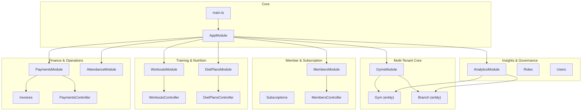
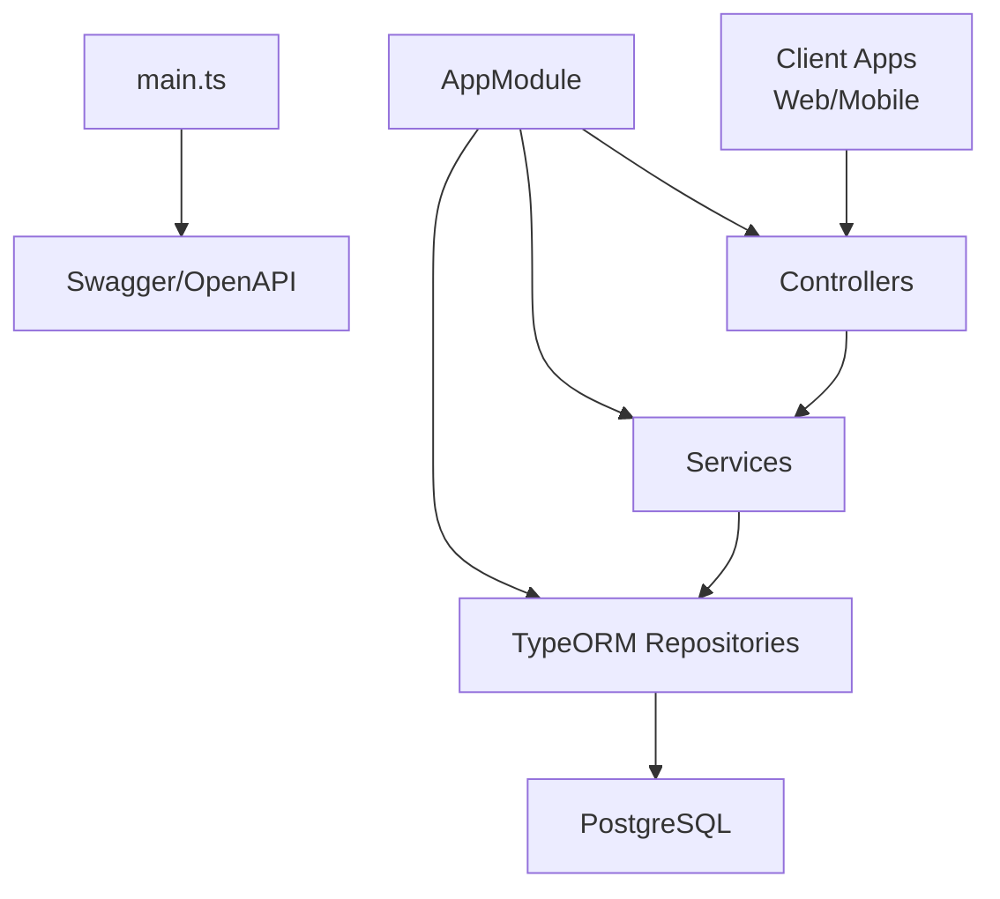
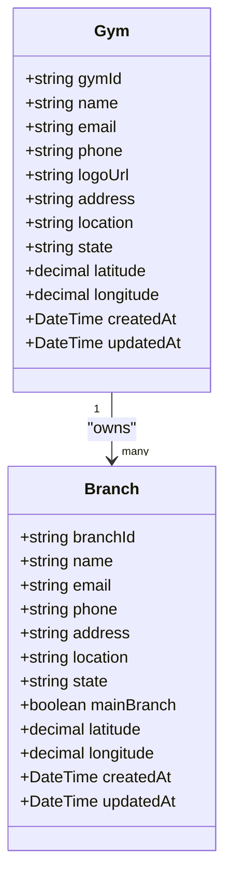
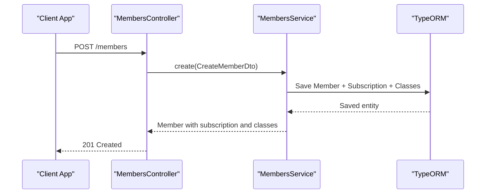
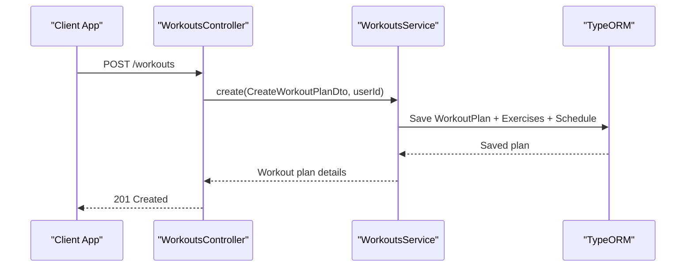
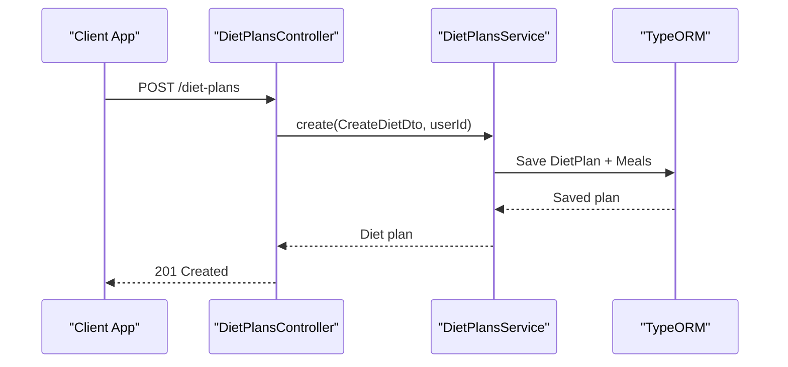
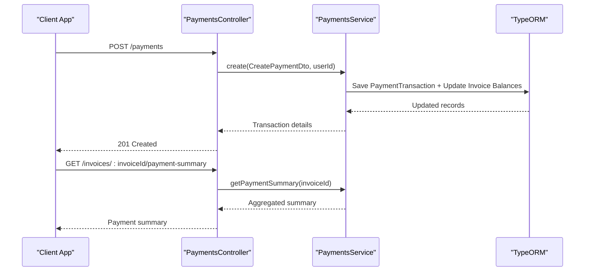
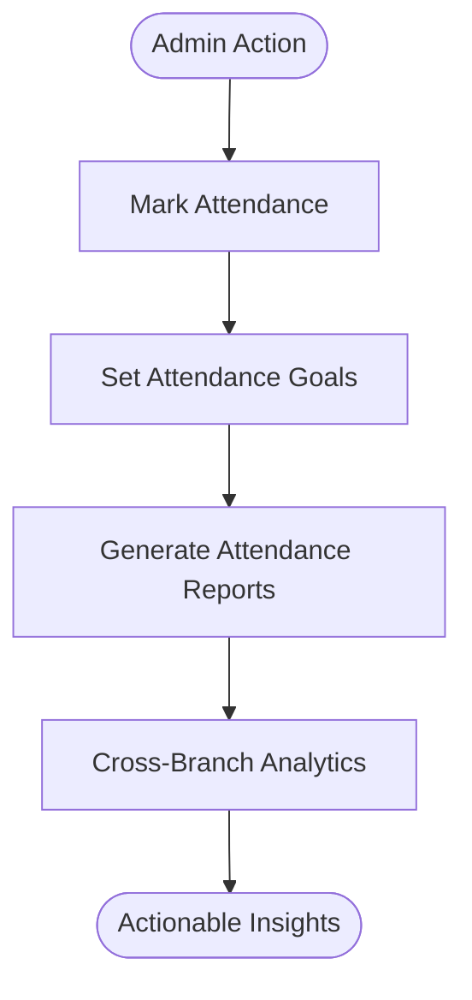
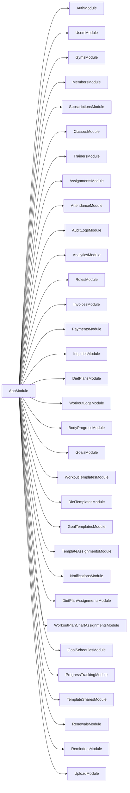

# Business Model & Features

<cite>
**Referenced Files in This Document**
- [app.module.ts](file://src/app.module.ts)
- [main.ts](file://src/main.ts)
- [gym.entity.ts](file://src/entities/gym.entity.ts)
- [branch.entity.ts](file://src/entities/branch.entity.ts)
- [gyms.module.ts](file://src/gyms/gyms.module.ts)
- [members.controller.ts](file://src/members/members.controller.ts)
- [members.module.ts](file://src/members/members.module.ts)
- [workouts.controller.ts](file://src/workouts/workouts.controller.ts)
- [workouts.module.ts](file://src/workouts/workouts.module.ts)
- [diet-plans.controller.ts](file://src/diet-plans/diet-plans.controller.ts)
- [diet-plans.module.ts](file://src/diet-plans/diet-plans.module.ts)
- [payments.controller.ts](file://src/payments/payments.controller.ts)
- [payments.module.ts](file://src/payments/payments.module.ts)
- [attendance.module.ts](file://src/attendance/attendance.module.ts)
- [analytics.module.ts](file://src/analytics/analytics.module.ts)
</cite>

## Table of Contents
1. [Introduction](#introduction)
2. [Project Structure](#project-structure)
3. [Core Components](#core-components)
4. [Architecture Overview](#architecture-overview)
5. [Detailed Component Analysis](#detailed-component-analysis)
6. [Dependency Analysis](#dependency-analysis)
7. [Performance Considerations](#performance-considerations)
8. [Troubleshooting Guide](#troubleshooting-guide)
9. [Conclusion](#conclusion)
10. [Appendices](#appendices)

## Introduction
This document defines the business model and feature portfolio for the gym management platform. The platform is a multi-tenant Software-as-a-Service (SaaS) solution designed to enable gym chains to operate multiple locations under unified management. It offers a comprehensive suite of capabilities spanning member lifecycle management, training and nutrition program delivery, financial operations, attendance tracking, and actionable analytics. The platform emphasizes operational efficiency, scalability, and a seamless digital experience for both administrators and members.

## Project Structure
The backend is built with NestJS and organized into modular feature domains. The application bootstraps Swagger/OpenAPI documentation and global validation, and integrates with PostgreSQL via TypeORM. The module composition reflects a domain-driven structure with dedicated modules for gyms, branches, members, memberships, subscriptions, classes, trainers, assignments, attendance, analytics, roles, invoices, payments, inquiries, diet plans, workout plans, goals, templates, notifications, progress tracking, renewals, and reminders.

**Diagram sources**
- [app.module.ts:66-136](file://src/app.module.ts#L66-L136)
- [main.ts:6-68](file://src/main.ts#L6-L68)
- [gym.entity.ts:12-55](file://src/entities/gym.entity.ts#L12-L55)
- [branch.entity.ts:18-78](file://src/entities/branch.entity.ts#L18-L78)
- [gyms.module.ts:11-17](file://src/gyms/gyms.module.ts#L11-L17)
- [members.module.ts:18-36](file://src/members/members.module.ts#L18-L36)
- [workouts.module.ts:11-25](file://src/workouts/workouts.module.ts#L11-L25)
- [diet-plans.module.ts:10-16](file://src/diet-plans/diet-plans.module.ts#L10-L16)
- [payments.module.ts:14-27](file://src/payments/payments.module.ts#L14-L27)
- [attendance.module.ts:16-35](file://src/attendance/attendance.module.ts#L16-L35)
- [analytics.module.ts:16-35](file://src/analytics/analytics.module.ts#L16-L35)

**Section sources**
- [app.module.ts:66-136](file://src/app.module.ts#L66-L136)
- [main.ts:6-68](file://src/main.ts#L6-L68)

## Core Components
The platform’s core offering revolves around a multi-tenant architecture supporting a “Gym” as the tenant root, with “Branches” representing individual locations. The system orchestrates member onboarding, subscription management, training/nutrition program delivery, financial operations, and operational insights.

- Multi-tenant SaaS model
  - Tenant: Gym
  - Child entities: Branch, User, Member, Trainer, Class, Attendance, Audit Logs, Inquiries, Goals, Templates, Assignments, Roles, Invoices, Payments, Renewals, Reminders
- Unified management enables centralized oversight across multiple branches while preserving local autonomy

Key feature portfolio:
- Member management: registration, profiles, subscriptions, dashboards
- Training program management: workout plans, templates, assignments, logs
- Nutrition program management: diet plans, templates, assignments
- Financial operations: billing, payments, invoicing, refunds, summaries
- Administrative tools: staff management, attendance tracking, analytics, reminders, renewals

Target market segments:
- Small gyms: streamlined operations, easy onboarding, cost-effective licensing
- Franchise chains: centralized brand control, uniform policies, multi-location visibility
- Corporate wellness programs: scalable membership plans, reporting, integration-ready APIs

Revenue streams and pricing model options:
- Subscription tiers aligned to branch count, concurrent users, and feature entitlements
- Optional add-ons for advanced analytics, white-label branding, premium support
- Usage-based or seat-based licensing depending on deployment model

Competitive advantages:
- Real-time reporting and analytics dashboards
- Automated billing and recurring payment orchestration
- Integrated communication channels (notifications, reminders)
- Mobile accessibility via modern frontend integrations

Success metrics and KPIs:
- Member acquisition cost (CAC), lifetime value (LTV)
- Churn rate, monthly recurring revenue (MRR), annual revenue retention (ARR)
- Average revenue per user (ARPU), conversion rate from inquiry to paid member
- Program completion rates, attendance trends, payment collection rates
- Operational efficiency indicators: average response times, audit completeness, staff productivity

Scalability and growth opportunities:
- Horizontal scaling via microservice decomposition and containerization
- Event-driven automation for renewals, reminders, and reporting
- Extensible template engine for training and nutrition programs
- API-first design enabling third-party integrations and white-label deployments

**Section sources**
- [gym.entity.ts:12-55](file://src/entities/gym.entity.ts#L12-L55)
- [branch.entity.ts:18-78](file://src/entities/branch.entity.ts#L18-L78)
- [gyms.module.ts:11-17](file://src/gyms/gyms.module.ts#L11-L17)
- [members.controller.ts:34-553](file://src/members/members.controller.ts#L34-L553)
- [workouts.controller.ts:29-800](file://src/workouts/workouts.controller.ts#L29-L800)
- [diet-plans.controller.ts:30-235](file://src/diet-plans/diet-plans.controller.ts#L30-L235)
- [payments.controller.ts:30-673](file://src/payments/payments.controller.ts#L30-L673)
- [attendance.module.ts:16-35](file://src/attendance/attendance.module.ts#L16-L35)
- [analytics.module.ts:16-35](file://src/analytics/analytics.module.ts#L16-L35)

## Architecture Overview
The system follows a layered architecture with clear separation of concerns:
- Presentation: Controllers expose REST endpoints with OpenAPI documentation
- Application: Services encapsulate business logic and workflows
- Persistence: TypeORM entities and repositories manage data access
- Cross-cutting: Guards, interceptors, pipes, and schedulers handle security, validation, and automation

**Diagram sources**
- [main.ts:28-65](file://src/main.ts#L28-L65)
- [app.module.ts:66-136](file://src/app.module.ts#L66-L136)

**Section sources**
- [main.ts:6-68](file://src/main.ts#L6-L68)
- [app.module.ts:66-136](file://src/app.module.ts#L66-L136)

## Detailed Component Analysis

### Multi-Tenant Tenant Model: Gym and Branch
The tenant model centers on a “Gym” entity that owns multiple “Branches.” Each branch maintains its own users, members, trainers, classes, and inquiries. This structure supports chain-wide policies while allowing branch-specific customization.

**Diagram sources**
- [gym.entity.ts:12-55](file://src/entities/gym.entity.ts#L12-L55)
- [branch.entity.ts:18-78](file://src/entities/branch.entity.ts#L18-L78)

**Section sources**
- [gym.entity.ts:12-55](file://src/entities/gym.entity.ts#L12-L55)
- [branch.entity.ts:18-78](file://src/entities/branch.entity.ts#L18-L78)
- [gyms.module.ts:11-17](file://src/gyms/gyms.module.ts#L11-L17)

### Member Management
Member management encompasses end-to-end member lifecycle operations: registration, profile updates, subscription assignment, class enrollment, and branch-level dashboards. The controller exposes endpoints for creation, listing, retrieval, updates, admin actions, and branch-scoped queries.

**Diagram sources**
- [members.controller.ts:34-222](file://src/members/members.controller.ts#L34-L222)

Operational highlights:
- Member creation with branch assignment, membership plan selection, and optional class enrollment
- Dashboard aggregation of subscriptions, attendance, and goals
- Admin-only updates and deletions with role checks
- Branch-scoped member listing and filtering

**Section sources**
- [members.controller.ts:34-553](file://src/members/members.controller.ts#L34-L553)
- [members.module.ts:18-36](file://src/members/members.module.ts#L18-L36)

### Training Program Management
Training program management supports creation, discovery, and assignment of workout plans and templates. The controller documents extensive filtering, sorting, and analytics endpoints for program insights.

**Diagram sources**
- [workouts.controller.ts:29-460](file://src/workouts/workouts.controller.ts#L29-L460)

Key capabilities:
- Structured plan creation with exercises, sets, progressions, schedules, and nutrition guidance
- Filtering by plan type, difficulty, status, and creator
- Analytics on completion rates, popularity, and performance metrics
- Template and assignment workflows for scalable distribution

**Section sources**
- [workouts.controller.ts:29-800](file://src/workouts/workouts.controller.ts#L29-L800)
- [workouts.module.ts:11-25](file://src/workouts/workouts.module.ts#L11-L25)

### Nutrition Program Management
Nutrition program management enables creation and administration of personalized diet plans with macronutrient targets, meal schedules, and goal alignment.

**Diagram sources**
- [diet-plans.controller.ts:30-116](file://src/diet-plans/diet-plans.controller.ts#L30-L116)

Capabilities:
- Personalized diet plans with calorie and macronutrient targets
- Meal scheduling and food lists
- Member-specific and user-assigned plan views
- Filtering by goal type and status

**Section sources**
- [diet-plans.controller.ts:30-235](file://src/diet-plans/diet-plans.controller.ts#L30-L235)
- [diet-plans.module.ts:10-16](file://src/diet-plans/diet-plans.module.ts#L10-L16)

### Financial Operations: Billing, Payments, Invoicing
Financial operations encompass invoice management, payment recording, verification, refunds, and comprehensive reporting. The controller supports branch-level and member-level payment histories and invoice payment summaries.

**Diagram sources**
- [payments.controller.ts:30-451](file://src/payments/payments.controller.ts#L30-L451)

Capabilities:
- Record payments via multiple methods (cash, card, online, bank transfer)
- Verify or reject pending payments
- Issue refunds with validation
- Payment summaries and invoice reconciliation
- Member payment history and branch reporting

**Section sources**
- [payments.controller.ts:30-673](file://src/payments/payments.controller.ts#L30-L673)
- [payments.module.ts:14-27](file://src/payments/payments.module.ts#L14-L27)

### Administrative Tools: Attendance Tracking, Analytics
Administrative tools include attendance tracking with goals and reporting, and analytics dashboards aggregating key metrics across gyms, branches, members, trainers, subscriptions, and financials.

[No sources needed since this diagram shows conceptual workflow, not actual code structure]

**Section sources**
- [attendance.module.ts:16-35](file://src/attendance/attendance.module.ts#L16-L35)
- [analytics.module.ts:16-35](file://src/analytics/analytics.module.ts#L16-L35)

## Dependency Analysis
The application module composes all feature modules and integrates shared infrastructure. The dependency graph highlights core modules and their relationships.

**Diagram sources**
- [app.module.ts:66-136](file://src/app.module.ts#L66-L136)

**Section sources**
- [app.module.ts:66-136](file://src/app.module.ts#L66-L136)

## Performance Considerations
- API throughput and latency: leverage pagination, filtering, and efficient joins to minimize payload sizes
- Caching: cache frequently accessed configurations, branch-level dashboards, and analytics aggregates
- Background jobs: offload heavy reporting and reminders to scheduled tasks
- Database indexing: ensure indexes on foreign keys, branch IDs, membership statuses, and payment dates
- Horizontal scaling: deploy multiple instances behind a load balancer; use connection pooling and read replicas for analytics-heavy queries

[No sources needed since this section provides general guidance]

## Troubleshooting Guide
Common issues and resolutions:
- Authentication failures: verify JWT Bearer token presence and validity; confirm roles and branch access
- Validation errors: review DTO constraints and required fields for endpoints like member creation and payment recording
- Authorization errors: ensure the requesting user has appropriate roles for admin-only endpoints
- Data integrity: cascade deletion and referential integrity constraints must be respected during member removal

**Section sources**
- [main.ts:28-65](file://src/main.ts#L28-L65)
- [members.controller.ts:413-459](file://src/members/members.controller.ts#L413-L459)
- [payments.controller.ts:35-93](file://src/payments/payments.controller.ts#L35-L93)

## Conclusion
The gym management platform’s multi-tenant SaaS model, combined with a robust feature portfolio spanning member management, training and nutrition programs, financial operations, and analytics, positions it to serve diverse market segments effectively. By emphasizing automation, real-time insights, and extensibility, the platform drives operational excellence and sustainable growth for gym chains, franchises, and corporate wellness initiatives.

[No sources needed since this section summarizes without analyzing specific files]

## Appendices
- API documentation: Swagger/OpenAPI is enabled and tagged by feature domains for discoverability and testing
- CORS configuration: flexible origins and credentials support for frontend integrations

**Section sources**
- [main.ts:28-65](file://src/main.ts#L28-L65)