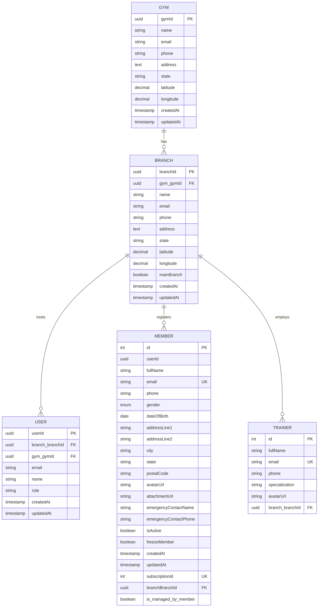
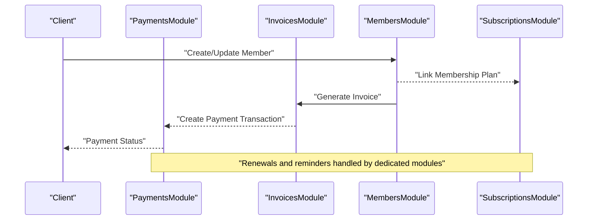
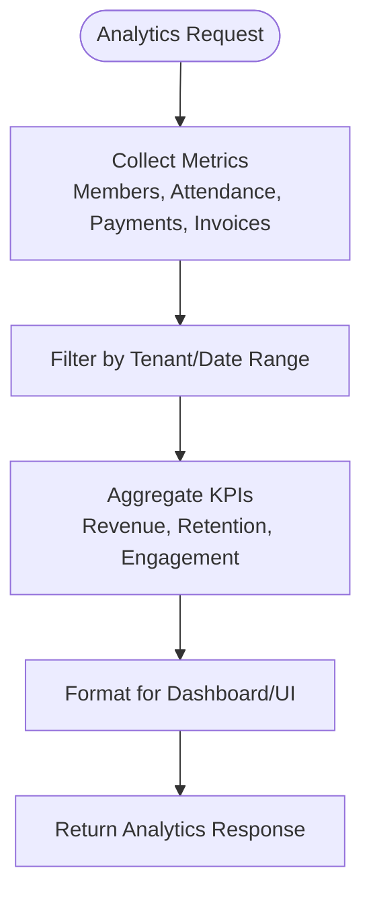
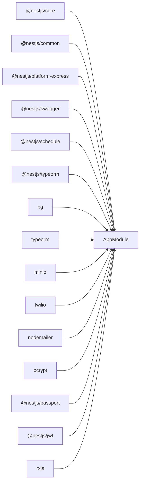

# Introduction & Purpose

<cite>
**Referenced Files in This Document**
- [main.ts](file://src/main.ts)
- [app.module.ts](file://src/app.module.ts)
- [package.json](file://package.json)
- [gym.entity.ts](file://src/entities/gym.entity.ts)
- [branch.entity.ts](file://src/entities/branch.entity.ts)
- [members.entity.ts](file://src/entities/members.entity.ts)
- [trainers.entity.ts](file://src/entities/trainers.entity.ts)
- [membership_plans.entity.ts](file://src/entities/membership_plans.entity.ts)
- [gyms.module.ts](file://src/gyms/gyms.module.ts)
- [members.module.ts](file://src/members/members.module.ts)
- [workouts.module.ts](file://src/workouts/workouts.module.ts)
- [diet-plans.module.ts](file://src/diet-plans/diet-plans.module.ts)
- [analytics.module.ts](file://src/analytics/analytics.module.ts)
- [payments.module.ts](file://src/payments/payments.module.ts)
</cite>

## Table of Contents
1. [Introduction](#introduction)
2. [Project Structure](#project-structure)
3. [Core Components](#core-components)
4. [Architecture Overview](#architecture-overview)
5. [Detailed Component Analysis](#detailed-component-analysis)
6. [Dependency Analysis](#dependency-analysis)
7. [Performance Considerations](#performance-considerations)
8. [Troubleshooting Guide](#troubleshooting-guide)
9. [Conclusion](#conclusion)

## Introduction
The NestJS Gym Management System is a comprehensive multi-tenant Software-as-a-Service (SaaS) platform designed to digitize and streamline the operations of fitness centers. It centralizes core workflows—member registration, training program management, nutrition tracking, financial operations, and administrative oversight—into a unified, scalable backend built with NestJS and PostgreSQL.

### Purpose and Value Proposition
- Digitization of manual gym workflows: Replace fragmented spreadsheets and paper-based systems with automated, real-time processes.
- Multi-tenancy: Support multiple gyms and branches under a single tenant, enabling centralized administration while preserving local autonomy.
- End-to-end operations: Cover the full lifecycle from member acquisition to retention, including memberships, classes, trainer assignments, attendance, nutrition plans, workout programs, invoicing, and payments.
- Real-time insights: Provide analytics dashboards to track engagement, revenue, and operational KPIs for informed decision-making.
- Operational efficiency: Automate repetitive tasks such as renewals, reminders, and reporting to reduce administrative burden.
- Revenue optimization: Improve cash flow through streamlined billing, automated renewals, and visibility into membership trends.

### Target Audience
- Gym owners and franchise operators seeking centralized control and scalability.
- Front desk and administrative staff managing daily operations, registrations, and member services.
- Trainers coordinating sessions, tracking progress, and delivering personalized plans.
- Managers monitoring performance metrics, class schedules, and resource utilization.

### Addressing Traditional Pain Points
- Manual data entry and reconciliation: Automated workflows reduce errors and free up time.
- Lack of real-time visibility: Dashboards and analytics enable proactive management.
- Fragmented systems: Unified platform integrates all departments into one cohesive ecosystem.
- Inefficient renewals and collections: Automated reminders and renewal requests improve retention and cash flow.

### Business Benefits
- Improved member retention: Personalized plans, progress tracking, and seamless renewals increase satisfaction and loyalty.
- Operational efficiency: Standardized processes, role-based access, and scheduled tasks optimize productivity.
- Revenue optimization: Clear visibility into membership performance, class attendance, and payment trends supports strategic decisions.

### Industry Context and Digital Transformation
As the fitness industry embraces digital transformation, gyms require robust, cloud-ready platforms that support growth, compliance, and member-centric experiences. This system aligns with modern trends by offering:
- Scalable SaaS architecture suitable for single-location gyms and multi-unit franchises.
- Role-based access control and audit logging to meet compliance needs.
- Integrations-ready design via modular microservice-style modules and standardized APIs.

## Project Structure
The application follows a modular NestJS architecture with domain-focused modules and shared infrastructure. The root module aggregates feature modules and configures database, scheduling, and file upload services.

```mermaid
graph TB
Main["src/main.ts<br/>Bootstrap, CORS, Validation Pipes, Swagger"] --> AppModule["src/app.module.ts<br/>Root Module"]
AppModule --> AuthMod["auth/*"]
AppModule --> UsersMod["users/*"]
AppModule --> GymsMod["gyms/*"]
AppModule --> MembersMod["members/*"]
AppModule --> PlansMod["membership-plans/*"]
AppModule --> SubscriptionsMod["subscriptions/*"]
AppModule --> ClassesMod["classes/*"]
AppModule --> TrainersMod["trainers/*"]
AppModule --> AssignmentsMod["assignments/*"]
AppModule --> AttendanceMod["attendance/*"]
AppModule --> AuditLogsMod["audit-logs/*"]
AppModule --> AnalyticsMod["analytics/*"]
AppModule --> RolesMod["roles/*"]
AppModule --> InvoicesMod["invoices/*"]
AppModule --> PaymentsMod["payments/*"]
AppModule --> InquiriesMod["inquiries/*"]
AppModule --> DietPlansMod["diet-plans/*"]
AppModule --> WorkoutLogsMod["workout-logs/*"]
AppModule --> BodyProgressMod["body-progress/*"]
AppModule --> GoalsMod["goals/*"]
AppModule --> WorkoutTemplatesMod["workouts/* (templates)/*"]
AppModule --> DietTemplatesMod["diet-plans/* (templates)/*"]
AppModule --> GoalTemplatesMod["goals/* (templates)/*"]
AppModule --> TemplateAssignmentsMod["templates/* (assignments)/*"]
AppModule --> NotificationsMod["notifications/*"]
AppModule --> UploadMod["upload/*"]
```

**Diagram sources**
- [main.ts:6-68](file://src/main.ts#L6-L68)
- [app.module.ts:66-137](file://src/app.module.ts#L66-L137)

**Section sources**
- [main.ts:6-68](file://src/main.ts#L6-L68)
- [app.module.ts:66-137](file://src/app.module.ts#L66-L137)

## Core Components
This section outlines the primary functional domains and their responsibilities, mapped to the module and entity structure.

- Multi-tenancy foundation
  - Gym and Branch entities model the multi-tenant hierarchy, enabling separate branding, locations, and user sets per gym.
  - Modules such as gyms and members operate within this tenant boundary.

- Member lifecycle management
  - Registration, profile maintenance, and status tracking are supported by the members module and related entities.
  - Membership plans and subscriptions tie into financial workflows.

- Training and nutrition programs
  - Workout templates and plans, along with diet templates and plans, enable personalized member programs.
  - Assignments connect members to trainers and share templates across teams.

- Operations and finance
  - Attendance tracking, class scheduling, and trainer management support daily operations.
  - Payments and invoices handle billing, transactions, and renewals.

- Insights and governance
  - Analytics modules aggregate KPIs for revenue, attendance, and engagement.
  - Audit logs and notifications provide transparency and communication.

**Section sources**
- [gym.entity.ts:12-55](file://src/entities/gym.entity.ts#L12-L55)
- [branch.entity.ts:18-78](file://src/entities/branch.entity.ts#L18-L78)
- [members.entity.ts:22-123](file://src/entities/members.entity.ts#L22-L123)
- [membership_plans.entity.ts:11-33](file://src/entities/membership_plans.entity.ts#L11-L33)
- [gyms.module.ts:11-17](file://src/gyms/gyms.module.ts#L11-L17)
- [members.module.ts:18-36](file://src/members/members.module.ts#L18-L36)
- [workouts.module.ts:11-25](file://src/workouts/workouts.module.ts#L11-L25)
- [diet-plans.module.ts:10-16](file://src/diet-plans/diet-plans.module.ts#L10-L16)
- [analytics.module.ts:16-35](file://src/analytics/analytics.module.ts#L16-L35)
- [payments.module.ts:14-27](file://src/payments/payments.module.ts#L14-L27)

## Architecture Overview
The system is structured around a modular backend with a focus on separation of concerns, maintainability, and extensibility. The root module orchestrates feature modules, while entities define the data model and relationships.

```mermaid
graph TB
subgraph "Runtime"
Bootstrap["src/main.ts<br/>CORS, Validation Pipes, Swagger"]
end
subgraph "Core Modules"
Auth["auth/*"]
Users["users/*"]
Roles["roles/*"]
Gyms["gyms/*"]
Members["members/*"]
Plans["membership-plans/*"]
Subscriptions["subscriptions/*"]
Classes["classes/*"]
Trainers["trainers/*"]
Assignments["assignments/*"]
Attendance["attendance/*"]
AuditLogs["audit-logs/*"]
Analytics["analytics/*"]
Inquiries["inquiries/*"]
Invoices["invoices/*"]
Payments["payments/*"]
DietPlans["diet-plans/*"]
WorkoutLogs["workout-logs/*"]
BodyProgress["body-progress/*"]
Goals["goals/*"]
WorkoutTemplates["workouts/* (templates)/*"]
DietTemplates["diet-plans/* (templates)/*"]
GoalTemplates["goals/* (templates)/*"]
TemplateAssignments["templates/* (assignments)/*"]
Notifications["notifications/*"]
Upload["upload/*"]
end
Bootstrap --> Auth
Bootstrap --> Users
Bootstrap --> Roles
Bootstrap --> Gyms
Bootstrap --> Members
Bootstrap --> Plans
Bootstrap --> Subscriptions
Bootstrap --> Classes
Bootstrap --> Trainers
Bootstrap --> Assignments
Bootstrap --> Attendance
Bootstrap --> AuditLogs
Bootstrap --> Analytics
Bootstrap --> Inquiries
Bootstrap --> Invoices
Bootstrap --> Payments
Bootstrap --> DietPlans
Bootstrap --> WorkoutLogs
Bootstrap --> BodyProgress
Bootstrap --> Goals
Bootstrap --> WorkoutTemplates
Bootstrap --> DietTemplates
Bootstrap --> GoalTemplates
Bootstrap --> TemplateAssignments
Bootstrap --> Notifications
Bootstrap --> Upload
```

**Diagram sources**
- [main.ts:6-68](file://src/main.ts#L6-L68)
- [app.module.ts:66-137](file://src/app.module.ts#L66-L137)

**Section sources**
- [main.ts:6-68](file://src/main.ts#L6-L68)
- [app.module.ts:66-137](file://src/app.module.ts#L66-L137)

## Detailed Component Analysis

### Multi-Tenant Data Model
The system models gyms and branches as tenants, with users, members, trainers, and classes scoped to branches. This ensures isolation and scalability across multiple fitness centers.

**Diagram sources**
- [gym.entity.ts:12-55](file://src/entities/gym.entity.ts#L12-L55)
- [branch.entity.ts:18-78](file://src/entities/branch.entity.ts#L18-L78)
- [members.entity.ts:22-123](file://src/entities/members.entity.ts#L22-L123)
- [trainers.entity.ts:4-26](file://src/entities/trainers.entity.ts#L4-L26)

**Section sources**
- [gym.entity.ts:12-55](file://src/entities/gym.entity.ts#L12-L55)
- [branch.entity.ts:18-78](file://src/entities/branch.entity.ts#L18-L78)
- [members.entity.ts:22-123](file://src/entities/members.entity.ts#L22-L123)
- [trainers.entity.ts:4-26](file://src/entities/trainers.entity.ts#L4-L26)

### Financial and Membership Workflow
The payments and membership modules coordinate billing, renewals, and subscriptions to streamline revenue operations.

**Diagram sources**
- [payments.module.ts:14-27](file://src/payments/payments.module.ts#L14-L27)
- [members.module.ts:18-36](file://src/members/members.module.ts#L18-L36)
- [membership_plans.entity.ts:11-33](file://src/entities/membership_plans.entity.ts#L11-L33)

**Section sources**
- [payments.module.ts:14-27](file://src/payments/payments.module.ts#L14-L27)
- [members.module.ts:18-36](file://src/members/members.module.ts#L18-L36)
- [membership_plans.entity.ts:11-33](file://src/entities/membership_plans.entity.ts#L11-L33)

### Analytics and Reporting
The analytics module aggregates data across entities to produce actionable insights for management.

**Diagram sources**
- [analytics.module.ts:16-35](file://src/analytics/analytics.module.ts#L16-L35)

**Section sources**
- [analytics.module.ts:16-35](file://src/analytics/analytics.module.ts#L16-L35)

## Dependency Analysis
The application leverages NestJS core modules and third-party libraries for security, persistence, scheduling, and integrations.

**Diagram sources**
- [package.json:22-46](file://package.json#L22-L46)

**Section sources**
- [package.json:22-46](file://package.json#L22-L46)

## Performance Considerations
- Modular design: Keep modules focused and avoid tight coupling to improve maintainability and testability.
- Caching and indexing: Add database indexes on frequently queried fields (e.g., member email, branch identifiers) to speed up lookups.
- Pagination and filtering: Implement server-side pagination and filters for analytics and listing endpoints to manage large datasets.
- Background jobs: Use scheduled tasks for recurring operations like renewals, reminders, and report generation.
- API validation: Validation pipes ensure clean inputs and reduce downstream processing overhead.

## Troubleshooting Guide
- CORS configuration: Verify allowed origins and credentials in the bootstrap configuration.
- Validation errors: Whitelist and transform inputs globally to prevent invalid payloads from reaching handlers.
- Swagger documentation: Use the generated OpenAPI spec to validate endpoint contracts and test payloads.
- Environment variables: Confirm database connection strings, storage credentials, and service keys are properly configured.

**Section sources**
- [main.ts:8-26](file://src/main.ts#L8-L26)
- [main.ts:28-65](file://src/main.ts#L28-L65)

## Conclusion
The NestJS Gym Management System delivers a modern, scalable foundation for fitness center operations. By consolidating member management, training and nutrition programs, class scheduling, and financial workflows into a single platform, it enables gyms to automate routine tasks, gain real-time insights, and optimize revenue—all while supporting growth across multiple locations. Its modular architecture and strong data modeling position it well for ongoing enhancements and integration with complementary frontend and third-party services.