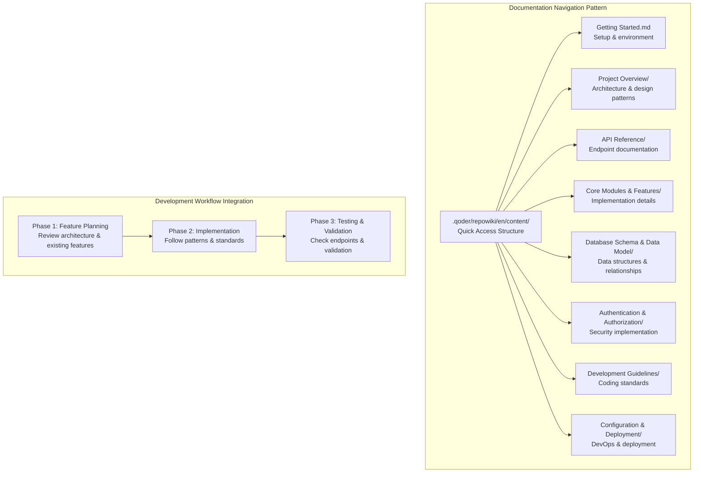
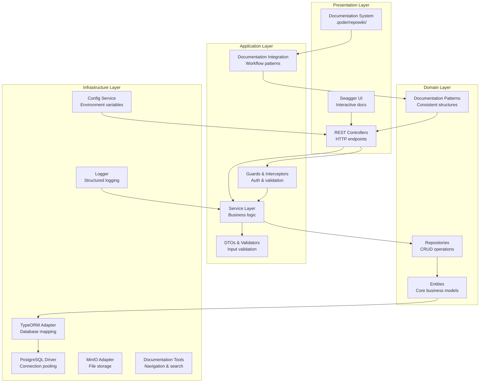
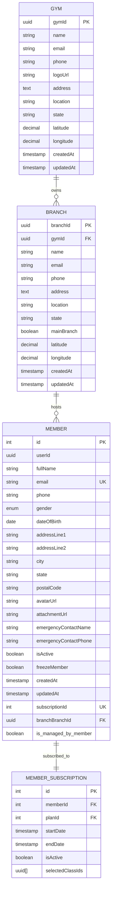
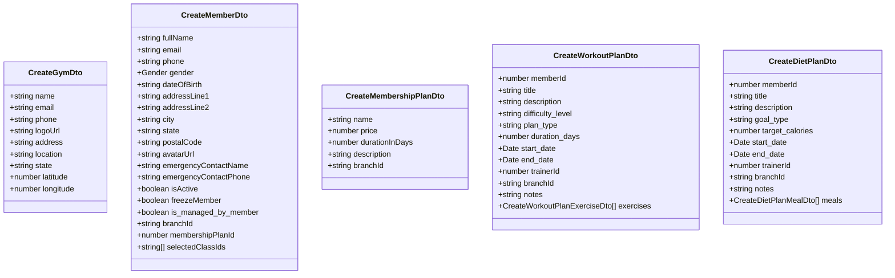

# Project Overview

<cite>
**Referenced Files in This Document**
- [main.ts](file://src/main.ts)
- [app.module.ts](file://src/app.module.ts)
- [package.json](file://package.json)
- [dbConfig.ts](file://dbConfig.ts)
- [auth.module.ts](file://src/auth/auth.module.ts)
- [gyms.module.ts](file://src/gyms/gyms.module.ts)
- [members.module.ts](file://src/members/members.module.ts)
- [workouts.module.ts](file://src/workouts/workouts.module.ts)
- [diet-plans.module.ts](file://src/diet-plans/diet-plans.module.ts)
- [analytics.module.ts](file://src/analytics/analytics.module.ts)
- [upload.module.ts](file://src/upload/upload.module.ts)
- [project_desc_refrence_guide.md](file://project_desc_refrence_guide.md)
- [gym.entity.ts](file://src/entities/gym.entity.ts)
- [branch.entity.ts](file://src/entities/branch.entity.ts)
- [members.entity.ts](file://src/entities/members.entity.ts)
- [member_subscriptions.entity.ts](file://src/entities/member_subscriptions.entity.ts)
- [create-gym.dto.ts](file://src/gyms/dto/create-gym.dto.ts)
- [create-member.dto.ts](file://src/members/dto/create-member.dto.ts)
- [create-membership-plan.dto.ts](file://src/membership-plans/dto/create-membership-plan.dto.ts)
- [create-workout-plan.dto.ts](file://src/workouts/dto/create-workout-plan.dto.ts)
- [create-diet-plan.dto.ts](file://src/diet-plans/dto/create-diet-plan.dto.ts)
</cite>

## Update Summary
**Changes Made**
- Enhanced documentation navigation patterns with comprehensive reference guide integration
- Updated development workflow integration to reference structured documentation sections
- Added new documentation organization patterns for improved developer onboarding
- Integrated .qoder/repowiki/ content structure for systematic knowledge management
- Updated project structure to reflect enhanced documentation accessibility

## Table of Contents
1. [Introduction](#introduction)
2. [Documentation Navigation & Development Workflow](#documentation-navigation--development-workflow)
3. [Project Structure](#project-structure)
4. [Core Components](#core-components)
5. [Architecture Overview](#architecture-overview)
6. [Detailed Component Analysis](#detailed-component-analysis)
7. [Dependency Analysis](#dependency-analysis)
8. [Performance Considerations](#performance-considerations)
9. [Troubleshooting Guide](#troubleshooting-guide)
10. [Conclusion](#conclusion)

## Introduction
The NestJS Gym Management System is a multi-tenant Software-as-a-Service (SaaS) platform designed to streamline fitness center operations across multiple locations. It provides a unified digital infrastructure for gym chains to manage memberships, subscriptions, training programs, nutrition plans, class scheduling, attendance tracking, and financial operations while maintaining tenant isolation and scalability.

**Enhanced Documentation Integration** The project now features a comprehensive documentation navigation system through the `.qoder/repowiki/en/content/` structure, providing structured access to:
- Getting Started guides for rapid onboarding
- Project Overview with architecture patterns
- API Reference with categorized endpoint documentation
- Core Modules & Features with implementation details
- Database Schema & Data Model with entity relationships
- Authentication & Authorization security implementations
- Development Guidelines for coding standards
- Configuration & Deployment procedures

Key value propositions:
- Multi-location orchestration with tenant-aware data segregation via gyms and branches
- End-to-end member lifecycle management from registration to subscription renewal
- Integrated wellness program delivery with customizable workout and diet plans
- Real-time analytics and reporting for operational insights
- Secure, scalable backend built on modern NestJS architecture with PostgreSQL persistence
- **Enhanced Developer Experience** through structured documentation navigation and workflow integration

Target audience:
- Franchise and corporate gym chains seeking centralized management
- Regional fitness operators managing multiple studio locations
- Enterprise health and wellness departments requiring robust member engagement tools
- Development teams requiring systematic documentation access and workflow integration

Competitive advantages:
- Modular microservice-style NestJS modules for maintainable, testable components
- Strong separation of concerns with dedicated modules for gym management, memberships, training, nutrition, and analytics
- Built-in tenant scoping through gym and branch entities ensuring data isolation
- Comprehensive CRUD APIs with DTO validation and Swagger documentation
- **Structured Documentation System** providing systematic knowledge management and developer onboarding
- Extensible entity model supporting future fitness industry integrations

## Documentation Navigation & Development Workflow

### Enhanced Documentation Structure
The project implements a systematic documentation navigation pattern through the `.qoder/repowiki/en/content/` directory structure:

**Diagram sources**
- [project_desc_refrence_guide.md:3-16](file://project_desc_refrence_guide.md#L3-L16)
- [project_desc_refrence_guide.md:18-33](file://project_desc_refrence_guide.md#L18-L33)

### Development Workflow Integration
The documentation system integrates with the development lifecycle through structured phases:

**Phase 1: Feature Planning**
- Review `Project Overview/Project Overview.md` for architecture patterns
- Check `Database Schema & Data Model/` for existing data structures  
- Review `Core Modules & Features/` for similar existing features

**Phase 2: Implementation**
- Use `API Reference/` for endpoint patterns and validation
- Follow `Development Guidelines/` for coding standards
- Reference `Authentication & Authorization/` for security requirements

**Phase 3: Testing & Validation**
- Check `API Reference/` for expected request/response formats
- Review `Database Schema & Data Model/` for data validation rules

**Section sources**
- [project_desc_refrence_guide.md:18-62](file://project_desc_refrence_guide.md#L18-L62)

## Project Structure
The application follows NestJS's layered architecture with domain-driven modules and enhanced documentation integration. The structure emphasizes separation of concerns, modularity, and systematic knowledge management:

```mermaid
graph TB
subgraph "Application Layer"
AppModule["AppModule<br/>Root module"]
AuthModule["AuthModule<br/>Authentication & Authorization"]
UsersModule["UsersModule<br/>User management"]
GymsModule["GymsModule<br/>Gym & Branch management"]
MembersModule["MembersModule<br/>Member management"]
MembershipPlansModule["MembershipPlansModule<br/>Pricing plans"]
SubscriptionsModule["SubscriptionsModule<br/>Member subscriptions"]
ClassesModule["ClassesModule<br/>Class scheduling"]
TrainersModule["TrainersModule<br/>Trainer management"]
AssignmentsModule["AssignmentsModule<br/>Member-trainer assignments"]
AttendanceModule["AttendanceModule<br/>Attendance tracking"]
AnalyticsModule["AnalyticsModule<br/>Business intelligence"]
PaymentsModule["PaymentsModule<br/>Financial transactions"]
InvoicesModule["InvoicesModule<br/>Billing & invoicing"]
DietPlansModule["DietPlansModule<br/>Nutrition programs"]
WorkoutTemplatesModule["WorkoutTemplatesModule<br/>Training templates"]
GoalsModule["GoalsModule<br/>Goal tracking"]
ProgressTrackingModule["ProgressTrackingModule<br/>Body metrics"]
NotificationsModule["NotificationsModule<br/>Communication"]
UploadModule["UploadModule<br/>File upload & storage"]
ExerciseLibraryModule["ExerciseLibraryModule<br/>Exercise database"]
MealLibraryModule["MealLibraryModule<br/>Meal database"]
RemindersModule["RemindersModule<br/>Automated notifications"]
RenewalsModule["RenewalsModule<br/>Subscription renewals"]
GoalSchedulesModule["GoalSchedulesModule<br/>Goal timeline management"]
GoalTemplatesModule["GoalTemplatesModule<br/>Goal template management"]
DietTemplatesModule["DietTemplatesModule<br/>Diet template management"]
WorkoutPlanChartAssignmentsModule["WorkoutPlanChartAssignmentsModule<br/>Training visualization"]
DietPlanAssignmentsModule["DietPlanAssignmentsModule<br/>Nutrition program assignment"]
TemplateAssignmentsModule["TemplateAssignmentsModule<br/>Template distribution"]
TemplateSharesModule["TemplateSharesModule<br/>Template sharing"]
BodyProgressModule["BodyProgressModule<br/>Body composition tracking"]
WorkoutLogsModule["WorkoutLogsModule<br/>Exercise logging"]
AuditLogsModule["AuditLogsModule<br/>Activity tracking"]
RolesModule["RolesModule<br/>Permission management"]
end
subgraph "Persistence Layer"
TypeORM["TypeORM Module"]
Entities["Entities<br/>Gym, Branch, Member,<br/>Subscription, Workout, Diet"]
PostgreSQL["PostgreSQL Database"]
MinIO["MinIO Storage<br/>File & image management"]
end
subgraph "Infrastructure"
Swagger["Swagger UI<br/>API Documentation"]
Config["Environment Config<br/>.env support"]
Scheduler["Task Scheduling<br/>@nestjs/schedule"]
Logger["Structured Logging<br/>Application insights"]
end
AppModule --> AuthModule
AppModule --> UsersModule
AppModule --> GymsModule
AppModule --> MembersModule
AppModule --> MembershipPlansModule
AppModule --> SubscriptionsModule
AppModule --> ClassesModule
AppModule --> TrainersModule
AppModule --> AssignmentsModule
AppModule --> AttendanceModule
AppModule --> AnalyticsModule
AppModule --> PaymentsModule
AppModule --> InvoicesModule
AppModule --> DietPlansModule
AppModule --> WorkoutTemplatesModule
AppModule --> GoalsModule
AppModule --> ProgressTrackingModule
AppModule --> NotificationsModule
AppModule --> UploadModule
AppModule --> ExerciseLibraryModule
AppModule --> MealLibraryModule
AppModule --> RemindersModule
AppModule --> RenewalsModule
AppModule --> GoalSchedulesModule
AppModule --> GoalTemplatesModule
AppModule --> DietTemplatesModule
AppModule --> WorkoutPlanChartAssignmentsModule
AppModule --> DietPlanAssignmentsModule
AppModule --> TemplateAssignmentsModule
AppModule --> TemplateSharesModule
AppModule --> BodyProgressModule
AppModule --> WorkoutLogsModule
AppModule --> AuditLogsModule
AppModule --> RolesModule
TypeORM --> Entities
Entities --> PostgreSQL
Entities --> MinIO
Swagger --> AppModule
Config --> AppModule
Scheduler --> AppModule
Logger --> AppModule
```

**Diagram sources**
- [app.module.ts:66-137](file://src/app.module.ts#L66-L137)
- [main.ts:28-65](file://src/main.ts#L28-L65)

The modular design enables independent development, testing, and deployment of functional domains while maintaining cohesive integration through the root AppModule. The enhanced documentation system provides systematic access to all modules and their relationships.

**Section sources**
- [app.module.ts:1-142](file://src/app.module.ts#L1-L142)
- [main.ts:1-70](file://src/main.ts#L1-L70)

## Core Components
The system comprises several core modules that collectively enable comprehensive gym management, each integrated with the documentation navigation system:

### Authentication & Authorization
The AuthModule provides JWT-based authentication with passport strategies, role-based access control, and tenant-aware user management. It integrates with the UsersModule to handle user lifecycle operations within gym and branch contexts. **Documentation Integration**: Refer to `Authentication & Authorization/` for implementation details and security patterns.

### Gym & Branch Management
The GymsModule orchestrates multi-location operations through Gym and Branch entities. Each Gym can contain multiple Branches, enabling franchise-style deployments where each location maintains its own data while being part of a larger tenant organization. **Documentation Integration**: Check `Core Modules & Features/Gym Management/` for detailed implementation patterns.

### Member Management
The MembersModule handles complete member profiles, including personal information, emergency contacts, membership status, and branch associations. It integrates with subscription management for automated billing and renewal workflows. **Documentation Integration**: See `Core Modules & Features/Member Management/` for comprehensive member lifecycle documentation.

### Training & Nutrition Programs
The system supports comprehensive wellness program delivery through:
- Workout Plans: Structured exercise routines with customizable exercises, sets, reps, and timing
- Diet Plans: Personalized nutrition programs with macronutrient tracking and meal planning
- Templates: Reusable workout and diet templates for efficient program creation
- Progress Tracking: Body metrics and goal achievement monitoring
- **Documentation Integration**: Refer to `Core Modules & Features/Training Programs/` and `Core Modules & Features/Nutrition Programs/` for implementation details.

### Financial Operations
The PaymentsModule manages transaction processing, while the InvoicesModule handles billing cycles and renewal requests. Together they provide end-to-end revenue management for subscription-based fitness services. **Documentation Integration**: Check `Core Modules & Features/Financial Operations/` for payment processing patterns.

### Advanced Features
The system includes specialized modules for comprehensive gym operations:
- **Exercise Library**: Centralized exercise database with categorization and filtering
- **Meal Library**: Nutritional database for meal planning and diet creation
- **Reminders**: Automated notification system for appointments and renewals
- **Audit Logs**: Comprehensive activity tracking and compliance reporting
- **Template Management**: Systematic distribution and sharing of workout and diet templates

**Section sources**
- [auth.module.ts:1-25](file://src/auth/auth.module.ts#L1-L25)
- [gyms.module.ts:1-18](file://src/gyms/gyms.module.ts#L1-L18)
- [members.module.ts:1-37](file://src/members/members.module.ts#L1-L37)
- [workouts.module.ts:1-26](file://src/workouts/workouts.module.ts#L1-L26)
- [diet-plans.module.ts:1-17](file://src/diet-plans/diet-plans.module.ts#L1-L17)
- [analytics.module.ts:1-36](file://src/analytics/analytics.module.ts#L1-L36)
- [upload.module.ts:1-13](file://src/upload/upload.module.ts#L1-L13)

## Architecture Overview
The system employs a layered architecture with clear boundaries between presentation, application, and persistence layers, enhanced by comprehensive documentation integration:

**Diagram sources**
- [app.module.ts:66-137](file://src/app.module.ts#L66-L137)
- [main.ts:28-65](file://src/main.ts#L28-L65)

The architecture ensures:
- Clean separation of concerns with explicit module boundaries
- Testable business logic isolated from HTTP concerns
- Pluggable persistence layer supporting database migrations and schema evolution
- Centralized configuration management for environment-specific settings
- Comprehensive API documentation generation
- **Systematic Documentation Integration** for consistent development patterns

## Detailed Component Analysis

### Multi-Tenant Data Model
The system implements tenant isolation through hierarchical entity relationships with comprehensive documentation support:

**Diagram sources**
- [gym.entity.ts:12-55](file://src/entities/gym.entity.ts#L12-L55)
- [branch.entity.ts:18-78](file://src/entities/branch.entity.ts#L18-L78)
- [members.entity.ts:22-123](file://src/entities/members.entity.ts#L22-L123)
- [member_subscriptions.entity.ts:14-70](file://src/entities/member_subscriptions.entity.ts#L14-L70)

### API Design & Validation
The system enforces strict input validation through DTOs with comprehensive field definitions, following documented patterns:

**Diagram sources**
- [create-gym.dto.ts:4-85](file://src/gyms/dto/create-gym.dto.ts#L4-L85)
- [create-member.dto.ts:17-215](file://src/members/dto/create-member.dto.ts#L17-L215)
- [create-membership-plan.dto.ts:11-44](file://src/membership-plans/dto/create-membership-plan.dto.ts#L11-L44)
- [create-workout-plan.dto.ts:77-144](file://src/workouts/dto/create-workout-plan.dto.ts#L77-L144)
- [create-diet-plan.dto.ts:95-151](file://src/diet-plans/dto/create-diet-plan.dto.ts#L95-L151)

### Practical Multi-Location Examples
The platform demonstrates real-world gym chain scenarios with documented implementation patterns:

**Franchise Deployment Example:**
- Corporate Gym Chain "Fitness First Elite" operates multiple locations
- Each branch maintains separate member databases while sharing corporate branding
- Subscription plans can be location-specific or corporate-wide
- Training programs adapt to branch equipment and instructor availability
- **Documentation Reference**: See `Core Modules & Features/Multi-Location Deployment/` for implementation patterns

**Regional Operator Example:**
- Regional fitness operator manages 15 locations across a metropolitan area
- Centralized analytics dashboard aggregates performance metrics
- Automated billing consolidates payments across all locations
- Standardized training protocols ensure quality consistency
- **Documentation Reference**: Check `Core Modules & Features/Regional Operations/` for scaling patterns

**Section sources**
- [gym.entity.ts:12-55](file://src/entities/gym.entity.ts#L12-L55)
- [branch.entity.ts:18-78](file://src/entities/branch.entity.ts#L18-L78)
- [members.entity.ts:22-123](file://src/entities/members.entity.ts#L22-L123)
- [member_subscriptions.entity.ts:14-70](file://src/entities/member_subscriptions.entity.ts#L14-L70)
- [create-gym.dto.ts:4-85](file://src/gyms/dto/create-gym.dto.ts#L4-L85)
- [create-member.dto.ts:17-215](file://src/members/dto/create-member.dto.ts#L17-L215)

## Dependency Analysis
The system leverages a comprehensive set of NestJS and third-party dependencies with enhanced documentation integration:

```mermaid
graph TB
subgraph "NestJS Core"
NestCore["@nestjs/core"]
NestCommon["@nestjs/common"]
NestPlatform["@nestjs/platform-express"]
NestConfig["@nestjs/config"]
NestSchedule["@nestjs/schedule"]
NestSwagger["@nestjs/swagger"]
NestTypeORM["@nestjs/typeorm"]
NestJWT["@nestjs/jwt"]
NestPassport["@nestjs/passport"]
end
subgraph "Database & ORM"
TypeORM["typeorm"]
Postgres["pg driver"]
MinIO["minio"]
end
subgraph "Security & Auth"
PassportJWT["passport-jwt"]
Bcrypt["bcrypt"]
ClassValidator["class-validator"]
ClassTransformer["class-transformer"]
end
subgraph "Development Tools"
ESLint["eslint"]
Prettier["prettier"]
Jest["jest"]
Supertest["supertest"]
end
subgraph "Infrastructure"
SwaggerUI["swagger-ui-express"]
Twilio["twilio"]
Nodemailer["nodemailer"]
TypeScript["typescript"]
RxJS["rxjs"]
ReflectMetadata["reflect-metadata"]
end
subgraph "Documentation System"
QoderWiki[".qoder/repowiki/<br/>Structured documentation"]
DocNavigation["Documentation Navigation<br/>Quick access patterns"]
DevWorkflow["Development Workflow<br/>Integration patterns"]
end
AppModule --> NestCore
AppModule --> NestCommon
AppModule --> NestConfig
AppModule --> NestSchedule
AppModule --> NestTypeORM
AppModule --> NestJWT
AppModule --> NestPassport
AppModule --> NestSwagger
NestTypeORM --> TypeORM
NestTypeORM --> Postgres
NestJWT --> PassportJWT
NestSwagger --> SwaggerUI
AppModule --> ClassValidator
AppModule --> MinIO
AppModule --> Nodemailer
AppModule --> Twilio
AppModule --> ESLint
AppModule --> Prettier
AppModule --> Jest
AppModule --> Supertest
QoderWiki --> DocNavigation
DocNavigation --> DevWorkflow
```

**Diagram sources**
- [package.json:22-46](file://package.json#L22-L46)
- [app.module.ts:66-137](file://src/app.module.ts#L66-L137)

**Section sources**
- [package.json:1-97](file://package.json#L1-L97)
- [dbConfig.ts:1-12](file://dbConfig.ts#L1-L12)

## Performance Considerations
The system incorporates several performance optimization strategies with documentation support:

- **Connection Pooling**: PostgreSQL connection pooling through TypeORM configuration
- **Caching Strategy**: Application-level caching for frequently accessed entities
- **Pagination Support**: Built-in pagination for large dataset queries
- **Indexing Strategy**: Strategic database indexing on frequently queried fields
- **Background Jobs**: Scheduled tasks for automated billing and report generation
- **Resource Optimization**: Efficient DTO transformations to minimize payload sizes
- **Documentation Optimization**: Structured documentation navigation reduces development time and improves code quality consistency

## Troubleshooting Guide
Common operational issues and resolutions with documentation-based troubleshooting:

**Database Connectivity Issues:**
- Verify DATABASE_URL or POSTGRES_URL environment variables
- Check PostgreSQL service availability and network connectivity
- Review connection pool limits and timeout configurations
- **Documentation Reference**: Check `Configuration & Deployment/Database Setup/` for configuration patterns

**Authentication Failures:**
- Validate JWT secret configuration and expiration settings
- Check role-based access permissions for requested endpoints
- Review CORS configuration for cross-origin requests
- **Documentation Reference**: See `Authentication & Authorization/JWT Configuration/` for security setup

**API Validation Errors:**
- Review DTO validation rules and required field constraints
- Check data type compatibility for numeric and date fields
- Verify UUID format compliance for entity identifiers
- **Documentation Reference**: Check `API Reference/Validation Rules/` for error handling patterns

**Performance Bottlenecks:**
- Monitor database query execution times
- Implement appropriate indexing strategies
- Review memory usage patterns and optimize entity loading
- **Documentation Reference**: See `Development Guidelines/Performance Optimization/` for best practices

**Documentation Navigation Issues:**
- Verify .qoder/repowiki/ directory structure
- Check file permissions for documentation access
- Review documentation index files for proper linking
- **Documentation Reference**: Refer to `Development Guidelines/Documentation Standards/` for maintenance procedures

**Section sources**
- [dbConfig.ts:3-11](file://dbConfig.ts#L3-L11)
- [main.ts:8-19](file://src/main.ts#L8-L19)
- [main.ts:20-26](file://src/main.ts#L20-L26)
- [project_desc_refrence_guide.md:112-136](file://project_desc_refrence_guide.md#L112-L136)

## Conclusion
The NestJS Gym Management System represents a comprehensive solution for modern fitness center operations with enhanced documentation integration. Its modular architecture, robust multi-tenancy support, extensive feature coverage, and systematic documentation navigation position it as an ideal platform for gym chains seeking digital transformation.

**Key Enhancements**:
- **Structured Documentation System**: The `.qoder/repowiki/` provides comprehensive, navigable documentation covering all aspects of the system
- **Development Workflow Integration**: Documentation patterns integrate seamlessly with the development lifecycle
- **Enhanced Developer Onboarding**: Quick reference guides and structured navigation reduce onboarding time
- **Systematic Knowledge Management**: Organized documentation sections ensure consistent information access

The system's emphasis on clean code architecture, comprehensive validation, scalable infrastructure, and systematic documentation ensures long-term maintainability and growth potential. Through its unified approach to gym management, member engagement, operational analytics, and developer experience, the platform delivers measurable value to fitness operators while providing a solid foundation for future enhancements and industry-specific integrations.

**Documentation Integration Benefits**:
- Reduced development time through structured navigation
- Consistent code patterns across modules
- Improved onboarding for new team members
- Better maintainability through systematic knowledge management
- Enhanced collaboration through shared documentation standards

The platform's comprehensive documentation system, combined with its robust technical architecture, positions it as a leading solution for modern fitness center digital transformation initiatives.