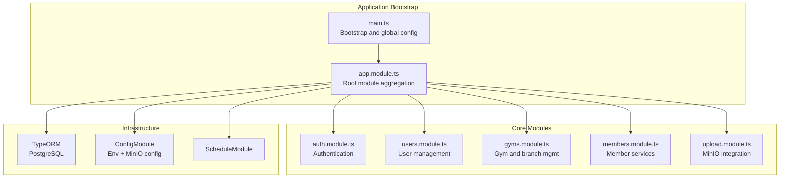
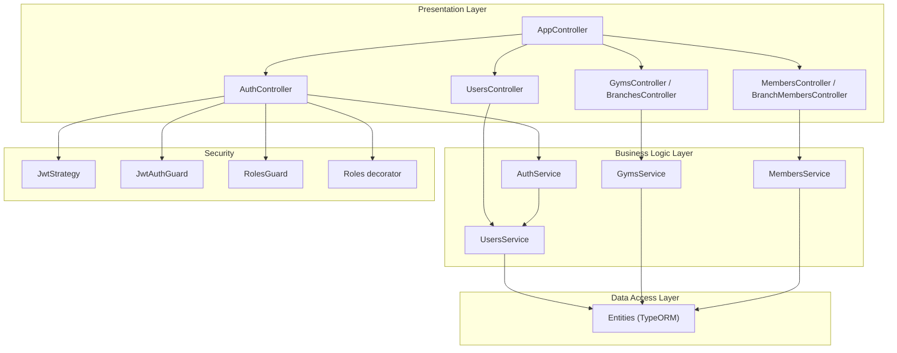
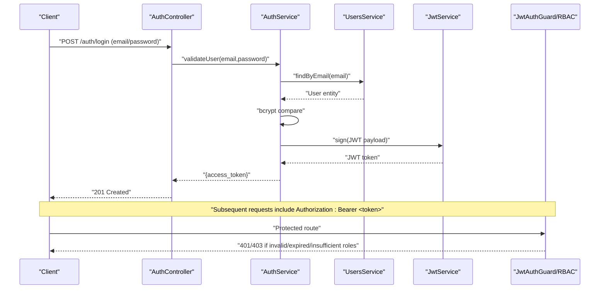
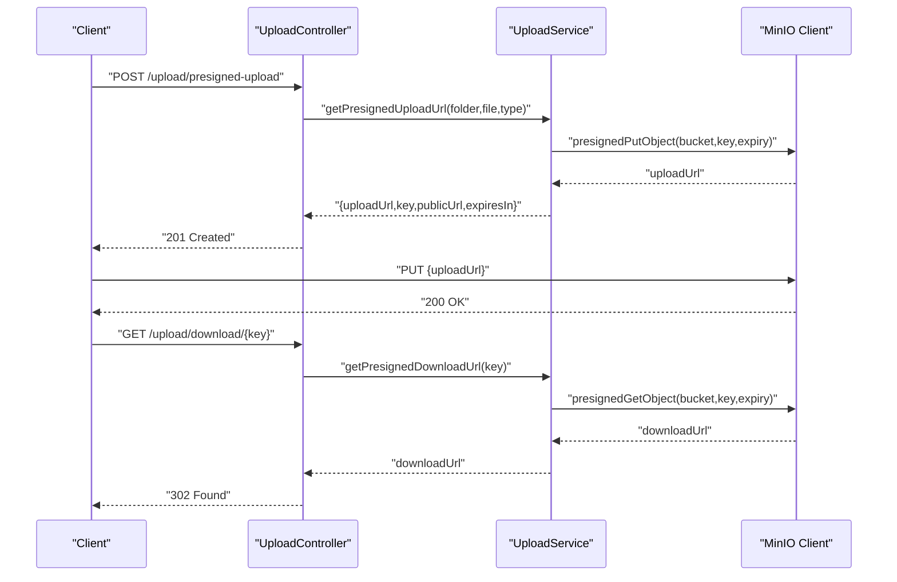
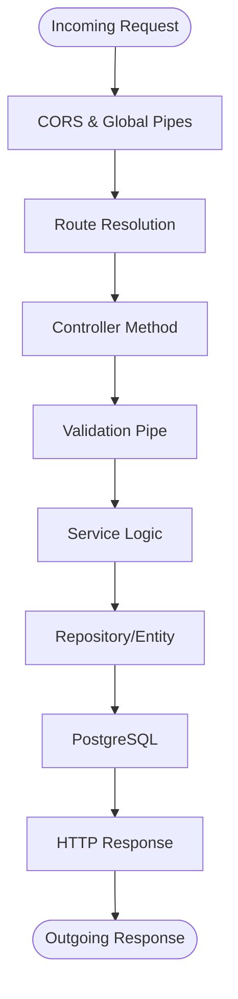
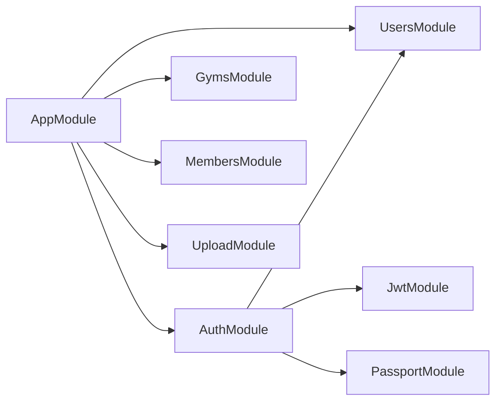

# System Architecture & Design

<cite>
**Referenced Files in This Document**
- [src/app.module.ts](file://src/app.module.ts)
- [src/main.ts](file://src/main.ts)
- [src/auth/auth.module.ts](file://src/auth/auth.module.ts)
- [src/auth/auth.service.ts](file://src/auth/auth.service.ts)
- [src/auth/guards/jwt-auth.guard.ts](file://src/auth/guards/jwt-auth.guard.ts)
- [src/auth/guards/roles.guard.ts](file://src/auth/guards/roles.guard.ts)
- [src/auth/strategies/jwt.strategy.ts](file://src/auth/strategies/jwt.strategy.ts)
- [src/auth/decorators/roles.decorator.ts](file://src/auth/decorators/roles.decorator.ts)
- [src/users/users.module.ts](file://src/users/users.module.ts)
- [src/members/members.module.ts](file://src/members/members.module.ts)
- [src/gyms/gyms.module.ts](file://src/gyms/gyms.module.ts)
- [src/upload/upload.module.ts](file://src/upload/upload.module.ts)
- [src/upload/upload.service.ts](file://src/upload/upload.service.ts)
- [src/config/minio.config.ts](file://src/config/minio.config.ts)
- [src/entities/branch.entity.ts](file://src/entities/branch.entity.ts)
- [src/common/enums/role.enum.ts](file://src/common/enums/role.enum.ts)
- [src/common/enums/permissions.enum.ts](file://src/common/enums/permissions.enum.ts)
- [src/app.controller.ts](file://src/app.controller.ts)
</cite>

## Table of Contents
1. [Introduction](#introduction)
2. [Project Structure](#project-structure)
3. [Core Components](#core-components)
4. [Architecture Overview](#architecture-overview)
5. [Detailed Component Analysis](#detailed-component-analysis)
6. [Dependency Analysis](#dependency-analysis)
7. [Performance Considerations](#performance-considerations)
8. [Troubleshooting Guide](#troubleshooting-guide)
9. [Conclusion](#conclusion)

## Introduction
This document describes the high-level architecture and design of the NestJS Gym Management System. The system follows a modular architecture with clear separation of concerns across authentication, user management, gym operations, member services, and administrative modules. It implements a layered architecture with presentation (controllers), business logic (services), and data access (entities via TypeORM) layers. The application leverages NestJS dependency injection to wire modules into the main application module. Authentication and authorization are enforced using JWT tokens and role-based access control (RBAC). Cross-cutting concerns include validation, logging, error handling, and security middleware. The system integrates with external services such as MinIO for file storage, Twilio for SMS-based OTP, and payment processors and notification services via module boundaries. Multi-tenancy is supported through gym and branch entities that define logical separation of data across locations.

## Project Structure
The project is organized into feature-based modules under the src directory, each encapsulating related controllers, services, DTOs, and entities. The main application module aggregates all feature modules and configures infrastructure providers such as TypeORM, configuration, scheduling, and the upload module.



**Diagram sources**
- [src/main.ts:6-68](file://src/main.ts#L6-L68)
- [src/app.module.ts:66-137](file://src/app.module.ts#L66-L137)

**Section sources**
- [src/app.module.ts:66-137](file://src/app.module.ts#L66-L137)
- [src/main.ts:6-68](file://src/main.ts#L6-L68)

## Core Components
- Root application module: Aggregates all feature modules, configures TypeORM, schedules, and uploads.
- Feature modules: Auth, Users, Gyms, Members, and others, each exporting services and controllers.
- Authentication and authorization: JWT-based authentication with guards and strategies, plus RBAC via decorators and guards.
- Data access: Entities mapped via TypeORM for all domain resources.
- External integrations: MinIO for file storage, Twilio for OTP, and placeholders for payment and notification services.

**Section sources**
- [src/app.module.ts:66-137](file://src/app.module.ts#L66-L137)
- [src/auth/auth.module.ts:11-24](file://src/auth/auth.module.ts#L11-L24)
- [src/users/users.module.ts:9-15](file://src/users/users.module.ts#L9-L15)
- [src/members/members.module.ts:18-36](file://src/members/members.module.ts#L18-L36)
- [src/gyms/gyms.module.ts:11-17](file://src/gyms/gyms.module.ts#L11-L17)
- [src/upload/upload.module.ts:6-12](file://src/upload/upload.module.ts#L6-L12)

## Architecture Overview
The system follows a layered architecture:
- Presentation Layer: Controllers expose REST endpoints and delegate to services.
- Business Logic Layer: Services encapsulate domain logic and orchestrate operations.
- Data Access Layer: Services use repositories derived from TypeORM entities.

Authentication and authorization are enforced at the controller level using guards and decorators. The dependency injection container wires modules and providers, ensuring loose coupling and testability.



**Diagram sources**
- [src/app.controller.ts:10-363](file://src/app.controller.ts#L10-L363)
- [src/auth/auth.module.ts:7-20](file://src/auth/auth.module.ts#L7-L20)
- [src/auth/auth.service.ts:14-164](file://src/auth/auth.service.ts#L14-L164)
- [src/users/users.module.ts:3-13](file://src/users/users.module.ts#L3-L13)
- [src/members/members.module.ts:3-34](file://src/members/members.module.ts#L3-L34)
- [src/gyms/gyms.module.ts:3-15](file://src/gyms/gyms.module.ts#L3-L15)
- [src/auth/strategies/jwt.strategy.ts:9-25](file://src/auth/strategies/jwt.strategy.ts#L9-L25)
- [src/auth/guards/jwt-auth.guard.ts:1-6](file://src/auth/guards/jwt-auth.guard.ts#L1-L6)
- [src/auth/guards/roles.guard.ts:12-41](file://src/auth/guards/roles.guard.ts#L12-L41)
- [src/auth/decorators/roles.decorator.ts:5-7](file://src/auth/decorators/roles.decorator.ts#L5-L7)

## Detailed Component Analysis

### Authentication and Authorization Flow
The authentication subsystem uses JWT tokens with a passport strategy and guards. The service supports both password-based and OTP-based login flows. RBAC is enforced via a roles guard and decorator.



**Diagram sources**
- [src/auth/auth.service.ts:31-51](file://src/auth/auth.service.ts#L31-L51)
- [src/auth/strategies/jwt.strategy.ts:22-24](file://src/auth/strategies/jwt.strategy.ts#L22-L24)
- [src/auth/guards/jwt-auth.guard.ts:4-5](file://src/auth/guards/jwt-auth.guard.ts#L4-L5)
- [src/auth/guards/roles.guard.ts:16-40](file://src/auth/guards/roles.guard.ts#L16-L40)
- [src/auth/decorators/roles.decorator.ts:6-7](file://src/auth/decorators/roles.decorator.ts#L6-L7)

**Section sources**
- [src/auth/auth.service.ts:14-164](file://src/auth/auth.service.ts#L14-L164)
- [src/auth/strategies/jwt.strategy.ts:9-25](file://src/auth/strategies/jwt.strategy.ts#L9-L25)
- [src/auth/guards/jwt-auth.guard.ts:1-6](file://src/auth/guards/jwt-auth.guard.ts#L1-L6)
- [src/auth/guards/roles.guard.ts:12-41](file://src/auth/guards/roles.guard.ts#L12-L41)
- [src/auth/decorators/roles.decorator.ts:1-8](file://src/auth/decorators/roles.decorator.ts#L1-L8)

### Multi-Tenant Architecture (Gym/Branch Separation)
Multi-tenancy is achieved by modeling gyms and branches as parent-child entities. Users, members, trainers, classes, and inquiries are associated with branches, ensuring logical separation of data per gym location.

```mermaid
erDiagram
GYM {
uuid id PK
string name
timestamp created_at
timestamp updated_at
}
BRANCH {
uuid branchId PK
uuid gym_id FK
string name
boolean mainBranch
timestamp created_at
timestamp updated_at
}
USER {
uuid userId PK
uuid branch_id FK
string email
string phone
string role
timestamp created_at
timestamp updated_at
}
MEMBER {
uuid memberId PK
uuid branch_id FK
string name
timestamp created_at
timestamp updated_at
}
TRAINER {
uuid trainerId PK
uuid branch_id FK
string name
timestamp created_at
timestamp updated_at
}
CLASS {
uuid classId PK
uuid branch_id FK
string name
timestamp created_at
timestamp updated_at
}
INQUIRY {
uuid inquiryId PK
uuid branch_id FK
string name
timestamp created_at
timestamp updated_at
}
GYM ||--o{ BRANCH : "has"
BRANCH ||--o{ USER : "hosts"
BRANCH ||--o{ MEMBER : "serves"
BRANCH ||--o{ TRAINER : "employs"
BRANCH ||--o{ CLASS : "conducts"
BRANCH ||--o{ INQUIRY : "receives"
```

**Diagram sources**
- [src/entities/branch.entity.ts:18-78](file://src/entities/branch.entity.ts#L18-L78)

**Section sources**
- [src/entities/branch.entity.ts:18-78](file://src/entities/branch.entity.ts#L18-L78)

### File Upload and Storage Integration (MinIO)
The upload module integrates with MinIO for storing files. It validates categories and sizes, generates unique keys, and provides presigned URLs for secure uploads/downloads. Access control ensures users can only access files within their role-scoped folders.



**Diagram sources**
- [src/upload/upload.service.ts:202-233](file://src/upload/upload.service.ts#L202-L233)
- [src/upload/upload.service.ts:314-326](file://src/upload/upload.service.ts#L314-L326)
- [src/config/minio.config.ts:20-36](file://src/config/minio.config.ts#L20-L36)

**Section sources**
- [src/upload/upload.module.ts:6-12](file://src/upload/upload.module.ts#L6-L12)
- [src/upload/upload.service.ts:11-345](file://src/upload/upload.service.ts#L11-L345)
- [src/config/minio.config.ts:1-37](file://src/config/minio.config.ts#L1-L37)

### Request Processing Flow (End-to-End)
Requests traverse the application through controllers, validated by global pipes, then processed by services, and persisted via TypeORM repositories.



**Diagram sources**
- [src/main.ts:13-26](file://src/main.ts#L13-L26)
- [src/app.module.ts:74-99](file://src/app.module.ts#L74-L99)

**Section sources**
- [src/main.ts:6-68](file://src/main.ts#L6-L68)
- [src/app.module.ts:66-137](file://src/app.module.ts#L66-L137)

## Dependency Analysis
The main application module imports and aggregates all feature modules, configuration, scheduling, and upload modules. Each feature module declares its TypeORM entities and exposes providers/controllers. Authentication depends on users and JWT configuration.



**Diagram sources**
- [src/app.module.ts:99-132](file://src/app.module.ts#L99-L132)
- [src/auth/auth.module.ts:11-21](file://src/auth/auth.module.ts#L11-L21)

**Section sources**
- [src/app.module.ts:66-137](file://src/app.module.ts#L66-L137)
- [src/auth/auth.module.ts:11-24](file://src/auth/auth.module.ts#L11-L24)

## Performance Considerations
- Use pagination for list endpoints to avoid large payloads.
- Leverage database indexes on frequently queried fields (e.g., branch associations).
- Cache infrequent configuration reads via NestJS ConfigModule.
- Offload heavy operations to scheduled tasks using ScheduleModule.
- Use presigned URLs for large file uploads to reduce server bandwidth.

## Troubleshooting Guide
- Authentication failures: Verify JWT secret configuration and token expiration; ensure guards are applied to protected routes.
- Authorization failures: Confirm role values and permissions mapping; ensure roles decorator matches guard expectations.
- File upload errors: Check MinIO endpoint, credentials, bucket existence, and file size/type constraints.
- Validation errors: Review DTOs and global validation pipe settings; whitelist and forbidNonWhitelisted options are enabled globally.
- CORS issues: Validate CORS origins configuration and credentials flag.

**Section sources**
- [src/auth/auth.service.ts:142-162](file://src/auth/auth.service.ts#L142-L162)
- [src/upload/upload.service.ts:43-54](file://src/upload/upload.service.ts#L43-L54)
- [src/main.ts:13-26](file://src/main.ts#L13-L26)

## Conclusion
The Gym Management System employs a clean, modular architecture with strong separation between authentication, user management, gym operations, and member services. The layered design, combined with dependency injection and guards, enables maintainable and testable code. JWT-based authentication and RBAC provide robust security, while MinIO integration supports scalable file handling. The multi-tenant model using gyms and branches ensures logical data isolation across locations. Cross-cutting concerns such as validation, logging, and error handling are consistently applied across the application.