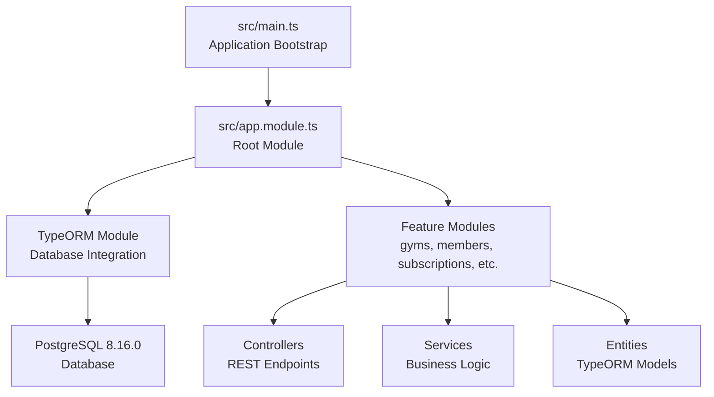
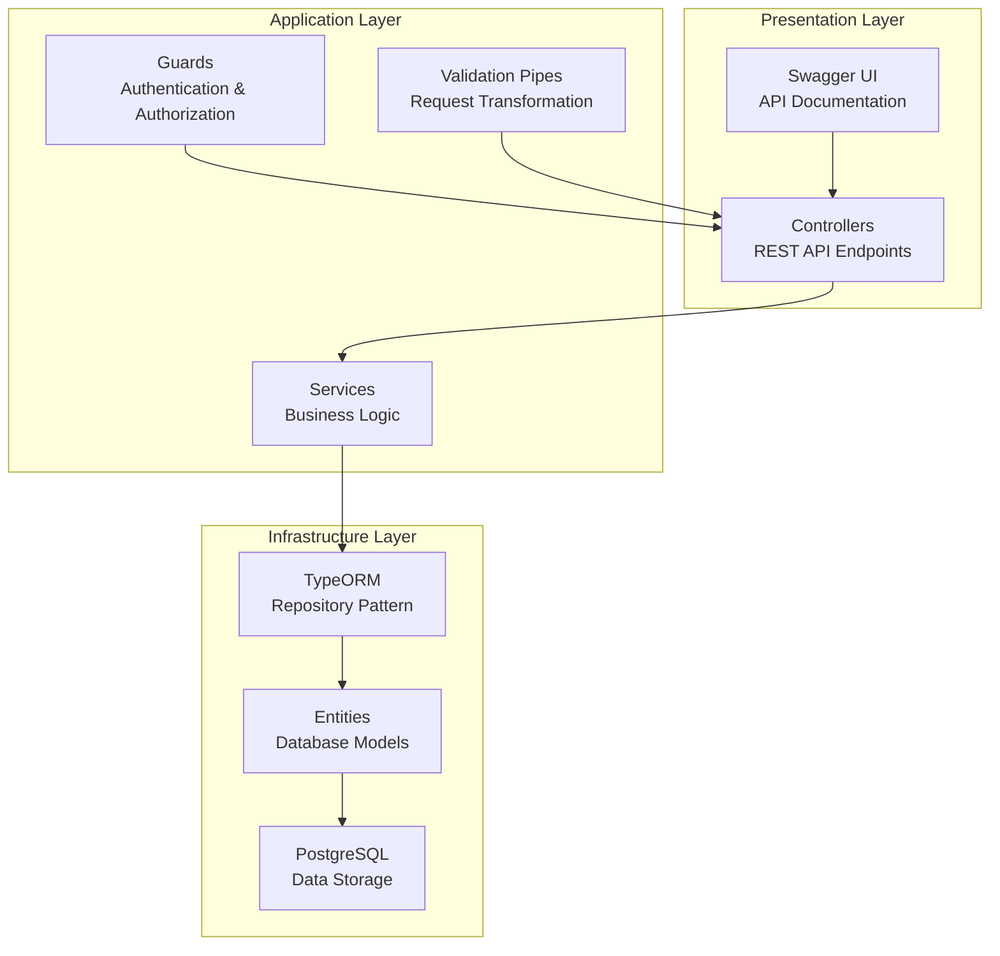
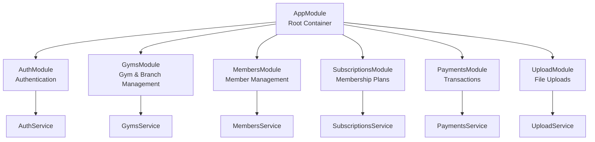
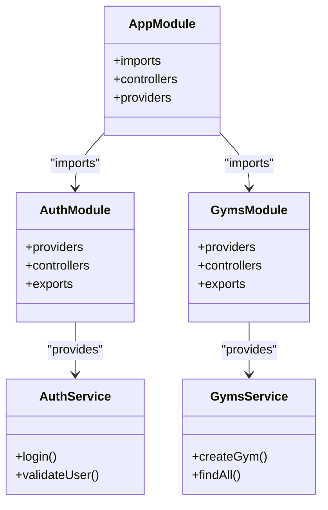
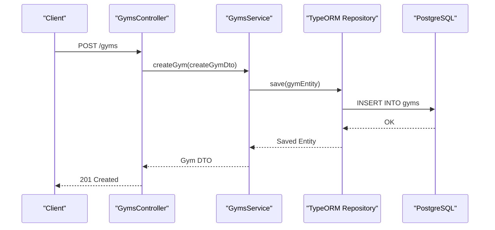
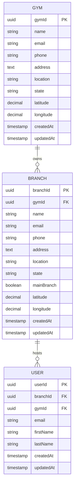

# Technology Stack & Architecture

<cite>
**Referenced Files in This Document**
- [package.json](file://package.json)
- [nest-cli.json](file://nest-cli.json)
- [tsconfig.json](file://tsconfig.json)
- [eslint.config.mjs](file://eslint.config.mjs)
- [.prettierrc](file://.prettierrc)
- [src/main.ts](file://src/main.ts)
- [src/app.module.ts](file://src/app.module.ts)
- [dbConfig.ts](file://dbConfig.ts)
- [src/app.controller.ts](file://src/app.controller.ts)
- [src/app.service.ts](file://src/app.service.ts)
- [src/entities/gym.entity.ts](file://src/entities/gym.entity.ts)
- [src/entities/branch.entity.ts](file://src/entities/branch.entity.ts)
- [src/gyms/gyms.module.ts](file://src/gyms/gyms.module.ts)
- [src/auth/auth.module.ts](file://src/auth/auth.module.ts)
- [src/test-db.ts](file://src/test-db.ts)
</cite>

## Table of Contents
1. [Introduction](#introduction)
2. [Project Structure](#project-structure)
3. [Core Technologies](#core-technologies)
4. [Architecture Overview](#architecture-overview)
5. [Development Environment Setup](#development-environment-setup)
6. [Modular Architecture Pattern](#modular-architecture-pattern)
7. [Dependency Injection System](#dependency-injection-system)
8. [Service Layer Design](#service-layer-design)
9. [Testing Framework](#testing-framework)
10. [Code Quality Tools](#code-quality-tools)
11. [Multi-Tenant Architecture](#multi-tenant-architecture)
12. [Performance Considerations](#performance-considerations)
13. [Troubleshooting Guide](#troubleshooting-guide)
14. [Conclusion](#conclusion)

## Introduction
This document provides a comprehensive overview of the technology stack and architectural foundation supporting the NestJS Gym Management System. It explains the strategic choices behind the selected technologies—NestJS 11.0.1, TypeScript, PostgreSQL 8.16.0, and TypeORM 0.3.24—and demonstrates how they collectively enable enterprise-grade scalability, maintainability, and extensibility for managing multi-gym operations. The document also covers development workflow, modular architecture, dependency injection, service layer design, testing, code quality tools, and the multi-tenant approach that supports scalable gym chain operations.

## Project Structure
The project follows a feature-based modular structure aligned with NestJS conventions. Modules encapsulate domain-specific functionality (e.g., gyms, members, subscriptions), while shared infrastructure (database, configuration, uploads) is centralized. The application bootstraps via a single entry point and exposes REST APIs with integrated Swagger documentation.

**Diagram sources**
- [src/main.ts:6-69](file://src/main.ts#L6-L69)
- [src/app.module.ts:66-137](file://src/app.module.ts#L66-L137)

**Section sources**
- [src/main.ts:1-70](file://src/main.ts#L1-L70)
- [src/app.module.ts:1-138](file://src/app.module.ts#L1-L138)

## Core Technologies
The system leverages a modern, enterprise-ready tech stack designed for scalability, type safety, and developer productivity.

- **NestJS 11.0.1**: Provides a robust, scalable backend framework with built-in support for dependency injection, modularity, and clean architecture. It integrates seamlessly with TypeScript, Swagger, and TypeORM.
- **TypeScript**: Ensures type safety, improved IDE support, and maintainability across the codebase. Compiler options emphasize strictness and decorator metadata for reflection-based frameworks like NestJS and TypeORM.
- **PostgreSQL 8.16.0**: A mature, ACID-compliant relational database offering advanced features, extensibility, and strong consistency guarantees essential for financial and membership data.
- **TypeORM 0.3.24**: An ORM enabling object-relational mapping with entity-centric design, migrations, and query building. It integrates tightly with NestJS via @nestjs/typeorm.

Benefits for enterprise-scale applications:
- **Scalability**: Modular architecture and database-driven design support horizontal scaling and multi-tenant separation.
- **Maintainability**: Strong typing, clear separation of concerns, and standardized patterns reduce technical debt.
- **Developer Experience**: Decorators, dependency injection, and code generation streamline development and testing.

**Section sources**
- [package.json:22-46](file://package.json#L22-L46)
- [tsconfig.json:2-19](file://tsconfig.json#L2-L19)
- [dbConfig.ts:3-11](file://dbConfig.ts#L3-L11)

## Architecture Overview
The system employs a layered architecture with clear boundaries between presentation, business logic, and persistence layers. The root module aggregates feature modules, each exposing controllers and services backed by TypeORM entities.

**Diagram sources**
- [src/app.module.ts:66-137](file://src/app.module.ts#L66-L137)
- [src/main.ts:28-65](file://src/main.ts#L28-L65)

**Section sources**
- [src/app.module.ts:1-138](file://src/app.module.ts#L1-L138)
- [src/main.ts:1-70](file://src/main.ts#L1-L70)

## Development Environment Setup
The development environment is configured for rapid iteration with hot reload, linting, formatting, and testing capabilities.

- **Node.js Requirements**: The project targets modern Node.js environments compatible with NestJS 11 and TypeScript 5.7.x. Ensure Node.js LTS is installed.
- **npm Scripts**: Comprehensive scripts cover building, running, debugging, linting, formatting, unit testing, coverage, and E2E tests.
- **Build Configuration**: Nest CLI compiles TypeScript with SWC for speed, emitting to the dist directory. Swagger plugin is enabled for automatic API documentation generation.

Key setup steps:
1. Install dependencies using npm install.
2. Configure environment variables (.env) for database connection and other runtime settings.
3. Start in development mode with npm run start:dev for hot reloading.
4. Build for production using npm run build.

**Section sources**
- [package.json:8-21](file://package.json#L8-L21)
- [nest-cli.json:5-8](file://nest-cli.json#L5-L8)
- [tsconfig.json:2-19](file://tsconfig.json#L2-L19)

## Modular Architecture Pattern
The application adopts a feature-based modular architecture where each domain area (e.g., gyms, members, subscriptions) is encapsulated within its own module. This promotes separation of concerns, testability, and independent development.

**Diagram sources**
- [src/app.module.ts:29-64](file://src/app.module.ts#L29-L64)
- [src/auth/auth.module.ts:11-21](file://src/auth/auth.module.ts#L11-L21)
- [src/gyms/gyms.module.ts:11-17](file://src/gyms/gyms.module.ts#L11-L17)

**Section sources**
- [src/app.module.ts:1-138](file://src/app.module.ts#L1-L138)
- [src/auth/auth.module.ts:1-25](file://src/auth/auth.module.ts#L1-L25)
- [src/gyms/gyms.module.ts:1-18](file://src/gyms/gyms.module.ts#L1-L18)

## Dependency Injection System
NestJS's built-in dependency injection (DI) container manages object creation and lifecycle. Providers are registered at module level and injected into controllers and services through constructor injection, promoting loose coupling and testability.

**Diagram sources**
- [src/app.module.ts:66-137](file://src/app.module.ts#L66-L137)
- [src/auth/auth.module.ts:11-21](file://src/auth/auth.module.ts#L11-L21)
- [src/gyms/gyms.module.ts:11-17](file://src/gyms/gyms.module.ts#L11-L17)

**Section sources**
- [src/app.module.ts:1-138](file://src/app.module.ts#L1-L138)
- [src/auth/auth.module.ts:1-25](file://src/auth/auth.module.ts#L1-L25)
- [src/gyms/gyms.module.ts:1-18](file://src/gyms/gyms.module.ts#L1-L18)

## Service Layer Design
The service layer encapsulates business logic, ensuring controllers remain thin and focused on request/response handling. Services coordinate with repositories (via TypeORM) and external integrations (e.g., upload storage, notifications).

**Diagram sources**
- [src/gyms/gyms.module.ts:11-17](file://src/gyms/gyms.module.ts#L11-L17)
- [src/app.module.ts:74-99](file://src/app.module.ts#L74-L99)

**Section sources**
- [src/gyms/gyms.module.ts:1-18](file://src/gyms/gyms.module.ts#L1-L18)
- [src/app.module.ts:1-138](file://src/app.module.ts#L1-L138)

## Testing Framework
The project uses Jest as the testing framework with TypeScript support via ts-jest. Tests can be run in watch mode, with coverage reporting and E2E configurations.

- **Unit Tests**: Located under src/**/*.spec.ts, leveraging NestJS TestingModule for isolated testing.
- **E2E Tests**: Configured via jest-e2e.json for end-to-end scenarios.
- **Coverage**: Enabled through Jest configuration to track test coverage across TypeScript files.

Common testing workflows:
- Run all tests: npm test
- Watch mode: npm run test:watch
- Coverage: npm run test:cov
- E2E tests: npm run test:e2e

**Section sources**
- [package.json:77-93](file://package.json#L77-L93)

## Code Quality Tools
Consistent code quality is enforced through ESLint and Prettier, integrated into the development workflow.

- **ESLint**: Configured with TypeScript recommended rules, type-checked configurations, and Prettier integration. Global rules define Jest and Node.js contexts, with specific warnings for floating promises and unsafe arguments.
- **Prettier**: Enforced formatting with single quotes and trailing commas for consistent style across the codebase.

Integration:
- Linting: npm run lint
- Formatting: npm run format

**Section sources**
- [eslint.config.mjs:7-34](file://eslint.config.mjs#L7-L34)
- [.prettierrc:1-4](file://.prettierrc#L1-L4)

## Multi-Tenant Architecture
The system implements a multi-tenant design centered around gyms and branches, enabling scalable operations across multiple locations and organizations.

**Diagram sources**
- [src/entities/gym.entity.ts:12-55](file://src/entities/gym.entity.ts#L12-L55)
- [src/entities/branch.entity.ts:18-78](file://src/entities/branch.entity.ts#L18-L78)

Rationale and benefits:
- **Isolation**: Each gym maintains its own set of branches, users, members, and related entities, preventing cross-contamination.
- **Scalability**: New gyms and branches can be added without modifying existing tenant data.
- **Access Control**: Guards and decorators enforce tenant-aware access patterns at runtime.
- **Data Integrity**: Foreign keys and cascading rules ensure referential integrity across tenant boundaries.

Operational implications:
- Controllers and services should filter queries by tenant identifiers (e.g., gymId/branchId).
- Middleware can extract tenant context from requests (e.g., JWT claims, subdomain, or headers).
- Migrations and seeding should respect tenant boundaries.

**Section sources**
- [src/entities/gym.entity.ts:1-56](file://src/entities/gym.entity.ts#L1-L56)
- [src/entities/branch.entity.ts:1-79](file://src/entities/branch.entity.ts#L1-L79)
- [src/app.module.ts:68-72](file://src/app.module.ts#L68-L72)

## Performance Considerations
- **Database Optimization**: Use appropriate indexes on foreign keys and frequently queried columns (e.g., gymId, branchId). Leverage connection pooling and consider read replicas for analytics-heavy workloads.
- **Caching**: Implement caching strategies for static data (e.g., membership plans, exercise libraries) to reduce database load.
- **Background Jobs**: Utilize scheduling modules for periodic tasks (e.g., reminders, renewals) to offload synchronous processing.
- **API Pagination**: Apply pagination and filtering to limit payload sizes for large collections.
- **Monitoring**: Integrate metrics and tracing to monitor response times, error rates, and resource utilization.

[No sources needed since this section provides general guidance]

## Troubleshooting Guide
Common issues and resolutions during development and deployment:

- **Database Connection Failures**: Verify DATABASE_URL or POSTGRES_URL environment variables and ensure the database is reachable. Use the connection test script to validate connectivity.
- **TypeORM Synchronization**: In development, automatic synchronization is enabled; in production, disable synchronization and use migrations instead.
- **Swagger Documentation Issues**: Confirm SwaggerModule configuration and ensure the /api route is accessible.
- **Environment Variables**: Ensure .env contains required keys (e.g., CORS_ORIGINS, database URLs) and that ConfigModule is properly loaded.
- **Jest Test Failures**: Check ts-jest configuration and ensure test files follow the *.spec.ts naming convention.

**Section sources**
- [dbConfig.ts:3-11](file://dbConfig.ts#L3-L11)
- [src/test-db.ts:1-19](file://src/test-db.ts#L1-L19)
- [src/main.ts:8-19](file://src/main.ts#L8-L19)
- [src/app.module.ts:68-72](file://src/app.module.ts#L68-L72)

## Conclusion
The NestJS Gym Management System is built on a solid, enterprise-grade foundation combining NestJS, TypeScript, PostgreSQL, and TypeORM. The modular architecture, dependency injection, and service layer design promote maintainability and scalability. The multi-tenant model, centered on gyms and branches, enables efficient operations across multiple locations. With comprehensive tooling for testing, linting, formatting, and documentation, the stack supports robust development practices and reliable deployments.