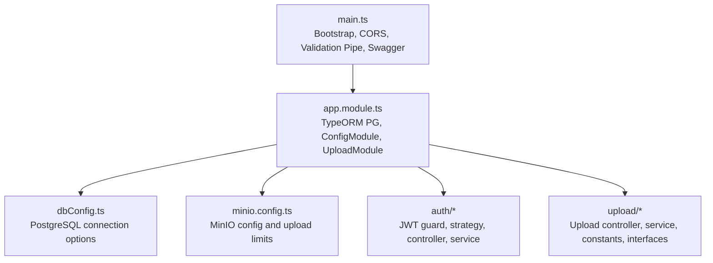
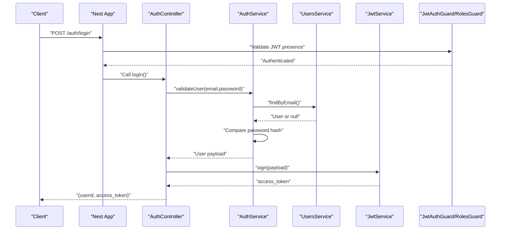
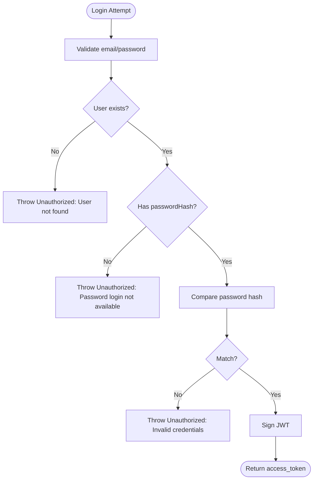
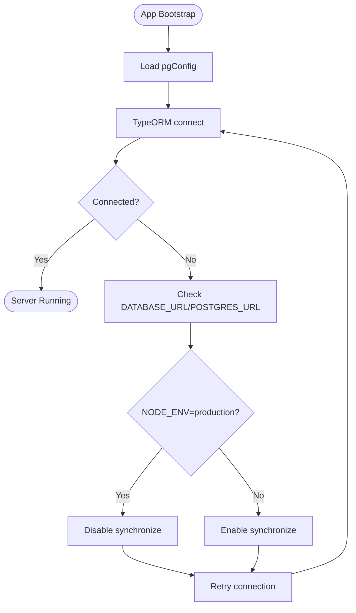
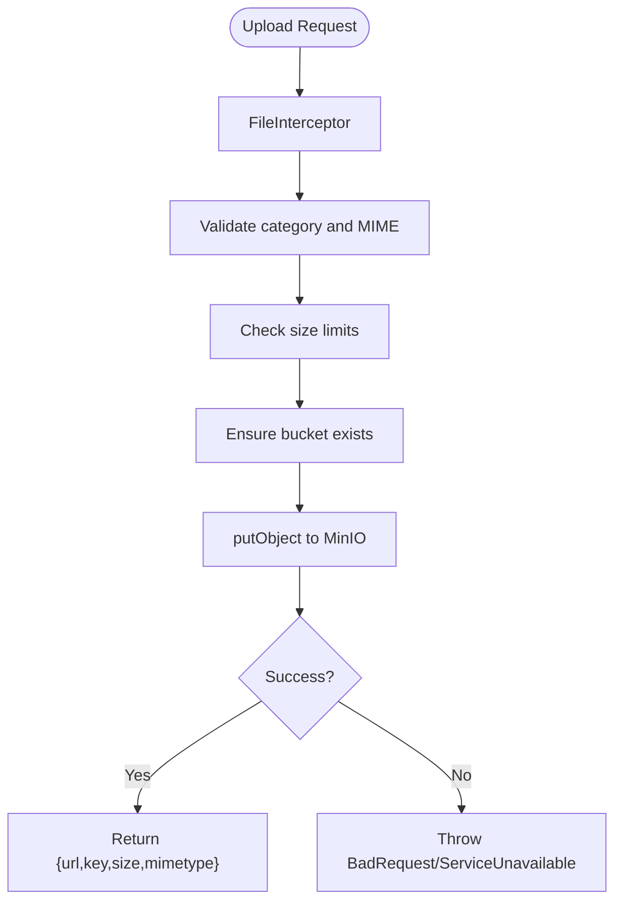
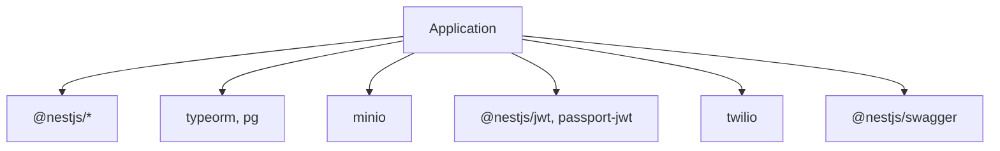

# Troubleshooting & FAQ

<cite>
**Referenced Files in This Document**
- [main.ts](file://src/main.ts)
- [app.module.ts](file://src/app.module.ts)
- [dbConfig.ts](file://dbConfig.ts)
- [minio.config.ts](file://src/config/minio.config.ts)
- [auth.controller.ts](file://src/auth/auth.controller.ts)
- [auth.service.ts](file://src/auth/auth.service.ts)
- [jwt-auth.guard.ts](file://src/auth/guards/jwt-auth.guard.ts)
- [roles.guard.ts](file://src/auth/guards/roles.guard.ts)
- [jwt.strategy.ts](file://src/auth/strategies/jwt.strategy.ts)
- [login-user.dto.ts](file://src/auth/dto/login-user.dto.ts)
- [upload.controller.ts](file://src/upload/upload.controller.ts)
- [upload.service.ts](file://src/upload/upload.service.ts)
- [upload.constants.ts](file://src/upload/constants/upload.constants.ts)
- [upload.interface.ts](file://src/upload/interfaces/upload.interface.ts)
- [package.json](file://package.json)
</cite>

## Table of Contents
1. [Introduction](#introduction)
2. [Project Structure](#project-structure)
3. [Core Components](#core-components)
4. [Architecture Overview](#architecture-overview)
5. [Detailed Component Analysis](#detailed-component-analysis)
6. [Dependency Analysis](#dependency-analysis)
7. [Performance Considerations](#performance-considerations)
8. [Troubleshooting Guide](#troubleshooting-guide)
9. [FAQ](#faq)
10. [Conclusion](#conclusion)
11. [Appendices](#appendices)

## Introduction
This document provides comprehensive troubleshooting and frequently asked questions for the Gym Management System. It focuses on diagnosing and resolving common issues related to authentication, database connectivity, file uploads, API endpoint errors, and performance bottlenecks. It also outlines systematic debugging approaches for server-side errors, client-side issues, and integration failures, along with diagnostic commands, log analysis techniques, monitoring strategies, recovery procedures, and preventive maintenance recommendations.

## Project Structure
The system is a NestJS application with modular feature areas (authentication, uploads, memberships, classes, payments, etc.). Key runtime concerns for troubleshooting include:
- Application bootstrap and CORS configuration
- TypeORM PostgreSQL connection configuration
- MinIO S3-compatible storage configuration and upload service
- Authentication via JWT strategy and guards
- API documentation via Swagger

**Diagram sources**
- [main.ts:1-70](file://src/main.ts#L1-L70)
- [app.module.ts:1-138](file://src/app.module.ts#L1-L138)
- [dbConfig.ts:1-12](file://dbConfig.ts#L1-L12)
- [minio.config.ts:1-37](file://src/config/minio.config.ts#L1-L37)

**Section sources**
- [main.ts:1-70](file://src/main.ts#L1-L70)
- [app.module.ts:1-138](file://src/app.module.ts#L1-L138)
- [dbConfig.ts:1-12](file://dbConfig.ts#L1-L12)
- [minio.config.ts:1-37](file://src/config/minio.config.ts#L1-L37)

## Core Components
- Application bootstrap and middleware:
  - Global CORS policy and origins
  - Validation pipe enforcing DTO whitelisting and transformation
  - Swagger/OpenAPI documentation setup with bearer auth
- Database:
  - PostgreSQL connection via TypeORM using environment-driven URL and synchronization mode
- Storage:
  - MinIO client configured via ConfigModule with bucket, endpoint, SSL, and upload size limits
- Authentication:
  - JWT strategy extracting tokens from Authorization header
  - Guards enforcing JWT and role-based access
  - OTP via Twilio Verify with robust error handling
- Uploads:
  - File validation by category and MIME type
  - Presigned URL generation for direct browser uploads
  - Access control checks per user role and ownership

**Section sources**
- [main.ts:1-70](file://src/main.ts#L1-L70)
- [app.module.ts:1-138](file://src/app.module.ts#L1-L138)
- [dbConfig.ts:1-12](file://dbConfig.ts#L1-L12)
- [minio.config.ts:1-37](file://src/config/minio.config.ts#L1-L37)
- [jwt.strategy.ts:1-26](file://src/auth/strategies/jwt.strategy.ts#L1-L26)
- [jwt-auth.guard.ts:1-6](file://src/auth/guards/jwt-auth.guard.ts#L1-L6)
- [roles.guard.ts:1-42](file://src/auth/guards/roles.guard.ts#L1-L42)
- [auth.service.ts:1-164](file://src/auth/auth.service.ts#L1-L164)
- [upload.service.ts:1-345](file://src/upload/upload.service.ts#L1-L345)

## Architecture Overview
High-level runtime flow for authentication and upload operations:

**Diagram sources**
- [auth.controller.ts:1-155](file://src/auth/auth.controller.ts#L1-L155)
- [auth.service.ts:1-164](file://src/auth/auth.service.ts#L1-L164)
- [jwt-auth.guard.ts:1-6](file://src/auth/guards/jwt-auth.guard.ts#L1-L6)
- [roles.guard.ts:1-42](file://src/auth/guards/roles.guard.ts#L1-L42)
- [jwt.strategy.ts:1-26](file://src/auth/strategies/jwt.strategy.ts#L1-L26)

## Detailed Component Analysis

### Authentication Troubleshooting
Common issues:
- Invalid credentials during login
- Missing or misconfigured JWT secret
- Twilio OTP provider errors
- Missing user for OTP

Resolution steps:
- Verify email/password correctness and that the user has a password hash
- Confirm JWT secret is set and strategy is initialized
- Check Twilio credentials and Verify Service SID; ensure availability and correct status codes are handled
- Ensure the phone number is normalized and eligible for OTP

**Diagram sources**
- [auth.service.ts:31-42](file://src/auth/auth.service.ts#L31-L42)

**Section sources**
- [auth.controller.ts:1-155](file://src/auth/auth.controller.ts#L1-L155)
- [auth.service.ts:1-164](file://src/auth/auth.service.ts#L1-L164)
- [jwt.strategy.ts:1-26](file://src/auth/strategies/jwt.strategy.ts#L1-L26)
- [jwt-auth.guard.ts:1-6](file://src/auth/guards/jwt-auth.guard.ts#L1-L6)
- [roles.guard.ts:1-42](file://src/auth/guards/roles.guard.ts#L1-L42)
- [login-user.dto.ts:1-18](file://src/auth/dto/login-user.dto.ts#L1-L18)

### Database Connectivity Troubleshooting
Common issues:
- Invalid or unreachable PostgreSQL URL
- Synchronization mismatch in production
- Entity discovery issues

Resolution steps:
- Confirm DATABASE_URL or POSTGRES_URL environment variable
- Review NODE_ENV to understand synchronize behavior
- Ensure entity paths match discovered locations

**Diagram sources**
- [dbConfig.ts:1-12](file://dbConfig.ts#L1-L12)
- [app.module.ts:74](file://src/app.module.ts#L74)

**Section sources**
- [dbConfig.ts:1-12](file://dbConfig.ts#L1-L12)
- [app.module.ts:74](file://src/app.module.ts#L74)

### File Upload Troubleshooting
Common issues:
- Invalid category or MIME type
- File size exceeding limits
- MinIO bucket not accessible
- Access denied for download
- Presigned URL generation failures

Resolution steps:
- Validate category against allowed types and sizes
- Ensure bucket exists and is reachable
- Confirm user has access rights based on role and ownership
- Use presigned URLs for direct uploads with correct content-type

**Diagram sources**
- [upload.service.ts:59-137](file://src/upload/upload.service.ts#L59-L137)
- [upload.constants.ts:1-34](file://src/upload/constants/upload.constants.ts#L1-L34)

**Section sources**
- [upload.controller.ts:1-167](file://src/upload/upload.controller.ts#L1-L167)
- [upload.service.ts:1-345](file://src/upload/upload.service.ts#L1-L345)
- [upload.constants.ts:1-34](file://src/upload/constants/upload.constants.ts#L1-L34)
- [upload.interface.ts:1-21](file://src/upload/interfaces/upload.interface.ts#L1-L21)

### API Endpoint Errors
Common issues:
- Missing or invalid JWT in Authorization header
- Role-based access denials
- DTO validation failures
- CORS mismatches

Resolution steps:
- Attach valid bearer token for protected endpoints
- Verify user role matches endpoint requirements
- Ensure request body conforms to DTO validation rules
- Align client origins with configured CORS origins

**Section sources**
- [main.ts:8-19](file://src/main.ts#L8-L19)
- [main.ts:20-26](file://src/main.ts#L20-L26)
- [jwt-auth.guard.ts:1-6](file://src/auth/guards/jwt-auth.guard.ts#L1-L6)
- [roles.guard.ts:1-42](file://src/auth/guards/roles.guard.ts#L1-L42)
- [auth.controller.ts:1-155](file://src/auth/auth.controller.ts#L1-L155)

## Dependency Analysis
Runtime dependencies relevant to troubleshooting:
- NestJS core and platform
- TypeORM and PostgreSQL driver
- MinIO client
- JWT and Passport
- Twilio SDK for OTP
- Swagger for API docs

**Diagram sources**
- [package.json:22-47](file://package.json#L22-L47)

**Section sources**
- [package.json:22-47](file://package.json#L22-L47)

## Performance Considerations
- Database:
  - Use production-grade PostgreSQL with connection pooling and proper indexing
  - Avoid synchronize in production; manage migrations separately
- Storage:
  - Monitor MinIO latency and throughput; consider CDN for public URLs
  - Tune upload size limits per category to balance security and usability
- Authentication:
  - Keep JWT secret secure and rotate periodically
  - Consider rate limiting for login and OTP endpoints
- Application:
  - Enable production logging and structured logs
  - Use health checks for database and storage services

[No sources needed since this section provides general guidance]

## Troubleshooting Guide

### Systematic Debugging Approaches
- Server-side errors:
  - Inspect application logs for stack traces and error messages
  - Verify environment variables for database and storage
  - Confirm service health endpoints for database and MinIO
- Client-side issues:
  - Validate Authorization header presence and format
  - Ensure DTO payloads match endpoint schemas
  - Check CORS configuration alignment with client origins
- Integration failures:
  - Test JWT strategy and guards independently
  - Validate Twilio OTP service configuration and network reachability
  - Confirm MinIO endpoint, bucket, and credentials

### Diagnostic Commands and Checks
- Environment and configuration:
  - Echo environment variables for database and storage
  - Verify service readiness endpoints for database and MinIO
- Logs:
  - Tail application logs during reproduction of issues
  - Filter by service names (e.g., UploadService, AuthService)
- Network:
  - Test connectivity to PostgreSQL and MinIO endpoints
  - Validate DNS resolution and firewall rules

### Monitoring Strategies
- Health endpoints:
  - Use upload module’s health check for MinIO
  - Implement custom health checks for database connectivity
- Metrics:
  - Track request latency, error rates, and file upload sizes
- Alerts:
  - Configure alerts for service unavailability and high error rates

### Recovery Procedures
- Critical system failures:
  - Restart application after fixing configuration
  - Reinitialize database schema if synchronize is enabled
- Data corruption scenarios:
  - Rollback to last known good migration
  - Restore MinIO bucket from backups
- Security incidents:
  - Rotate JWT secret and invalidate tokens
  - Review and tighten access controls
  - Audit logs for unauthorized access attempts

### Preventive Maintenance
- Regular backups for database and MinIO
- Scheduled health checks and capacity planning
- Dependency updates with regression testing
- Security audits for secrets and access policies

**Section sources**
- [upload.controller.ts:160-167](file://src/upload/upload.controller.ts#L160-L167)
- [upload.service.ts:331-344](file://src/upload/upload.service.ts#L331-L344)
- [dbConfig.ts:1-12](file://dbConfig.ts#L1-L12)
- [minio.config.ts:20-36](file://src/config/minio.config.ts#L20-L36)

## FAQ

Q1: Why am I getting “Invalid credentials” when logging in?
- Ensure the email exists and has a password hash. Confirm the password matches the stored hash.

Q2: How do I fix “JWT secret not found”?
- Set the JWT secret environment variable expected by the JWT strategy.

Q3: Why does OTP verification fail?
- Check Twilio credentials and Verify Service SID. Ensure the phone number is normalized and eligible.

Q4: I get “File too large” errors. How can I increase limits?
- Adjust upload size limits per category in configuration.

Q5: Why is my file upload failing with “Storage service unavailable”?
- Verify MinIO endpoint, bucket, and credentials. Ensure the bucket exists and is reachable.

Q6: I cannot download a file. What gives?
- Access is restricted by role and ownership. Ensure you have permission to access the file key.

Q7: How do I enable CORS for my frontend?
- Set CORS_ORIGINS to include your frontend domains. Defaults apply for localhost.

Q8: How can I monitor system health?
- Use the upload health check endpoint and implement database health checks.

Q9: What should I do if the database connection fails?
- Confirm DATABASE_URL/POSTGRES_URL and ensure PostgreSQL is reachable.

Q10: How often should I back up the system?
- Back up PostgreSQL and MinIO regularly. Automate and test restoration procedures.

**Section sources**
- [auth.service.ts:31-42](file://src/auth/auth.service.ts#L31-L42)
- [jwt.strategy.ts:10-20](file://src/auth/strategies/jwt.strategy.ts#L10-L20)
- [auth.service.ts:120-140](file://src/auth/auth.service.ts#L120-L140)
- [upload.service.ts:59-79](file://src/upload/upload.service.ts#L59-L79)
- [upload.service.ts:133-136](file://src/upload/upload.service.ts#L133-L136)
- [upload.service.ts:289-309](file://src/upload/upload.service.ts#L289-L309)
- [main.ts:8-19](file://src/main.ts#L8-L19)
- [upload.controller.ts:160-167](file://src/upload/upload.controller.ts#L160-L167)
- [dbConfig.ts:4-7](file://dbConfig.ts#L4-L7)

## Conclusion
This guide consolidates actionable troubleshooting steps, diagnostic techniques, and preventive measures for the Gym Management System. By validating configuration, leveraging health checks, and following structured debugging workflows, most issues can be identified and resolved efficiently. For persistent or complex problems, escalate to senior support with logs, environment details, and reproduction steps.

[No sources needed since this section summarizes without analyzing specific files]

## Appendices

### Environment Variables Reference
- Database:
  - DATABASE_URL or POSTGRES_URL
  - NODE_ENV affects synchronize behavior
- Storage:
  - MINIO_ENDPOINT, MINIO_ACCESS_KEY, MINIO_SECRET_KEY, MINIO_BUCKET, MINIO_PUBLIC_URL, MINIO_USE_SSL
  - MAX_FILE_SIZE and category-specific limits
- Authentication:
  - JWT_SECRET for JWT strategy
  - Twilio credentials and Verify Service SID for OTP
- Application:
  - PORT for server listen
  - CORS_ORIGINS for allowed origins

**Section sources**
- [dbConfig.ts:4-11](file://dbConfig.ts#L4-L11)
- [minio.config.ts:20-36](file://src/config/minio.config.ts#L20-L36)
- [jwt.strategy.ts:15-19](file://src/auth/strategies/jwt.strategy.ts#L15-L19)
- [auth.service.ts:22-28](file://src/auth/auth.service.ts#L22-L28)
- [main.ts:67](file://src/main.ts#L67)