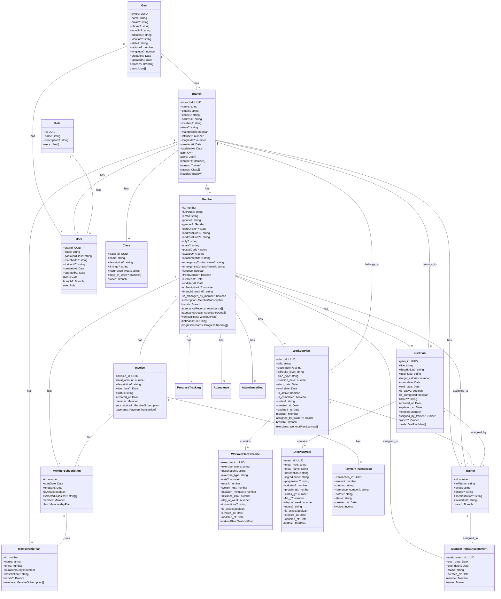

# Gym Management System - Entity Relationship Analysis

## Table of Contents
1. [Entity Overview](#entity-overview)
2. [Relationship Analysis](#relationship-analysis)
3. [Cardinality Mapping](#cardinality-mapping)
4. [Junction Tables](#junction-tables)
5. [Inheritance Hierarchies](#inheritance-hierarchies)
6. [Data Integrity Issues](#data-integrity-issues)
7. [ER Diagram](#er-diagram)
8. [Business Process Support](#business-process-support)

## Entity Overview

The gym management system consists of the following core entities:

### Core Entities
- **Gym** - Represents a gym organization
- **Branch** - Represents individual gym locations
- **Member** - Gym members/customers
- **Trainer** - Fitness trainers
- **MembershipPlan** - Different membership tiers
- **MemberSubscription** - Member's subscription to a plan
- **User** - System users (admin, staff, etc.)
- **Role** - User roles and permissions

### Fitness Tracking Entities
- **WorkoutPlan** - Customized workout plans
- **WorkoutPlanExercise** - Exercises in a workout plan
- **DietPlan** - Nutrition plans
- **DietPlanMeal** - Meals in a diet plan
- **ExerciseLibrary** - Repository of exercises
- **ProgressTracking** - Member progress records
- **BodyProgress** - Physical measurements
- **Attendance** - Member attendance tracking
- **AttendanceGoal** - Attendance targets
- **WorkoutLogs** - Member workout logging

### Financial Entities
- **Invoice** - Billing documents
- **PaymentTransaction** - Payment records

### Additional Entities
- **Class** - Group fitness classes
- **Inquiry** - Member inquiries
- **Notification** - System notifications
- **AuditLogs** - System audit trail
- **Goals** - Member fitness goals

## Relationship Analysis

### 1. Gym-Branch Relationship
**Gym** → **Branch**
- A Gym can have multiple Branches (1:N)
- Each Branch belongs to exactly one Gym
- **Cardinality**: 1:M (One-to-Many)
- **Purpose**: Organizes gym locations under a central organization

### 2. Branch-Member Relationship
**Branch** → **Member**
- A Branch can have many Members (1:N)
- A Member belongs to one Branch (nullable)
- **Cardinality**: 1:M (One-to-Many)
- **Purpose**: Tracks which branch a member is registered at

### 3. Branch-Trainer Relationship
**Branch** → **Trainer**
- A Branch can have many Trainers (1:N)
- A Trainer belongs to exactly one Branch
- **Cardinality**: 1:M (One-to-Many)
- **Purpose**: Assigns trainers to specific gym locations

### 4. Branch-Class Relationship
**Branch** → **Class**
- A Branch can have many Classes (1:N)
- A Class belongs to exactly one Branch
- **Cardinality**: 1:M (One-to-Many)
- **Purpose**: Organizes classes by branch location

### 5. Branch-MembershipPlan Relationship
**Branch** → **MembershipPlan**
- A Branch can have many MembershipPlans (1:N, nullable)
- A MembershipPlan can belong to one Branch (nullable)
- **Cardinality**: 1:M (One-to-Many, optional)
- **Purpose**: Allows branch-specific membership plans

### 6. Member-MemberSubscription Relationship
**Member** ↔ **MemberSubscription**
- A Member has exactly one MemberSubscription (1:1)
- A MemberSubscription belongs to exactly one Member
- **Cardinality**: 1:1 (One-to-One)
- **Purpose**: Links members to their active subscription

### 7. MemberSubscription-MembershipPlan Relationship
**MemberSubscription** → **MembershipPlan**
- Many MemberSubscriptions can reference one MembershipPlan (N:1)
- A MembershipPlan can have many MemberSubscriptions (1:N)
- **Cardinality**: M:1 (Many-to-One)
- **Purpose**: Associates subscriptions with specific membership plans

### 8. Member-Trainer Assignment (Junction Table)
**Member** ↔ **Trainer** (via MemberTrainerAssignment)
- Many-to-Many relationship with additional attributes
- **Cardinality**: M:N (Many-to-Many)
- **Purpose**: Tracks trainer-member assignments with start/end dates

### 9. Member-WorkoutPlan Relationship
**Member** → **WorkoutPlan**
- A Member can have many WorkoutPlans (1:N)
- A WorkoutPlan belongs to exactly one Member
- **Cardinality**: 1:M (One-to-Many)
- **Purpose**: Tracks workout plans assigned to members

### 10. Member-DietPlan Relationship
**Member** → **DietPlan**
- A Member can have many DietPlans (1:N)
- A DietPlan belongs to exactly one Member
- **Cardinality**: 1:M (One-to-Many)
- **Purpose**: Tracks diet plans assigned to members

### 11. Member-ProgressTracking Relationship
**Member** → **ProgressTracking**
- A Member can have many ProgressTracking records (1:N)
- A ProgressTracking record belongs to exactly one Member
- **Cardinality**: 1:M (One-to-Many)
- **Purpose**: Tracks member progress over time

### 12. Member-Attendance Relationship
**Member** → **Attendance**
- A Member can have many Attendance records (1:N)
- An Attendance record belongs to exactly one Member
- **Cardinality**: 1:M (One-to-Many)
- **Purpose**: Tracks member attendance at the gym

### 13. Member-AttendanceGoal Relationship
**Member** → **AttendanceGoal**
- A Member can have many AttendanceGoals (1:N)
- An AttendanceGoal belongs to exactly one Member
- **Cardinality**: 1:M (One-to-Many)
- **Purpose**: Tracks attendance targets for members

### 14. Member-Invoice Relationship
**Member** → **Invoice**
- A Member can have many Invoices (1:N)
- An Invoice belongs to exactly one Member
- **Cardinality**: 1:M (One-to-Many)
- **Purpose**: Tracks billing for members

### 15. Invoice-PaymentTransaction Relationship
**Invoice** → **PaymentTransaction**
- An Invoice can have many PaymentTransactions (1:N)
- A PaymentTransaction belongs to exactly one Invoice
- **Cardinality**: 1:M (One-to-Many)
- **Purpose**: Tracks payments made against invoices

### 16. WorkoutPlan-WorkoutPlanExercise Relationship
**WorkoutPlan** → **WorkoutPlanExercise**
- A WorkoutPlan can have many WorkoutPlanExercises (1:N)
- A WorkoutPlanExercise belongs to exactly one WorkoutPlan
- **Cardinality**: 1:M (One-to-Many)
- **Purpose**: Defines exercises within a workout plan

### 17. DietPlan-DietPlanMeal Relationship
**DietPlan** → **DietPlanMeal**
- A DietPlan can have many DietPlanMeals (1:N)
- A DietPlanMeal belongs to exactly one DietPlan
- **Cardinality**: 1:M (One-to-Many)
- **Purpose**: Defines meals within a diet plan

### 18. WorkoutPlan-Trainer Relationship
**WorkoutPlan** → **Trainer**
- A WorkoutPlan can be assigned by one Trainer (N:1, nullable)
- A Trainer can assign many WorkoutPlans (1:N)
- **Cardinality**: M:1 (Many-to-One, optional)
- **Purpose**: Tracks which trainer created the workout plan

### 19. DietPlan-Trainer Relationship
**DietPlan** → **Trainer**
- A DietPlan can be assigned by one Trainer (N:1, nullable)
- A Trainer can assign many DietPlans (1:N)
- **Cardinality**: M:1 (Many-to-One, optional)
- **Purpose**: Tracks which trainer created the diet plan

### 20. WorkoutPlan-Branch Relationship
**WorkoutPlan** → **Branch**
- A WorkoutPlan can be associated with one Branch (N:1, nullable)
- A Branch can have many WorkoutPlans (1:N)
- **Cardinality**: M:1 (Many-to-One, optional)
- **Purpose**: Tracks which branch the workout plan belongs to

### 21. DietPlan-Branch Relationship
**DietPlan** → **Branch**
- A DietPlan can be associated with one Branch (N:1, nullable)
- A Branch can have many DietPlans (1:N)
- **Cardinality**: M:1 (Many-to-One, optional)
- **Purpose**: Tracks which branch the diet plan belongs to

### 22. Gym-User Relationship
**Gym** → **User**
- A Gym can have many Users (1:N, nullable)
- A User can belong to one Gym (N:1, nullable)
- **Cardinality**: M:1 (Many-to-One, optional)
- **Purpose**: Assigns users to gym organizations

### 23. Branch-User Relationship
**Branch** → **User**
- A Branch can have many Users (1:N)
- A User can belong to one Branch (N:1, nullable)
- **Cardinality**: M:1 (Many-to-One, optional)
- **Purpose**: Assigns users to specific branches

### 24. Role-User Relationship
**Role** → **User**
- A Role can have many Users (1:N)
- A User has exactly one Role
- **Cardinality**: 1:M (One-to-Many)
- **Purpose**: Defines user permissions and access levels

### 25. Invoice-MemberSubscription Relationship
**Invoice** → **MemberSubscription**
- An Invoice can reference one MemberSubscription (N:1, nullable)
- A MemberSubscription can have many Invoices (1:N)
- **Cardinality**: M:1 (Many-to-One, optional)
- **Purpose**: Links invoices to specific subscriptions

## Cardinality Mapping

| Relationship | Cardinality | Description |
|-------------|-------------|-------------|
| Gym → Branch | 1:M | One gym has many branches |
| Branch → Member | 1:M | One branch has many members |
| Branch → Trainer | 1:M | One branch has many trainers |
| Branch → Class | 1:M | One branch has many classes |
| Branch → MembershipPlan | 1:M (optional) | One branch has many membership plans |
| Member ↔ MemberSubscription | 1:1 | One member has one subscription |
| MemberSubscription → MembershipPlan | M:1 | Many subscriptions use one plan |
| Member ↔ Trainer | M:N (via junction) | Many-to-many trainer assignments |
| Member → WorkoutPlan | 1:M | One member has many workout plans |
| Member → DietPlan | 1:M | One member has many diet plans |
| Member → ProgressTracking | 1:M | One member has many progress records |
| Member → Attendance | 1:M | One member has many attendance records |
| Member → AttendanceGoal | 1:M | One member has many attendance goals |
| Member → Invoice | 1:M | One member has many invoices |
| Invoice → PaymentTransaction | 1:M | One invoice has many payments |
| WorkoutPlan → WorkoutPlanExercise | 1:M | One workout plan has many exercises |
| DietPlan → DietPlanMeal | 1:M | One diet plan has many meals |
| WorkoutPlan → Trainer | M:1 (optional) | Many plans assigned by one trainer |
| DietPlan → Trainer | M:1 (optional) | Many plans assigned by one trainer |
| WorkoutPlan → Branch | M:1 (optional) | Many plans belong to one branch |
| DietPlan → Branch | M:1 (optional) | Many plans belong to one branch |
| Gym → User | M:1 (optional) | Many users belong to one gym |
| Branch → User | M:1 (optional) | Many users belong to one branch |
| Role → User | 1:M | One role has many users |
| Invoice → MemberSubscription | M:1 (optional) | Many invoices for one subscription |

## Junction Tables

### MemberTrainerAssignment
- **Purpose**: Establishes many-to-many relationship between Members and Trainers
- **Attributes**:
  - `assignment_id` (UUID): Primary key
  - `member_id` (FK): References Member
  - `trainer_id` (FK): References Trainer
  - `start_date` (Date): Assignment start date
  - `end_date` (Date, nullable): Assignment end date
  - `status` (enum): 'active' or 'ended'
  - `created_at` (Date): Creation timestamp
- **Cardinality**: M:N between Member and Trainer
- **Cascade**: Deletes when member is deleted

### WorkoutPlanExercise
- **Purpose**: Establishes one-to-many relationship between WorkoutPlans and exercises
- **Attributes**:
  - `exercise_id` (UUID): Primary key
  - `workoutPlan` (FK): References WorkoutPlan
  - `exercise_name` (string): Name of the exercise
  - `description` (text, nullable): Exercise description
  - `exercise_type` (enum): 'sets_reps', 'time', or 'distance'
  - `sets`, `reps`, `weight_kg`, `duration_minutes`, `distance_km` (numeric, nullable): Exercise parameters
  - `day_of_week` (int): Which day this exercise is scheduled
  - `instructions` (text, nullable): Exercise instructions
  - `is_active` (boolean): Activity status
  - `created_at`, `updated_at` (Date): Timestamps
- **Cardinality**: 1:N from WorkoutPlan to WorkoutPlanExercise
- **Cascade**: Deletes when workout plan is deleted

### DietPlanMeal
- **Purpose**: Establishes one-to-many relationship between DietPlans and meals
- **Attributes**:
  - `meal_id` (UUID): Primary key
  - `dietPlan` (FK): References DietPlan
  - `meal_type` (enum): 'breakfast', 'lunch', 'dinner', 'snack', 'pre_workout', 'post_workout'
  - `meal_name` (string): Name of the meal
  - `description`, `ingredients`, `preparation` (text, nullable): Meal details
  - `calories`, `protein_g`, `carbs_g`, `fat_g` (numeric, nullable): Nutrition information
  - `day_of_week` (int): Which day this meal is scheduled
  - `notes` (text, nullable): Additional notes
  - `is_active` (boolean): Activity status
  - `created_at`, `updated_at` (Date): Timestamps
- **Cardinality**: 1:N from DietPlan to DietPlanMeal
- **Cascade**: Deletes when diet plan is deleted

## Inheritance Hierarchies

The system does not use traditional inheritance patterns (single-table, class-table, or joined inheritance). Instead, it uses:

1. **Composition over Inheritance**: Entities are related through relationships rather than inheritance
2. **User-Member-Trainer Pattern**: 
   - `User` entity contains `memberId` and `trainerId` fields
   - This creates a loose association rather than formal inheritance
   - **Issue**: This creates potential data integrity problems (see below)

## Data Integrity Issues

### 1. User-Member-Trainer Relationship Design
**Problem**: The relationship between User, Member, and Trainer is problematic:
- `User` has optional `memberId` and `trainerId` fields
- These are strings without foreign key constraints
- No formal relationship is defined between User and Member/Trainer
- **Risk**: Orphaned records, data inconsistency

**Recommendation**: 
- Add proper foreign key relationships
- Consider using inheritance or separate user types

### 2. Circular Dependency in MemberSubscription
**Problem**: 
- `Member` has a 1:1 relationship with `MemberSubscription`
- `MemberSubscription` has a reference back to `Member`
- `Invoice` references both `Member` and `MemberSubscription`
- **Risk**: Potential circular reference issues

**Recommendation**: 
- Ensure proper cascade delete rules
- Consider if the bidirectional relationship is necessary

### 3. Nullable Foreign Keys
**Problem**: Many relationships have nullable foreign keys:
- `WorkoutPlan.branch` (nullable)
- `DietPlan.branch` (nullable)
- `WorkoutPlan.assigned_by_trainer` (nullable)
- `DietPlan.assigned_by_trainer` (nullable)
- **Risk**: Incomplete data, difficulty tracking ownership

**Recommendation**: 
- Consider making these required where appropriate
- Add validation to ensure data completeness

### 4. Member Subscription ID Uniqueness
**Problem**: 
- `Member` has `subscriptionId` as a unique column
- But `MemberSubscription` has its own auto-increment ID
- **Risk**: Potential confusion between subscription IDs

**Recommendation**: 
- Use consistent ID strategies
- Ensure proper relationship mapping

### 5. Payment Transaction Status
**Problem**: 
- `PaymentTransaction` has a default status of 'completed'
- This might not reflect the actual payment state
- **Risk**: Incorrect financial reporting

**Recommendation**: 
- Consider 'pending' as default for new transactions
- Ensure status is properly updated during payment processing

### 6. Member Freeze Field Typo
**Problem**: 
- `Member` has a field `freezMember` (typo)
- Comment indicates it should be `freezeMember`
- **Risk**: Confusion in code usage

**Recommendation**: 
- Fix the typo in next major version
- Maintain backward compatibility

## ER Diagram

## Business Process Support

### 1. Membership Management
The entity relationships support comprehensive membership management:

**Process Flow**:
1. A **Gym** is created with multiple **Branches**
2. **MembershipPlans** are defined (branch-specific or global)
3. **Members** register at a specific **Branch**
4. Members get a **MemberSubscription** linked to a **MembershipPlan**
5. **Invoices** are generated for membership fees
6. **PaymentTransactions** record payments against invoices
7. Member status is tracked through subscription dates

**Supported Features**:
- Multi-location gym management
- Branch-specific membership plans
- Subscription tracking and renewals
- Billing and payment processing
- Member activation/deactivation

### 2. Training Assignments
The system supports trainer-member relationships:

**Process Flow**:
1. **Trainers** are assigned to specific **Branches**
2. **MemberTrainerAssignment** creates relationships between members and trainers
3. Assignments have start/end dates and status tracking
4. Trainers can create **WorkoutPlans** and **DietPlans** for members
5. Plans are tracked with assignment information

**Supported Features**:
- Trainer to member assignment
- Assignment duration tracking
- Trainer-created workout and diet plans
- Multiple trainers per member
- Assignment status management

### 3. Fitness Tracking
Comprehensive fitness tracking is supported:

**Process Flow**:
1. **WorkoutPlans** are created for members (by trainers or system)
2. Plans contain **WorkoutPlanExercises** with specific parameters
3. **DietPlans** are created with **DietPlanMeals**
4. **ProgressTracking** records member progress
5. **BodyProgress** tracks physical measurements
6. **Attendance** records gym visits
7. **AttendanceGoals** set targets for members
8. **WorkoutLogs** track actual workouts performed

**Supported Features**:
- Custom workout plan creation
- Detailed exercise tracking
- Nutrition planning
- Progress monitoring
- Attendance management
- Goal setting and tracking

### 4. Financial Transactions
Financial processes are well-supported:

**Process Flow**:
1. **Invoices** are generated for membership fees, classes, or services
2. **PaymentTransactions** record payments
3. Payments are linked to specific invoices
4. Payment status is tracked (pending, completed, failed, refund)
5. Multiple payments can be made against a single invoice

**Supported Features**:
- Invoice generation
- Multiple payment methods (cash, card, online, bank transfer)
- Payment status tracking
- Partial payments
- Financial reporting capabilities

### 5. Additional Business Processes

**Class Management**:
- **Classes** are organized by branch
- Members can select classes during subscription
- Class schedules and recurrence patterns are tracked

**User Management**:
- **Users** with different **Roles** manage the system
- Users can be assigned to gyms and branches
- Role-based access control is implemented

**Inquiry Management**:
- **Inquiries** from potential members are tracked
- Inquiries are associated with branches
- Follow-up and response tracking

**Notification System**:
- **Notifications** keep members and staff informed
- Notifications can be member-specific or system-wide

**Audit Logging**:
- **AuditLogs** track system changes
- Comprehensive audit trail for compliance

## Summary

The gym management system has a well-designed entity relationship structure that supports all core business processes:

1. **Strong organizational structure** with Gym → Branch hierarchy
2. **Comprehensive membership management** with subscription tracking
3. **Flexible training system** with trainer assignments and custom plans
4. **Detailed fitness tracking** with workout, diet, and progress monitoring
5. **Robust financial system** with invoicing and payment processing

The use of junction tables (MemberTrainerAssignment) and composite entities (WorkoutPlanExercise, DietPlanMeal) allows for complex relationships while maintaining data integrity. The system could benefit from addressing the identified data integrity issues, particularly around the User-Member-Trainer relationship design.
